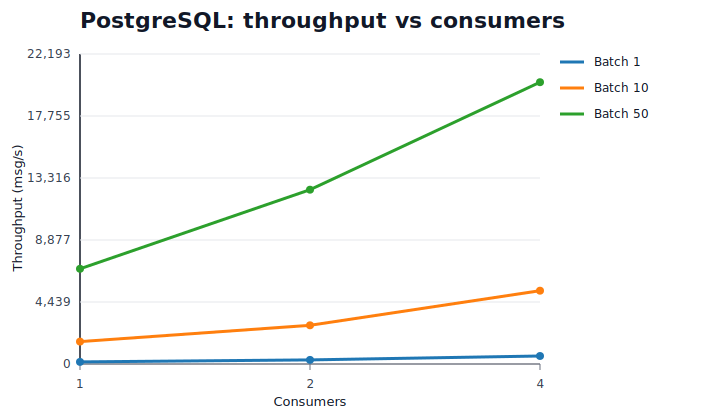
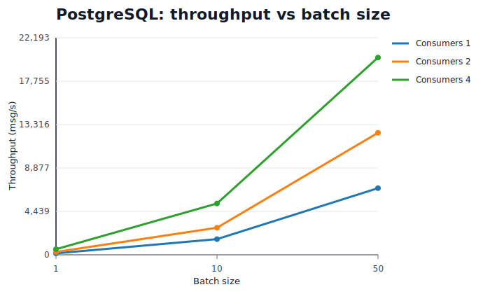
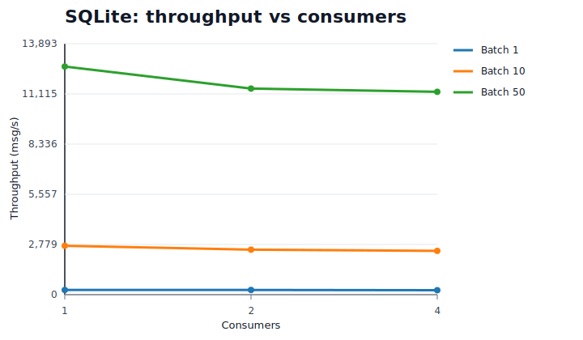
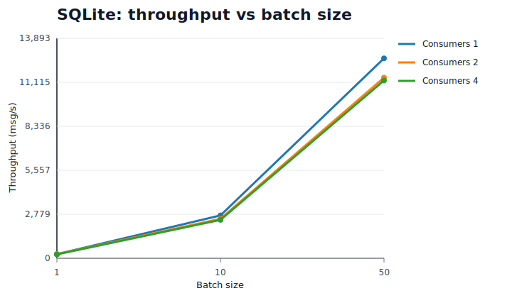
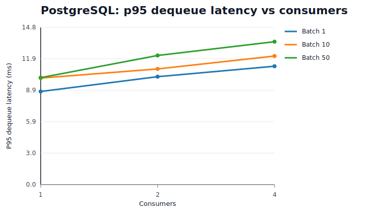
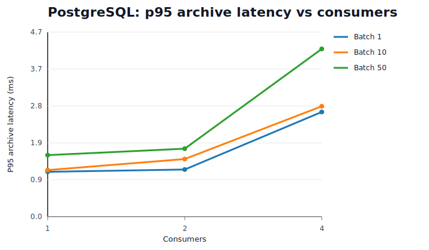
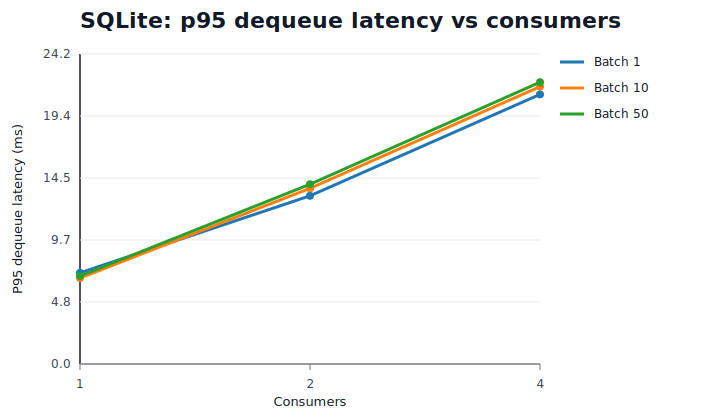
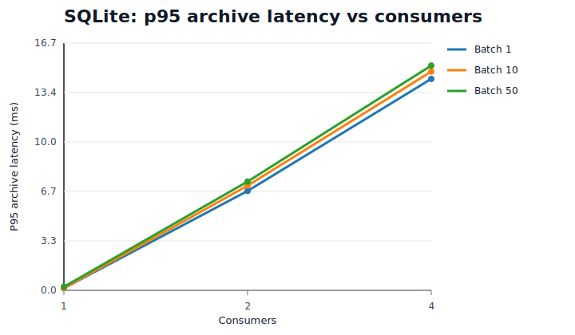

# Queue Drain Fixed Backlog

`queue.drain_fixed_backlog` is the first curated queue benchmark scenario for pgqrs.

It measures how fast a pre-populated queue can be drained under a sweep of:

- consumer count
- dequeue batch size

## Question

For a fixed pre-populated backlog, how do throughput, completion time, and latency vary with consumer count and dequeue batch size?

## Why This Matters

This scenario isolates the consumer side of the queue.

That makes it useful for:

- understanding how well a backend scales under drain pressure
- separating batch-size effects from concurrency effects
- identifying whether higher concurrency improves useful work or only adds contention

## Setup

The PostgreSQL and SQLite curated baselines use:

- Rust executor
- release mode
- `prefill_jobs = 50000`
- compatibility profile
- variables:
  - `consumers = [1, 2, 4]`
  - `dequeue_batch_size = [1, 10, 50]`

Additional backend notes on this page use smaller directional runs where the full `50000`-job sweep is not yet practical:

- Turso guidance below uses a local-path `single_process` run with `prefill_jobs = 200`
- S3 guidance below uses a durable `single_process` run with `prefill_jobs = 500`
- The S3 run is routed through `LocalStack + Toxiproxy` with `60 ms` injected latency and `0 ms` jitter

## Primary Findings

### PostgreSQL

PostgreSQL scales with both consumers and batch size.

- At `batch_size = 1`, throughput improves from `149.5 msg/s` to `575.0 msg/s` as consumers rise from `1` to `4` (`3.85x`).
- At `batch_size = 10`, throughput improves from `1603.1 msg/s` to `5249.6 msg/s` (`3.27x`).
- At `batch_size = 50`, throughput improves from `6817.1 msg/s` to `20175.8 msg/s` (`2.96x`).
- At `1 consumer`, increasing batch size from `1` to `50` improves throughput from `149.5 msg/s` to `6817.1 msg/s` (`45.59x`).
- At `4 consumers`, increasing batch size from `1` to `50` improves throughput from `575.0 msg/s` to `20175.8 msg/s` (`35.09x`).





### SQLite

SQLite benefits strongly from larger batch sizes, but does not scale with more consumers in this scenario.

- At `batch_size = 1`, throughput changes from `261.0 msg/s` to `247.0 msg/s` as consumers rise from `1` to `4` (`0.95x`).
- At `batch_size = 10`, throughput changes from `2709.0 msg/s` to `2422.7 msg/s` (`0.89x`).
- At `batch_size = 50`, throughput changes from `12630.3 msg/s` to `11232.9 msg/s` (`0.89x`).
- At `1 consumer`, increasing batch size from `1` to `50` improves throughput from `261.0 msg/s` to `12630.3 msg/s` (`48.40x`).
- At `4 consumers`, increasing batch size from `1` to `50` improves throughput from `247.0 msg/s` to `11232.9 msg/s` (`45.47x`).





### Turso

The current Turso run is a directional local-path measurement, not a hosted edge-service benchmark.

Its shape is close to SQLite:

- At `batch_size = 1`, throughput changes from `173.0 msg/s` to `165.6 msg/s` as consumers rise from `1` to `4` (`0.96x`).
- At `batch_size = 10`, throughput changes from `1503.7 msg/s` to `1504.5 msg/s` (`1.00x`).
- At `batch_size = 50`, throughput changes from `6452.5 msg/s` to `6804.3 msg/s` (`1.05x`).
- At `1 consumer`, increasing batch size from `1` to `50` improves throughput from `173.0 msg/s` to `6452.5 msg/s` (`37.30x`).
- At `4 consumers`, increasing batch size from `1` to `50` improves throughput from `165.6 msg/s` to `6804.3 msg/s` (`41.09x`).

This is the behavior to expect from the current `turso:///...` backend in this repo: local SQLite-family storage with a different client stack, not a remote Turso edge deployment.

### S3

The current S3 run is a directional durable baseline over an emulated remote object-store path.

It behaves very differently from the local-file backends:

- At `batch_size = 1`, throughput changes from `6.6 msg/s` to `6.7 msg/s` as consumers rise from `1` to `4` (`1.01x`).
- At `batch_size = 10`, throughput changes from `66.2 msg/s` to `63.6 msg/s` (`0.96x`).
- At `batch_size = 50`, throughput changes from `325.8 msg/s` to `265.4 msg/s` (`0.81x`).
- At `1 consumer`, increasing batch size from `1` to `50` improves throughput from `6.6 msg/s` to `325.8 msg/s` (`49.35x`).
- At `4 consumers`, increasing batch size from `1` to `50` improves throughput from `6.7 msg/s` to `265.4 msg/s` (`39.89x`).

This is the useful queue-drain takeaway for S3Store today:

- durable object-store latency dominates the drain path
- batching is still the main lever
- extra consumers do not help and can reduce throughput once they add contention on the shared remote-backed state

## Latency Behavior

### PostgreSQL

PostgreSQL latency stays comparatively flat as consumer count rises.

- `p95 dequeue latency` rises from `8.78 ms` to `11.16 ms` at `batch_size = 1` (`1.27x`).
- `p95 dequeue latency` rises from `10.09 ms` to `13.48 ms` at `batch_size = 50` (`1.34x`).
- `p95 archive latency` rises from `1.13 ms` to `2.64 ms` at `batch_size = 1` (`2.33x`).
- `p95 archive latency` rises from `1.55 ms` to `4.23 ms` at `batch_size = 50` (`2.73x`).





### SQLite

SQLite latency rises sharply as more consumers are added, even though throughput does not improve.

- `p95 dequeue latency` rises from `7.13 ms` to `21.06 ms` at `batch_size = 1` (`2.96x`).
- `p95 dequeue latency` rises from `6.88 ms` to `22.02 ms` at `batch_size = 50` (`3.20x`).
- `p95 archive latency` rises from `0.15 ms` to `14.30 ms` at `batch_size = 1` (`98.64x`).
- `p95 archive latency` rises from `0.24 ms` to `15.20 ms` at `batch_size = 50` (`64.15x`).





### Turso

The current Turso local-path run also shows a "local backend with limited write scaling" shape, but with lower absolute latencies than the published SQLite baseline:

- `p95 dequeue latency` rises from `4.02 ms` to `13.06 ms` at `batch_size = 1` (`3.25x`).
- `p95 dequeue latency` rises from `4.94 ms` to `14.97 ms` at `batch_size = 50` (`3.03x`).
- `p95 archive latency` rises from `3.19 ms` to `12.96 ms` at `batch_size = 1` (`4.06x`).
- `p95 archive latency` rises from `4.03 ms` to `14.02 ms` at `batch_size = 50` (`3.48x`).

Treat these as directional rather than directly comparable to the `50000`-job SQLite baseline, but the operational conclusion is straightforward: batch size matters much more than adding more consumers.

### S3

The S3 durable path has much higher latency, and that latency rises almost linearly with consumer count in this scenario:

- `p95 dequeue latency` rises from `79.68 ms` to `306.40 ms` at `batch_size = 1` (`3.85x`).
- `p95 dequeue latency` rises from `82.62 ms` to `304.12 ms` at `batch_size = 50` (`3.68x`).
- `p95 archive latency` rises from `80.01 ms` to `306.52 ms` at `batch_size = 1` (`3.83x`).
- `p95 archive latency` rises from `78.01 ms` to `310.38 ms` at `batch_size = 50` (`3.98x`).

These numbers come from the emulated S3 path described above, not a direct AWS measurement, so read them as "how this object-store-backed design behaves under a remote-latency envelope" rather than as a cloud-provider guarantee.

## How To Interpret This

The current benchmark says:

- PostgreSQL is the backend that scales with concurrency for this queue scenario.
- SQLite is functional and predictable, with good single-consumer throughput, but extra consumers mostly add contention rather than throughput.
- Turso in this repo currently behaves like a local SQLite-family backend, not a remote edge deployment.
- S3 is viable when remote durable queue state matters more than raw throughput, but it is the slowest option in this scenario by a large margin because end-to-end per-message latency is much higher.
- Batch size is an important lever across all of the current backends.

In practical terms:

- choose PostgreSQL for multi-consumer throughput
- choose SQLite or local-path Turso for simple embedded or CLI usage
- choose S3 only when object-storage-backed durability and portability are worth the throughput tradeoff

This should be read as scenario behavior, not as a universal backend ranking.

SQLite remains useful for embedded, test, and low-operational-overhead use cases even when it is not the scalable choice for multi-consumer drain workloads.

## Artifacts

Curated baselines used for this page:

- [`postgres-rust-compat-release-20260321.jsonl`](https://github.com/vrajat/pgqrs/blob/main/benchmarks/data/baselines/queue.drain_fixed_backlog/postgres-rust-compat-release-20260321.jsonl)
- [`sqlite-rust-compat-release-20260321.jsonl`](https://github.com/vrajat/pgqrs/blob/main/benchmarks/data/baselines/queue.drain_fixed_backlog/sqlite-rust-compat-release-20260321.jsonl)
- [`20260402T161856Z-s3-rust-compat.jsonl`](https://github.com/vrajat/pgqrs/blob/main/benchmarks/data/baselines/queue.drain_fixed_backlog/20260402T161856Z-s3-rust-compat.jsonl)

Directional run referenced for Turso:

- [`20260331T154501Z-turso-rust-single_process.jsonl`](https://github.com/vrajat/pgqrs/blob/main/benchmarks/data/raw/queue.drain_fixed_backlog/20260331T154501Z-turso-rust-single_process.jsonl)

To explore runs interactively:

```bash
make benchmark-dashboard
```

## Comparability Notes

- PostgreSQL and SQLite are the cleanest like-for-like comparison on this page because both use the same curated `prefill_jobs = 50000` compatibility baseline.
- The Turso results are directional local-path numbers from a smaller `prefill_jobs = 200` run.
- The S3 results are directional durable numbers from a smaller `prefill_jobs = 500` run over `LocalStack + Toxiproxy`.
- That means S3 and Turso guidance here is useful for backend selection and shape-of-behavior questions, but not for pretending every backend number on the page is directly apples-to-apples.
