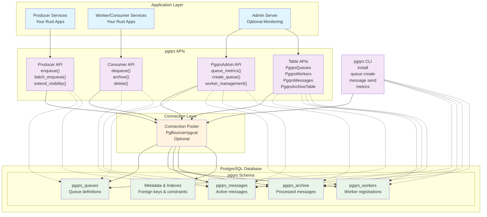

# Concepts

## Architecture

pgqrs is a job queue library built around PostgreSQL with a clean separation of concerns. The architecture consists of Producer, Consumer and Admin roles. System metadata and queue items are stored in tables.

### System Overview

### Component Details

#### 1. **PostgreSQL Database**
- **Central storage** for all queue data with proper relational design
- **Four core tables** with foreign key relationships:
	- `pgqrs_queues`: Queue definitions and metadata
	- `pgqrs_workers`: Worker registrations linked to queues
	- `pgqrs_messages`: Active messages awaiting processing
	- `pgqrs_archive`: Processed messages for audit trails
- **ACID compliance** ensures message durability and exactly-once processing
- **SKIP LOCKED** feature enables efficient concurrent message processing
- **Referential integrity** maintains data consistency across tables

#### 2. **Producer Services - Message Creation**
- **Your Rust applications** that create and enqueue jobs
- **Producer API** for message creation operations
- **Key operations**:
	- `producer.enqueue(payload)` - Add single job to queue
	- `producer.batch_enqueue(payloads)` - Add multiple jobs efficiently
	- `producer.enqueue_delayed(payload, delay)` - Schedule future jobs
	- `producer.extend_visibility(msg_id, duration)` - Extend job processing time
- **Validation & rate limiting** built-in for message integrity
- **Queue-specific instances** for type safety and performance

#### 3. **Consumer Services - Message Processing**
- **Your Rust applications** that process jobs from queues
- **Consumer API** for message consumption operations
- **Key operations**:
	- `consumer.dequeue()` - Fetch single job with automatic locking
	- `consumer.dequeue_batch(size)` - Fetch multiple jobs efficiently
	- `consumer.archive(msg_id)` - Archive processed message for audit trail
	- `consumer.delete(msg_id)` - Remove completed message
	- `consumer.delete_batch(msg_ids)` - Remove multiple completed messages
- **Automatic visibility timeouts** prevent stuck jobs
- **Queue-specific instances** for focused processing

#### 4. **Table APIs - Direct Data Access**
- **Table trait interface** for consistent CRUD operations
- **Four table implementations**:
	- `PgqrsQueues`: Manage queue definitions (`insert`, `get`, `list`, `delete`)
	- `PgqrsWorkers`: Manage worker registrations with queue relationships
	- `PgqrsMessages`: Direct message table access (typically used by Producer/Consumer)
	- `PgqrsArchiveTable`: Archive management with full CRUD support
- **Common interface methods**:
	- `count()` - Count total records
	- `count_by_fk(id)` - Count records by foreign key relationship
	- `filter_by_fk(id)` - List records by foreign key relationship
- **Type-safe operations** with proper error handling

#### 5. **Admin Server - System Management**
- **Your monitoring/admin service** using `PgqrsAdmin` APIs
- **Cross-cutting concerns** for system health and management
- **Key operations**:
	- `admin.queue_metrics(name)` - Get queue health metrics
	- `admin.all_queues_metrics()` - System-wide monitoring
	- `admin.create_queue(name)` - Queue lifecycle management
	- `admin.worker_management()` - Worker registration and health
	- `admin.purge_archive(name)` - Archive cleanup operations
	- `admin.install()` / `admin.uninstall()` - Schema management

#### 6. **Connection Pooler (Optional)**
- **PgBouncer or pgcat** for connection management and scaling
- **Connection multiplexing** allows more workers than database connections
- **Transaction-mode compatibility** for queue operations

#### 7. **pgqrs CLI**
- **Command-line tool** for administrative operations
- **Direct database access** for debugging and management
- **Key commands**:
	- `pgqrs install` - Set up database schema with all tables
	- `pgqrs queue create <name>` - Create new queues
	- `pgqrs queue metrics <name>` - Inspect queue health

### Data Flow

1. **Job Creation**: Producer services use dedicated `Producer` instances to add jobs to the `pgqrs_messages` table
2. **Worker Registration**: Worker services register with `pgqrs_workers` table linking to specific queues
3. **Job Processing**: Consumer services use `Consumer` instances to fetch jobs with automatic locking
4. **Job Archiving**: Consumers mark jobs as completed by using `archive()` to move completed jobs to `pgqrs_archive`.
5. **Job Deletion**: Optionally, consumers use `delete()` to delete jobs from `pgqrs_messages` table
6. **System Monitoring**: Admin services query across all tables for metrics and health monitoring

### Scalability Patterns

- **Horizontal Workers**: Run multiple consumer instances for increased throughput
- **Producer Scaling**: Scale producer services independently based on job creation load
- **Queue Partitioning**: Use multiple queues to distribute load and isolate workloads
- **Connection Pooling**: PgBouncer enables more workers than database connections
- **Batch Processing**: Process multiple jobs per database transaction for efficiency
- **Worker Registration**: Track and monitor worker health via `pgqrs_workers` table

### Deployment Considerations

- **Database**: Single PostgreSQL instance or managed service (RDS, Cloud SQL)
- **Workers**: Deploy as separate services/containers, scale independently
- **Producers**: Integrate pgqrs library into existing application services
- **Admin/CLI**: Use for operational management and debugging
