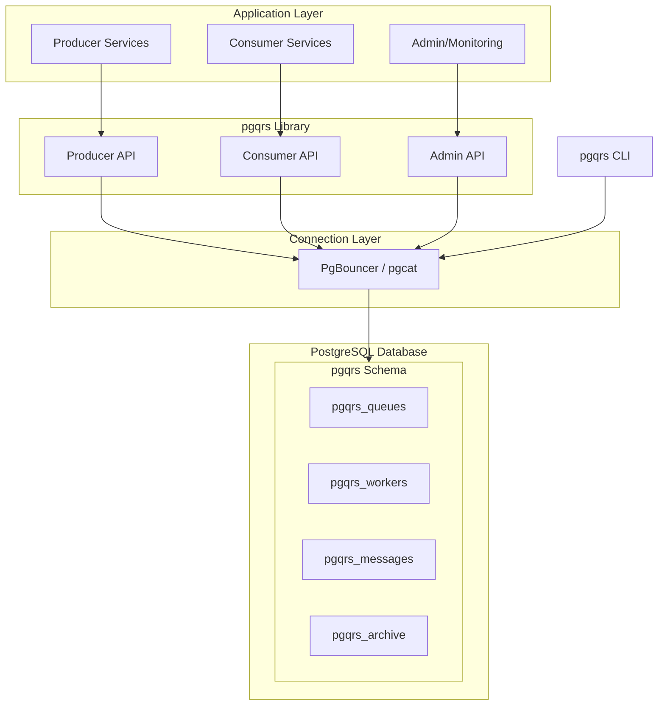
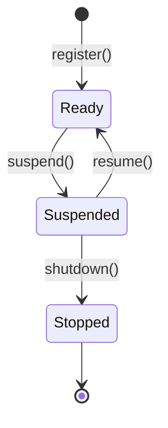
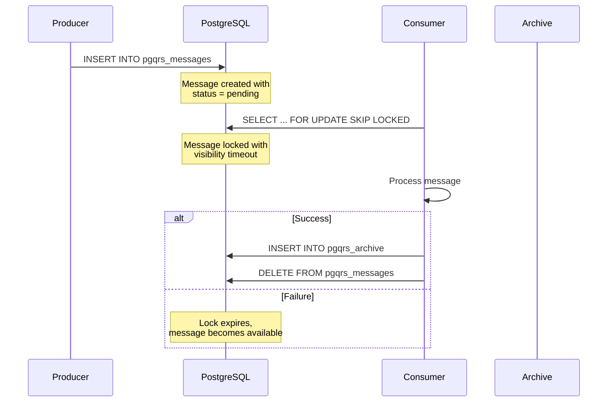

# Architecture

This page provides a comprehensive overview of pgqrs's architecture and design principles.

## Overview

pgqrs is a job queue library built around PostgreSQL with a clean separation of concerns. The architecture consists of three main roles: **Producer**, **Consumer**, and **Admin**. System metadata and queue items are stored in PostgreSQL tables.

## System Diagram



## Core Components

### 1. PostgreSQL Database

The foundation of pgqrs. All queue data is stored in PostgreSQL tables with proper relational design.

**Four core tables:**

| Table | Purpose |
|-------|---------|
| `pgqrs_queues` | Queue definitions and metadata |
| `pgqrs_workers` | Worker registrations linked to queues |
| `pgqrs_messages` | Active messages awaiting processing |
| `pgqrs_archive` | Processed messages for audit trails |

**Key PostgreSQL features used:**

- **ACID compliance** ensures message durability and exactly-once processing
- **`SKIP LOCKED`** enables efficient concurrent message processing without blocking
- **Foreign keys** maintain referential integrity across tables
- **Indexes** optimize queue operations

### 2. Producer

Producers create and enqueue messages to queues.

**Key operations:**

| Method | Description |
|--------|-------------|
| `enqueue(payload)` | Add a single message to the queue |
| `batch_enqueue(payloads)` | Add multiple messages efficiently |
| `enqueue_delayed(payload, delay)` | Schedule a message for future processing |
| `extend_visibility(msg_id, duration)` | Extend processing time for a message |

**Features:**

- Automatic worker registration
- Built-in payload validation
- Rate limiting support
- Queue-specific instances for type safety

### 3. Consumer

Consumers fetch and process messages from queues.

**Key operations:**

| Method | Description |
|--------|-------------|
| `dequeue()` | Fetch messages with automatic locking |
| `dequeue_many_with_delay(count, lock_time)` | Fetch batch with custom lock time |
| `archive(msg_id)` | Archive a processed message |
| `delete(msg_id)` | Delete a message without archiving |
| `delete_many(msg_ids)` | Batch delete messages |

**Features:**

- Automatic visibility timeouts prevent stuck jobs
- Batch processing support
- Archive or delete completed messages

### 4. Admin

Admin provides system management and monitoring capabilities.

**Key operations:**

| Method | Description |
|--------|-------------|
| `install()` | Set up the pgqrs schema |
| `verify()` | Verify schema installation |
| `create_queue(name)` | Create a new queue |
| `delete_queue(name)` | Delete a queue and its messages |
| `queue_metrics(name)` | Get queue health metrics |
| `all_queues_metrics()` | System-wide monitoring |

### 5. Workers

Workers are the runtime identity of Producers and Consumers. Each Producer or Consumer instance registers itself as a worker.

**Worker Lifecycle:**



**Worker States:**

| State | Description |
|-------|-------------|
| `Ready` | Active and processing work |
| `Suspended` | Paused, not accepting new work |
| `Stopped` | Completed shutdown (terminal) |

## Data Flow

1. **Message Creation**: Producer enqueues a message to `pgqrs_messages`
2. **Worker Registration**: Workers register in `pgqrs_workers` linking to their queue
3. **Message Fetch**: Consumer dequeues using `SELECT ... FOR UPDATE SKIP LOCKED`
4. **Processing**: Message is locked with a visibility timeout
5. **Completion**: Consumer archives to `pgqrs_archive` or deletes
6. **Monitoring**: Admin queries all tables for metrics



## Scalability Patterns

### Horizontal Scaling

- **Multiple Consumers**: Run multiple consumer instances for increased throughput
- **Multiple Producers**: Scale producers independently based on message creation load
- **Queue Partitioning**: Use multiple queues to distribute and isolate workloads

### Connection Pooling

pgqrs works with connection poolers like PgBouncer and pgcat:

- Enables more workers than database connections
- Transaction-mode compatible for queue operations
- Reduces database connection overhead

### Batch Processing

Process multiple messages per database transaction for efficiency:

```rust
// Fetch up to 100 messages with 30-second lock
let messages = consumer.dequeue_many_with_delay(100, 30).await?;

// Process and archive in batch
let ids: Vec<i64> = messages.iter().map(|m| m.id).collect();
consumer.archive_many(ids).await?;
```

## Deployment Patterns

### Simple Setup

```
┌─────────────┐     ┌──────────────┐
│ Application │────▶│  PostgreSQL  │
│  (pgqrs)    │     │   Database   │
└─────────────┘     └──────────────┘
```

### With Connection Pooler

```
┌─────────────┐     ┌───────────┐     ┌──────────────┐
│ Application │────▶│ PgBouncer │────▶│  PostgreSQL  │
│  (pgqrs)    │     │           │     │   Database   │
└─────────────┘     └───────────┘     └──────────────┘
```

### Scaled Deployment

```
┌───────────────┐
│  Producer 1   │───┐
├───────────────┤   │     ┌───────────┐     ┌──────────────┐
│  Producer 2   │───┼────▶│ PgBouncer │────▶│  PostgreSQL  │
├───────────────┤   │     └───────────┘     │   (Primary)  │
│  Consumer 1   │───┤                       └──────────────┘
├───────────────┤   │
│  Consumer 2   │───┤
├───────────────┤   │
│  Consumer 3   │───┘
└───────────────┘
```

## Design Principles

1. **Library-only**: No additional servers or infrastructure to operate
2. **PostgreSQL-native**: Leverage PostgreSQL's reliability and features
3. **Exactly-once delivery**: Within the visibility timeout window
4. **Simple API**: Easy to understand and use correctly
5. **Observable**: Built-in metrics and monitoring support

## What's Next?

- [Producer & Consumer](producer-consumer.md) - Deep dive into message handling
- [Workers](workers.md) - Understanding worker lifecycle
- [Message Lifecycle](message-lifecycle.md) - Message states and transitions
