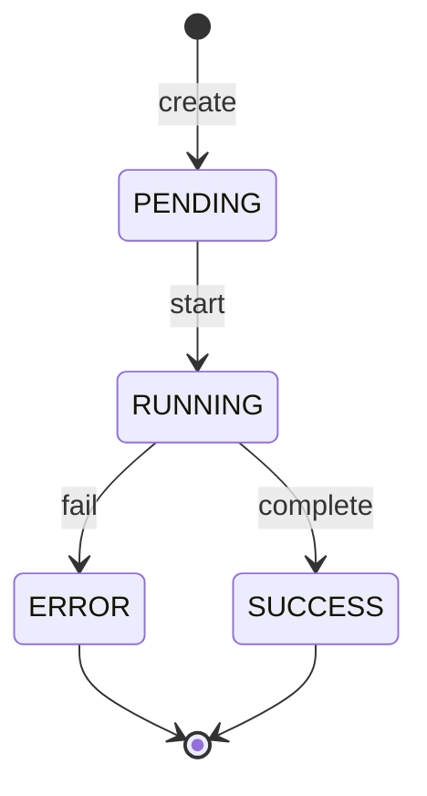
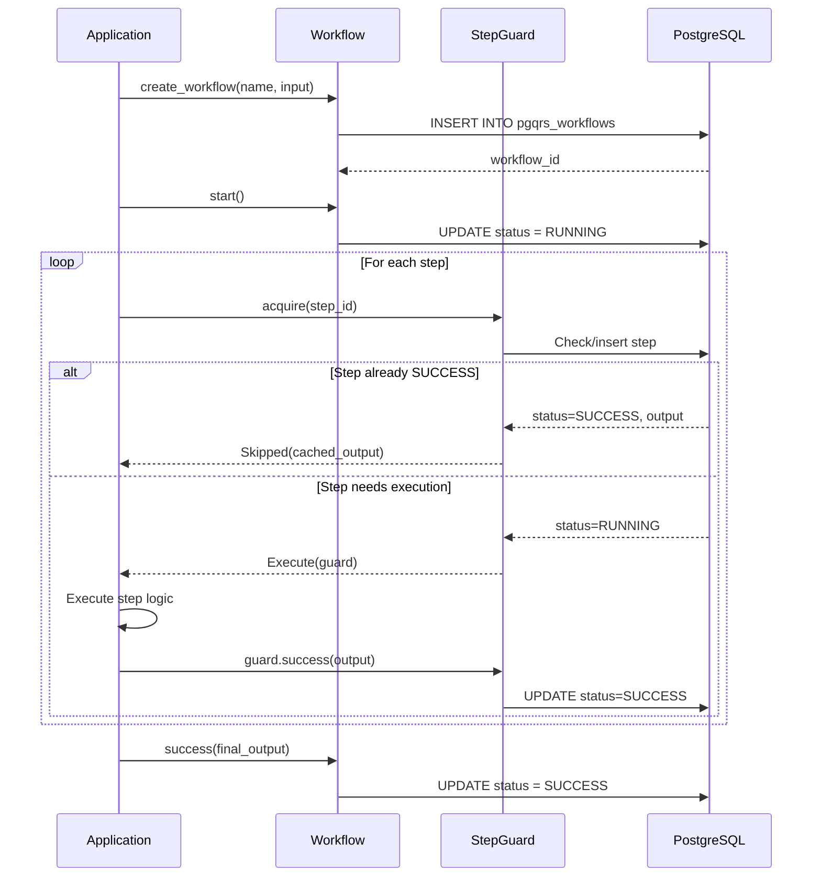

# Durable Workflows

Durable workflows extend pgqrs to support multi-step, resumable execution that survives crashes, restarts, and long pauses.

## Overview

Traditional job queues process individual messages independently. Durable workflows go further by orchestrating multiple steps into a cohesive execution unit with:

- **Crash recovery**: Execution resumes from the last completed step after failures
- **Exactly-once semantics**: Completed steps are never re-executed
- **Persistent state**: All progress is stored in PostgreSQL
- **Code-first approach**: Define workflows using native language constructs

## Key Concepts

### Workflow

A workflow is a durable, interruptible execution of code composed of multiple steps. It has a unique ID and tracks overall execution status.

| Property | Description |
|----------|-------------|
| `workflow_id` | Unique identifier for the execution |
| `name` | Workflow type name |
| `status` | Current state: `PENDING`, `RUNNING`, `SUCCESS`, or `ERROR` |
| `input` | Initial input payload (JSON) |
| `output` | Final result if successful (JSON) |
| `error` | Error details if failed (JSON) |

### Step

A step is a single, atomic unit of execution within a workflow. Each step is identified by a unique `step_id` and tracked independently.

| Property | Description |
|----------|-------------|
| `step_id` | Unique identifier within the workflow |
| `status` | Current state: `PENDING`, `RUNNING`, `SUCCESS`, or `ERROR` |
| `output` | Step result if successful (JSON) |
| `error` | Error details if failed (JSON) |

### Workflow Status Transitions



## Architecture

Durable workflows leverage pgqrs's PostgreSQL foundation to persist state.

### Database Schema

Two tables track workflow execution:

**`pgqrs_workflows`** - Stores workflow-level state:

```sql
CREATE TABLE pgqrs_workflows (
    workflow_id BIGSERIAL PRIMARY KEY,
    name VARCHAR(255) NOT NULL,
    status pgqrs_workflow_status NOT NULL,
    input JSONB,
    output JSONB,
    error JSONB,
    created_at TIMESTAMPTZ NOT NULL DEFAULT NOW(),
    updated_at TIMESTAMPTZ NOT NULL DEFAULT NOW(),
    executor_id VARCHAR(255)
);
```

**`pgqrs_workflow_steps`** - Stores step-level state:

```sql
CREATE TABLE pgqrs_workflow_steps (
    workflow_id BIGINT NOT NULL REFERENCES pgqrs_workflows(workflow_id),
    step_id VARCHAR(255) NOT NULL,
    status pgqrs_workflow_status NOT NULL,
    input JSONB,
    output JSONB,
    error JSONB,
    started_at TIMESTAMPTZ,
    completed_at TIMESTAMPTZ,
    PRIMARY KEY (workflow_id, step_id)
);
```

### Execution Model



## Crash Recovery

The key feature of durable workflows is automatic recovery after crashes.

### How It Works

1. **Step completion is atomic**: Each step's output is persisted to PostgreSQL before returning
2. **Step checking is idempotent**: When acquiring a step, the system checks if it's already complete
3. **Skipping completed steps**: If a step was already successful, its cached output is returned immediately

### Recovery Scenario

```
RUN 1 (crashes after Step 2):
├── Step 1: Execute → SUCCESS ✓
├── Step 2: Execute → SUCCESS ✓
├── Step 3: Execute → CRASH! ✗
└── Workflow status: RUNNING

RUN 2 (resumes):
├── Step 1: Check → SKIPPED (cached) ✓
├── Step 2: Check → SKIPPED (cached) ✓
├── Step 3: Execute → SUCCESS ✓
└── Workflow status: SUCCESS
```

## Exactly-Once Semantics

pgqrs provides **exactly-once logical execution** of workflow steps:

!!! note "Important Distinction"
    Exactly-once applies to the *logical execution* of steps. External side effects (API calls, file writes) may still need additional idempotency handling.

### Guarantees

- A step that returned `SUCCESS` will never execute again
- The cached output from successful steps is always returned
- A step in `ERROR` state is terminal and blocks re-execution

### Implementation

The `StepGuard` uses PostgreSQL's `INSERT ... ON CONFLICT` to atomically:

1. Check if the step exists and its status
2. Insert or update the step record
3. Return the appropriate state to the caller

## Dynamic Workflows

Since workflows are code-first, dynamic execution patterns are supported naturally:

=== "Rust"

    ```rust
    #[pgqrs_workflow]
    async fn dynamic_flow(ctx: &Workflow, condition: bool) -> Result<String, anyhow::Error> {
        let result = step_a(ctx).await?;

        if condition {
            // Only executed if condition is True
            step_b(ctx, result).await
        } else {
            // Alternative path
            step_c(ctx, result).await
        }
    }
    ```

=== "Python"

    ```python
    @workflow
    async def dynamic_flow(ctx, condition: bool):
        result = await step_a(ctx)

        if condition:
            # Only executed if condition is True
            await step_b(ctx, result)
        else:
            # Alternative path
            await step_c(ctx, result)
    ```

The workflow structure is determined at runtime, with each execution potentially taking different paths based on inputs or intermediate results.

## Comparison with Other Systems

| Feature | pgqrs | Temporal | Airflow |
|---------|-------|----------|---------|
| Definition | Code-first | Code-first | DAG object |
| State storage | PostgreSQL | Dedicated cluster (Cassandra/PostgreSQL) | PostgreSQL/MySQL |
| Dynamic flows | Native | Native | Limited |
| Dependencies | PostgreSQL only | Temporal server + DB | Scheduler + DB |
| Language | Rust, Python | Multiple | Python |

## Best Practices

### Step Granularity

Design steps at the right level of granularity:

- **Too fine**: Excessive database overhead
- **Too coarse**: Lost progress on failure

=== "Rust"

    ```rust
    // Good: Logical units of work
    #[pgqrs_step]
    async fn fetch_user_data(ctx: &Workflow, user_id: i64) -> Result<User, anyhow::Error> {
        api::get_user(user_id).await
    }

    #[pgqrs_step]
    async fn process_user(ctx: &Workflow, user_data: User) -> Result<ProcessedUser, anyhow::Error> {
        Ok(transform(user_data))
    }

    // Bad: Too granular
    #[pgqrs_step]
    async fn get_user_name(ctx: &Workflow, user_id: i64) -> Result<String, anyhow::Error> {
        Ok(user_data.name.clone())  // Too small
    }
    ```

=== "Python"

    ```python
    # Good: Logical units of work
    @step
    async def fetch_user_data(ctx, user_id):
        return await api.get_user(user_id)

    @step
    async def process_user(ctx, user_data):
        return transform(user_data)

    # Bad: Too granular
    @step
    async def get_user_name(ctx, user_id):
        return user_data["name"]  # Too small
    ```

### Idempotent External Calls

For external side effects, implement idempotency:

=== "Rust"

    ```rust
    #[pgqrs_step]
    async fn charge_payment(ctx: &Workflow, order_id: &str, amount: f64) -> Result<PaymentResult, anyhow::Error> {
        // Use idempotency key to prevent double charges
        let idempotency_key = format!("order-{}", order_id);
        payment_api::charge(&idempotency_key, amount).await
    }
    ```

=== "Python"

    ```python
    @step
    async def charge_payment(ctx, order_id, amount):
        # Use idempotency key to prevent double charges
        return await payment_api.charge(
            idempotency_key=f"order-{order_id}",
            amount=amount
        )
    ```

### Error Handling

Steps that fail are marked as `ERROR` and are terminal. Design accordingly:

=== "Rust"

    ```rust
    use std::io;

    #[pgqrs_step]
    async fn risky_operation(ctx: &Workflow, data: &str) -> Result<ApiResponse, anyhow::Error> {
        match external_api::call(data).await {
            Ok(response) => Ok(response),
            Err(e) => {
                // Check for transient errors (e.g., timeout)
                if let Some(io_err) = e.downcast_ref::<io::Error>() {
                    if io_err.kind() == io::ErrorKind::TimedOut {
                        // Re-raise to retry on next workflow run
                        return Err(e);
                    }
                }
                // Return permanent errors as data instead of failing
                Ok(ApiResponse { error: Some(e.to_string()), data: None })
            }
        }
    }
    ```

=== "Python"

    ```python
    @step
    async def risky_operation(ctx, data):
        try:
            return await external_api.call(data)
        except RetryableError:
            # Re-raise to retry on next workflow run
            raise
        except PermanentError as e:
            # Return error as data instead of failing
            return {"error": str(e), "data": None}
    ```

## Next Steps

- [Durable Workflows Guide](../guides/durable-workflows.md): Step-by-step tutorial
- [Workflow API](../api/workflows.md): Detailed API reference
