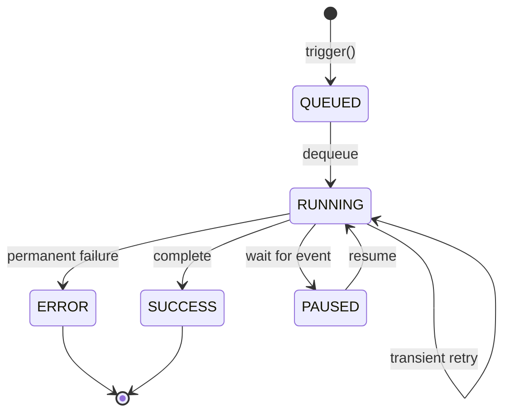
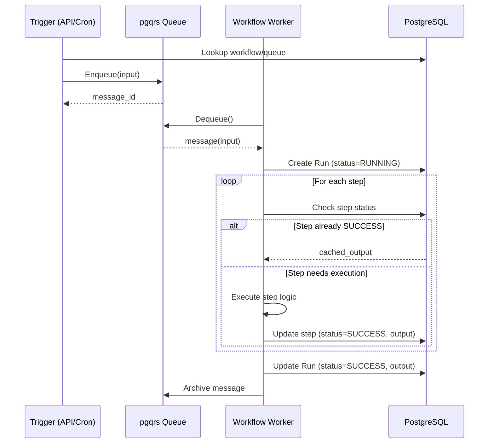

# Durable Workflows

Durable workflows extend pgqrs to support multi-step, resumable execution that survives crashes, restarts, and long pauses.

## Overview

Traditional job queues process individual messages independently. Durable workflows go further by orchestrating multiple steps into a cohesive execution unit with:

- **Crash recovery**: Execution resumes from the last completed step after failures
- **Exactly-once semantics**: Completed steps are never re-executed
- **Persistent state**: All progress is stored in PostgreSQL
- **Code-first approach**: Define workflows using native language constructs
- **Trigger/Worker separation**: Decouple workflow submission from execution

## Trigger/Worker Model

In v0.14, pgqrs introduces a clear separation between **Triggers** and **Workers**:

- **Triggers**: Submit workflow runs by enqueuing an input payload. Triggers can be HTTP handlers, cron jobs, or event listeners.
- **Workers**: Centralized processes that poll for work, create execution runs, and process steps.
- **Queues**: Each workflow name maps 1:1 to a PostgreSQL queue.

This separation allows for fast-fail validation at trigger time and centralized management of execution logic.

## Key Concepts

### Workflow Definition

A workflow definition is a named template (e.g., `zip_files`) that maps to a specific queue. It is created once during setup.

| Property | Description |
|----------|-------------|
| `workflow_id` | Unique identifier for the definition |
| `name` | Unique name (e.g., `process_order_v1`) |
| `queue_id` | Reference to the associated pgqrs queue |

### Workflow Run

A workflow run is a specific execution instance of a definition. It tracks the overall status and stores the input/output for that specific execution.

| Property | Description |
|----------|-------------|
| `run_id` | Unique identifier for the execution instance |
| `workflow_id` | Reference to the workflow definition |
| `status` | Current state: `QUEUED`, `RUNNING`, `PAUSED`, `SUCCESS`, or `ERROR` |
| `input` | Initial input payload (JSON) |
| `output` | Final result if successful (JSON) |
| `error` | Error details if failed (JSON) |

### Step

A step is a single, atomic unit of execution within a workflow run. Each step is identified by a unique `step_id` and tracked independently for crash recovery.

| Property | Description |
|----------|-------------|
| `run_id` | Reference to the workflow run |
| `step_id` | Unique identifier within the run |
| `status` | Current state: `RUNNING`, `PAUSED`, `SUCCESS`, or `ERROR` |
| `output` | Step result if successful (JSON) |
| `error` | Error details if failed (JSON) |

## Workflow Lifecycle

Workflow runs transition through several states during their lifecycle:



- **QUEUED**: The trigger has enqueued the input; no worker has picked it up yet.
- **RUNNING**: A worker is currently executing the workflow steps.
- **PAUSED**: The workflow is waiting for an external event or a scheduled interval.
- **SUCCESS**: The workflow completed all steps successfully (Terminal).
- **ERROR**: The workflow encountered a permanent failure (Terminal).

## Architecture

Durable workflows leverage pgqrs's PostgreSQL foundation to persist state across three primary tables.

### Database Schema

**`pgqrs_workflows`** - Stores workflow definitions:

```sql
CREATE TABLE pgqrs_workflows (
    workflow_id BIGSERIAL PRIMARY KEY,
    name VARCHAR(255) NOT NULL UNIQUE,
    queue_id BIGINT NOT NULL REFERENCES pgqrs_queues(queue_id),
    created_at TIMESTAMPTZ NOT NULL DEFAULT NOW()
);
```

**`pgqrs_workflow_runs`** - Stores execution instances:

```sql
CREATE TABLE pgqrs_workflow_runs (
    run_id BIGSERIAL PRIMARY KEY,
    workflow_id BIGINT NOT NULL REFERENCES pgqrs_workflows(workflow_id),
    status VARCHAR(50) NOT NULL, -- QUEUED, RUNNING, PAUSED, SUCCESS, ERROR
    input JSONB,
    output JSONB,
    error JSONB,
    created_at TIMESTAMPTZ NOT NULL DEFAULT NOW(),
    started_at TIMESTAMPTZ,
    paused_at TIMESTAMPTZ,
    completed_at TIMESTAMPTZ,
    worker_id BIGINT REFERENCES pgqrs_workers(worker_id)
);
```

**`pgqrs_workflow_steps`** - Stores step-level state for recovery:

```sql
CREATE TABLE pgqrs_workflow_steps (
    run_id BIGINT NOT NULL REFERENCES pgqrs_workflow_runs(run_id),
    step_id VARCHAR(255) NOT NULL,
    status VARCHAR(50) NOT NULL, -- RUNNING, PAUSED, SUCCESS, ERROR
    input JSONB,
    output JSONB,
    error JSONB,
    started_at TIMESTAMPTZ,
    completed_at TIMESTAMPTZ,
    PRIMARY KEY (run_id, step_id)
);
```

### Execution Model

The execution flow ensures that triggers only interact with the queue, while workers manage the run lifecycle.



## Crash Recovery

The key feature of durable workflows is automatic recovery after worker crashes.

### How It Works

1. **Step completion is atomic**: Each step's output is persisted to PostgreSQL before the next step begins.
2. **Message Visibility**: When a worker dequeues a message, it becomes invisible to other workers. If the worker crashes, the message becomes visible again after a timeout.
3. **Resumption**: A new worker dequeues the same message, recreates the run context, and re-executes the handler.
4. **Skipping completed steps**: The `ctx.step()` method checks the database. If a step was already successful, it returns the cached output immediately without re-running the logic.

## Retry and Pause

### DRY Retry Principle

pgqrs uses the **DRY (Don't Repeat Yourself) Retry** principle. Retry timing is managed entirely by the message queue's visibility, not by separate columns in the workflow tables.

- **Transient Errors**: If a step fails with a retryable error, the worker updates the message's `visible_after` timestamp. The worker then moves on to other work. When the timestamp elapses, the message is redelivered and the workflow resumes.
- **No `retry_at`**: There is no `retry_at` column in the steps table. The message queue is the single source of truth for when work should resume.

### Pause and Resume

Workflows can enter a `PAUSED` state when waiting for external events (e.g., human approval or a webhook).

1. The handler returns a `Pause` signal with a check interval.
2. The worker updates the run status to `PAUSED` and sets the message visibility to the next check time.
3. External systems can resume a workflow by updating the step status in the database or making the message visible immediately.

## API Patterns

### Triggering a Workflow

Triggers use a noun-verb pattern to submit work.

=== "Rust"

    ```rust
    let message = workflow("zip_files")
        .trigger(&ZipParams { bucket, prefix })?
        .execute(&store)
        .await?;
    ```

=== "Python"

    ```python
    message = await workflow("zip_files") \
        .trigger(ZipParams(bucket=bucket, prefix=prefix)) \
        .execute(store)
    ```

### Defining Steps

Handlers use the `ctx.step()` method to wrap atomic units of work.

=== "Rust"

    ```rust
    async fn zip_files_handler(ctx: &mut dyn Workflow, params: ZipParams) -> Result<ZipResult, Error> {
        let files = ctx.step("list_files", || async {
            s3::list_objects(&params.bucket, &params.prefix).await
        }).await?;
        
        // ...
    }
    ```

=== "Python"

    ```python
    async def zip_files_handler(ctx, params: ZipParams):
        files = await ctx.step("list_files", lambda: s3.list_objects(params.bucket, params.prefix))
        # ...
    ```

## Versioning

pgqrs identifies workflows by name. To support multiple versions of a workflow, include the version in the name.

**Recommended Naming Convention**: `{workflow_name}_v{version}` (e.g., `process_invoice_v1`, `process_invoice_v2`).

This allows you to:
- Run multiple versions of a worker simultaneously.
- Route new triggers to the latest version while allowing old runs to complete on the previous version.

## Best Practices

### Step Granularity

Design steps at the right level of granularity:

- **Too fine**: Excessive database overhead for small operations.
- **Too coarse**: Large amounts of work lost on failure; harder to ensure idempotency.

### Idempotent External Calls

Exactly-once semantics apply to the *logical execution* of steps. External side effects (API calls, file writes) should be idempotent, as a step might be partially executed before a crash.

### Error Classification

- **Permanent Errors**: Return an `ERROR` status. The message is archived, and the run is marked as failed.
- **Transient Errors**: Raise a retryable error. The message stays in the queue for redelivery.

## Next Steps

- [Durable Workflows Guide](../guides/durable-workflows.md): Step-by-step tutorial
- [Workflow API](../api/workflows.md): Detailed API reference
