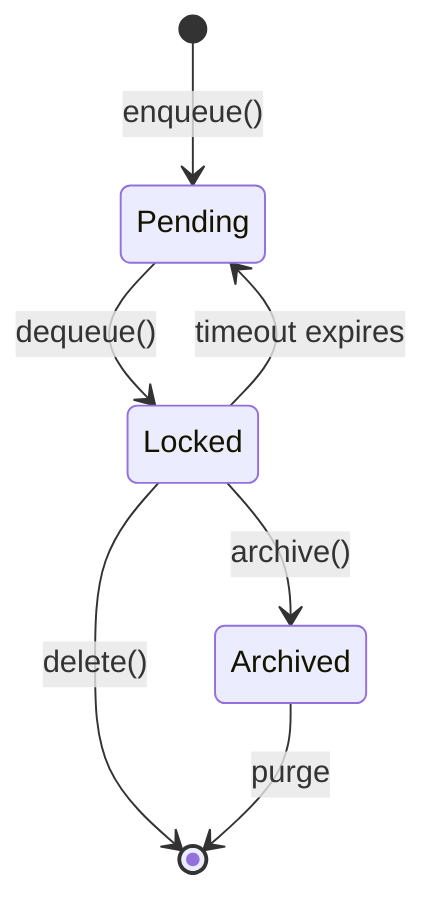
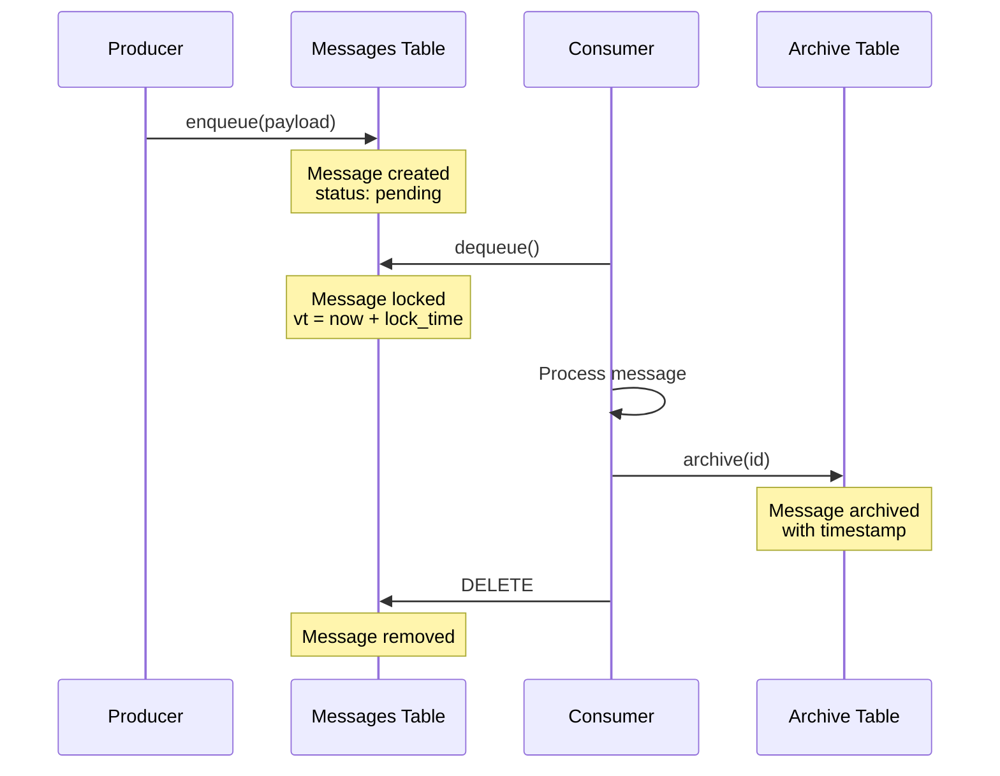
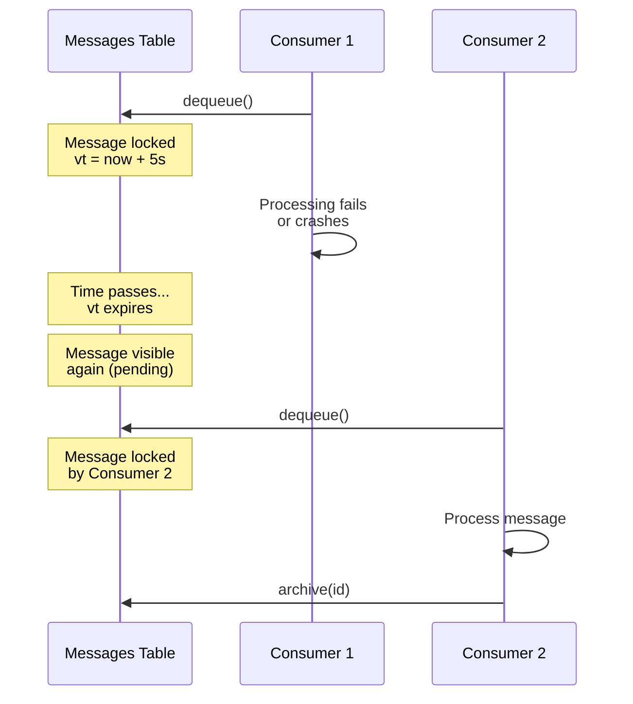
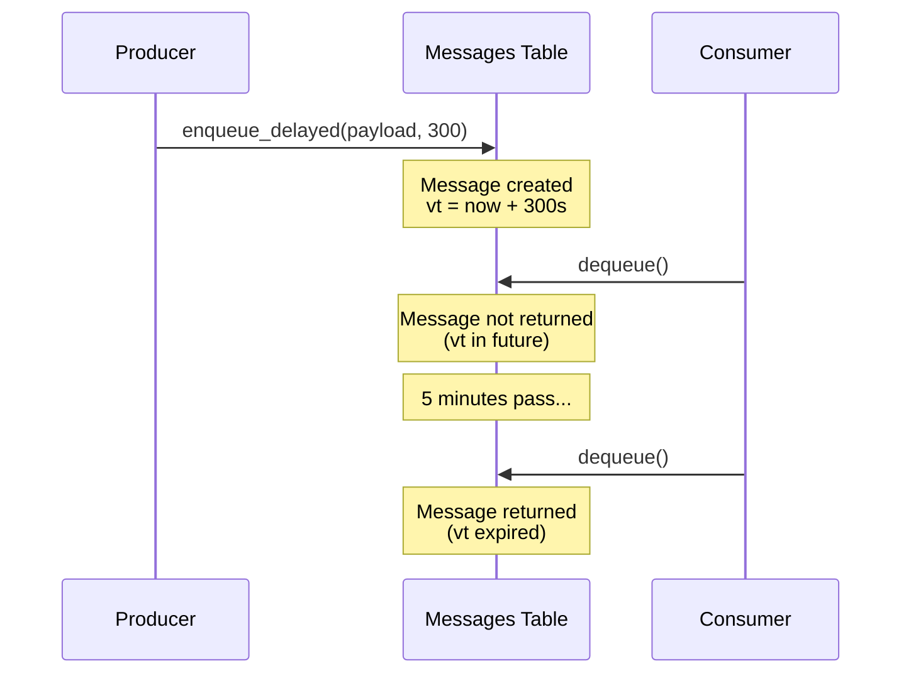
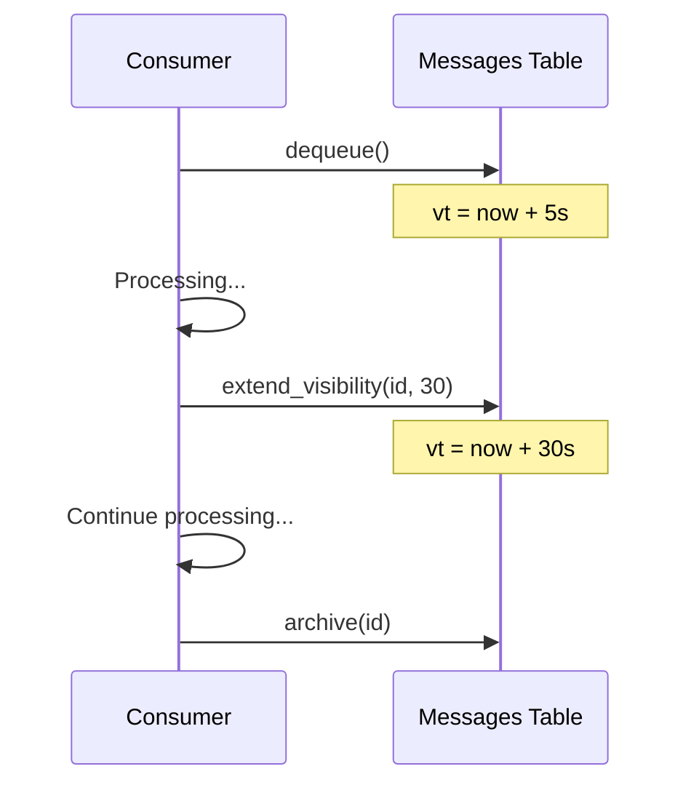

# Message Lifecycle

This page explains the complete lifecycle of a message in pgqrs, from creation to archival.

## Overview

Messages in pgqrs go through several states as they move through the system:



## Message States

### Pending

A message is **pending** when it's in the queue and available for processing.

**Characteristics:**
- Visible to consumers
- `vt` (visibility timeout) is in the past or NULL
- Can be dequeued

**How to get here:**
- `producer.enqueue()` - immediate availability
- `producer.enqueue_delayed()` - after delay expires
- Lock timeout expires on a locked message

### Locked

A message is **locked** when a consumer has dequeued it and is processing it.

**Characteristics:**
- Not visible to other consumers
- `vt` (visibility timeout) is in the future
- `read_ct` incremented
- Associated with a specific worker

**How to get here:**
- `consumer.dequeue()`

**Transitions:**
- → **Archived**: `consumer.archive()`
- → **Deleted**: `consumer.delete()`
- → **Pending**: Visibility timeout expires

### Archived

A message is **archived** when processing completed successfully and the message was moved to the archive table.

**Characteristics:**
- Stored in `pgqrs_archive` table
- Includes original payload and metadata
- Records `archived_at` timestamp
- Useful for audit trails

**How to get here:**
- `consumer.archive()`

### Deleted

A message is **deleted** when it's removed from the system entirely.

**Characteristics:**
- No longer exists in any table
- Cannot be recovered
- No audit trail

**How to get here:**
- `consumer.delete()`

## Message Flow

### Normal Processing Flow



### Timeout and Retry Flow



## Message Fields

### In Messages Table

| Field | Type | Description |
|-------|------|-------------|
| `id` | `BIGINT` | Unique identifier |
| `queue_id` | `BIGINT` | Reference to queue |
| `payload` | `JSONB` | Your message data |
| `enqueued_at` | `TIMESTAMPTZ` | When message was created |
| `vt` | `TIMESTAMPTZ` | Visibility timeout (lock expiry) |
| `read_ct` | `INT` | Number of dequeue attempts |

### In Archive Table

| Field | Type | Description |
|-------|------|-------------|
| `id` | `BIGINT` | Original message ID |
| `queue_id` | `BIGINT` | Reference to queue |
| `payload` | `JSONB` | Original message data |
| `enqueued_at` | `TIMESTAMPTZ` | Original creation time |
| `archived_at` | `TIMESTAMPTZ` | When archived |
| `read_ct` | `INT` | Final read count |

## Delayed Messages

Delayed messages have a `vt` set in the future at creation time:

=== "Rust"

    ```rust
    // Message won't be visible for 5 minutes
    let message = producer.enqueue_delayed(&payload, 300).await?;
    ```

=== "Python"

    ```python
    import pgqrs
    import asyncio

    admin = pgqrs.Admin("postgresql://localhost/mydb")
    producer = pgqrs.Producer(admin, "tasks", "scheduler", 8080)

    # Send delayed message (available in 300 seconds = 5 minutes)
    message_id = await producer.enqueue_delayed(
        {"task": "send_reminder", "user_id": 123},
        delay_seconds=300
    )

    print(f"Scheduled message {message_id} for future processing")
    ```



## Visibility Extension

Extend the lock on a message if processing takes longer:

=== "Rust"

    ```rust
        // Processing taking longer than expected...
    consumer.extend_visibility(message.id, 30).await?;
    ```

=== "Python"

    ```python
    import pgqrs
    import asyncio

    admin = pgqrs.Admin("postgresql://localhost/mydb")
    consumer = pgqrs.Consumer(admin, "tasks", "worker1", 8080)

    # Dequeue and extend processing time
    messages = await consumer.dequeue()
    if messages:
        msg = messages[0]

        # Extend visibility by 5 minutes (300 seconds)
        await consumer.extend_visibility(msg.id, extension_seconds=300)

        # Continue processing with extended timeout
        result = await long_running_task(msg.payload)
        await consumer.archive(msg.id)
    ```



## Read Count

The `read_ct` field tracks how many times a message has been dequeued:

| read_ct | Meaning |
|---------|---------|
| 1 | First attempt |
| 2 | Second attempt (first retry) |
| 3+ | Multiple retries |

Use this for dead-letter queue logic:

=== "Rust"

    ```rust
    let messages = consumer.dequeue().await?;
    for message in messages {
        if message.read_ct > 3 {
            // Move to dead-letter queue
            move_to_dlq(&message).await?;
            consumer.delete(message.id).await?;
        } else {
            // Normal processing
            process(&message).await?;
            consumer.archive(message.id).await?;
        }
    }
    ```

=== "Python"

    ```python
    messages = await consumer.dequeue()
    for message in messages:
        # Note: read_ct field access depends on QueueMessage implementation
        # Currently archive is available, delete is not yet exposed
        try:
            await process(message)
            await consumer.archive(message.id)
        except Exception as e:
            print(f"Failed to process message {message.id}: {e}")
            # Message will become available again after lock expires
    ```

    !!! note
        The `delete` method and `read_ct` field access may not be fully exposed in Python bindings yet.

## Archive vs Delete

Choose based on your requirements:

| Operation | Use When |
|-----------|----------|
| **Archive** | Need audit trail, compliance requirements, debugging |
| **Delete** | No retention needed, minimize storage, ephemeral data |

### Archive

=== "Rust"

    ```rust
    consumer.archive(message.id).await?;
    // Message moved to pgqrs_archive, audit trail preserved
    ```

=== "Python"

    ```python
    await consumer.archive(message.id)
    # Message moved to pgqrs_archive, audit trail preserved
    ```

### Delete

=== "Rust"

    ```rust
    consumer.delete(message.id).await?;
    // Message gone forever, no audit trail
    ```

=== "Python"

    ```python
    import pgqrs
    import json

    admin = pgqrs.Admin("postgresql://localhost/mydb")
    consumer = pgqrs.Consumer(admin, "tasks", "worker1", 8080)

    # Dequeue and handle poison message
    messages = await consumer.dequeue()
    if messages:
        msg = messages[0]

        try:
            # Attempt to process
            data = json.loads(msg.payload) if isinstance(msg.payload, str) else msg.payload
            result = await process_task(data)
            await consumer.archive(msg.id)
        except (json.JSONDecodeError, ValueError) as e:
            print(f"Invalid message format: {e}")
            # Delete without archiving
            await consumer.delete(msg.id)
    ```

## Archive Management

### Query Archived Messages

```bash
pgqrs archive list tasks
pgqrs archive count tasks
```

### Purge Old Archives

```bash
# Delete archived messages older than 30 days
pgqrs archive delete tasks --older-than 30d
```

### Programmatic Archive Access

=== "Rust"

    ```rust
    use pgqrs::Archive;

    let archive = Archive::new(pool.clone());

    // Count archived messages for a queue
    let count = archive.count_for_fk(queue_id, &mut tx).await?;

    // List archived messages
    let messages = archive.filter_by_fk(queue_id, &mut tx).await?;
    ```

=== "Python"

    ```python
    admin = Admin("postgresql://localhost/mydb")
    archive = await admin.get_archive()

    # Count archived messages
    count = await archive.count()
    print(f"Total archived: {count}")
    ```

## Best Practices

### 1. Set Appropriate Lock Times

=== "Rust"

    ```rust
    // Short tasks: 5-10 seconds
    let messages = consumer.dequeue_many_with_delay(100, 10).await?;

    // Long tasks: extend as needed
    let messages = consumer.dequeue_many_with_delay(10, 60).await?;
    for message in messages {
        if might_take_long(&message) {
            consumer.extend_visibility(message.id, 300).await?;
        }
        // Process...
    }
    ```

=== "Python"

    ```python
    # Currently Python uses default lock times
    messages = await consumer.dequeue()

    # Process quickly to avoid lock expiration
    for message in messages:
        await process(message)
        await consumer.archive(message.id)
    ```

### 2. Handle Retries Gracefully

=== "Rust"

    ```rust
    for message in messages {
        match process(&message).await {
            Ok(_) => consumer.archive(message.id).await?,
            Err(e) if message.read_ct < 3 => {
                // Let it retry (don't archive/delete)
                tracing::warn!("Will retry message {}: {}", message.id, e);
            }
            Err(e) => {
                // Too many retries, move to DLQ
                move_to_dlq(&message, e).await?;
                consumer.delete(message.id).await?;
            }
        }
    }
    ```

=== "Python"

    ```python
    for message in messages:
        try:
            await process(message)
            await consumer.archive(message.id)
        except Exception as e:
            print(f"Error processing {message.id}: {e}")
            # Message will retry after lock expires
            # Consider logging for manual intervention
    ```

### 3. Archive for Observability

Even if you don't need long-term retention, archives help debugging:

=== "Rust"

    ```rust
    // Always archive in development
    consumer.archive(message.id).await?;

    // In production, archive or delete based on message type
    if message.payload.get("debug").is_some() {
        consumer.archive(message.id).await?;
    } else {
        consumer.delete(message.id).await?;
    }
    ```

=== "Python"

    ```python
    # Archive the message to remove it from the queue
    await consumer.archive(message.id)
    ```

## What's Next?

- [Basic Workflow Guide](../guides/basic-workflow.md) - Complete working examples
- [Batch Processing](../guides/batch-processing.md) - High-throughput patterns
