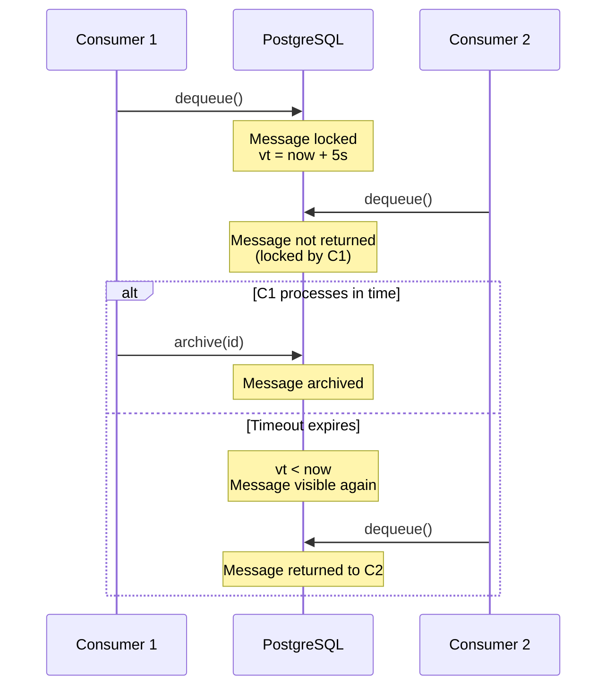

# Producer & Consumer

This page explains the Producer and Consumer pattern in pgqrs and how messages flow through the system.

## Overview

pgqrs uses a classic producer-consumer pattern:

- **Producers** create messages and add them to queues
- **Consumers** fetch messages from queues and process them

Both are implemented as lightweight library components that connect directly to PostgreSQL.

## Producer

A Producer is responsible for creating and enqueueing messages to a specific queue.

### Creating a Producer

=== "Rust"

    ```rust
    use pgqrs;
    use serde_json::json;

    let store = pgqrs::connect("postgresql://localhost/mydb").await?;

    let ids = pgqrs::enqueue()
        .message(&json!({"task": "send_email"}))
        .to("notifications")
        .execute(&store)
        .await?;
    ```

=== "Python"

    ```python
    import asyncio
    import pgqrs

    async def main():
        store = await pgqrs.connect("postgresql://localhost/mydb")

        # Send a message
        msg_id = await pgqrs.produce(store, "tasks", {"task": "send_email"})
        print(f"Enqueued message: {msg_id}")

    asyncio.run(main())
    ```

### Producer Operations

#### Single Message

=== "Rust"

    ```rust
    use serde_json::json;

    let payload = json!({
        "action": "send_email",
        "to": "user@example.com"
    });

    let message = producer.enqueue(&payload).await?;
    println!("Message ID: {}", message.id);
    ```

=== "Python"

    ```python
    import asyncio
    import pgqrs

    async def main():
        store = await pgqrs.connect("postgresql://localhost/mydb")

        payload = {
            "action": "send_email",
            "to": "user@example.com"
        }

        msg_id = await pgqrs.produce(store, "tasks", payload)
        print(f"Message ID: {msg_id}")

    asyncio.run(main())
    ```


#### Batch Enqueue

Send multiple messages in a single transaction:

=== "Rust"

    ```rust
    let payloads = vec![
        json!({"task": 1}),
        json!({"task": 2}),
        json!({"task": 3}),
    ];

    let messages = producer.batch_enqueue(&payloads).await?;
    println!("Enqueued {} messages", messages.len());
    ```

=== "Python"

    ```python
    import asyncio
    import pgqrs

    async def main():
        store = await pgqrs.connect("postgresql://localhost/mydb")

        payloads = [
            {"task": 1},
            {"task": 2},
            {"task": 3},
        ]

        msg_ids = await pgqrs.produce_batch(store, "tasks", payloads)
        print(f"Enqueued {len(msg_ids)} messages")

    asyncio.run(main())
    ```


#### Delayed Messages

Schedule messages for future processing:

=== "Rust"

    ```rust
    let payload = json!({"reminder": "Follow up with customer"});

    // Available after 5 minutes (300 seconds)
    let message = producer.enqueue_delayed(&payload, 300).await?;
    ```

=== "Python"

    ```python
    import pgqrs

    admin = pgqrs.admin("postgresql://localhost/mydb")
    producer = pgqrs.producer(admin, "tasks", "scheduler", 8080)

    payload = {"reminder": "Follow up with customer"}

    # Available after 5 minutes (300 seconds)
    message_id = await producer.enqueue_delayed(payload, delay_seconds=300)
    print(f"Scheduled message {message_id} for 5 minutes from now")
    ```

#### Extend Visibility

If processing takes longer than expected, extend the lock:

=== "Rust"

    ```rust
    // Extend lock by 30 more seconds
    let extended = consumer.extend_visibility(message_id, 30).await?;
    if extended {
        println!("Lock extended successfully");
    }
    ```

=== "Python"

    # Extend lock by 30 more seconds
    # Note: Method is named 'extend_vt' in Python and called on the consumer
    extended = await consumer.extend_vt(msg.id, 30)
    if extended:
        print("Lock extended successfully")
    ```


## Consumer

A Consumer fetches and processes messages from a specific queue.

### Creating a Consumer

=== "Rust"

    ```rust
    use pgqrs;

    let store = pgqrs::connect("postgresql://localhost/mydb").await?;

    pgqrs::dequeue()
        .from("notifications")
        .handle(|msg| async move {
            println!("Processing: {:?}", msg.payload);
            Ok(())
        })
        .execute(&store)
        .await?;
    ```

=== "Python"

    ```python
    import asyncio
    import pgqrs

    async def handler(msg):
        print(f"Processing: {msg.payload}")
        return True  # Return True to archive, False to extend visibility

    async def main():
        store = await pgqrs.connect("postgresql://localhost/mydb")
        await pgqrs.consume(store, "tasks", handler)

    asyncio.run(main())
    ```


### Consumer Operations

#### Dequeue Messages

=== "Rust"

    ```rust
    // Fetch available messages (up to default batch size)
    let messages = consumer.dequeue().await?;

    for message in messages {
        println!("ID: {}", message.id);
        println!("Payload: {:?}", message.payload);
        println!("Enqueued at: {}", message.enqueued_at);
    }
    ```

=== "Python"

    ```python
    import asyncio
    import pgqrs

    async def main():
        store = await pgqrs.connect("postgresql://localhost/mydb")

        # Dequeue using iterator pattern
        async for msg in pgqrs.consume_iter(store, "tasks"):
            print(f"ID: {msg.id}")
            print(f"Payload: {msg.payload}")
            print(f"Enqueued at: {msg.enqueued_at}")

            # Archive after processing
            await msg.archive()

    asyncio.run(main())
    ```


#### Dequeue with Options

=== "Rust"

    ```rust
    // Fetch up to 50 messages with 30-second lock
    let messages = consumer.dequeue_many_with_delay(50, 30).await?;
    ```

=== "Python"

    ```python
    # Custom batch size and visibility timeout
    async for msg in pgqrs.consume_iter(
        store,
        "tasks",
        batch_size=50,
        vt=30  # visibility timeout (30 seconds)
    ):
        await process_message(msg)
        await msg.archive()
    ```


#### Archive Messages

After successful processing, archive the message:

=== "Rust"

    ```rust
    // Single message
    consumer.archive(message.id).await?;

    // Batch archive
    let ids: Vec<i64> = messages.iter().map(|m| m.id).collect();
    consumer.archive_many(ids).await?;
    ```

=== "Python"

    ```python
    # Archive after processing
    await msg.archive()

    # Batch archive (if using low-level API)
    # await consumer.archive_batch([msg1.id, msg2.id, msg3.id])
    ```

Archiving moves the message to `pgqrs_archive` for audit trails.

#### Delete Messages

If you don't need an audit trail, delete directly:

=== "Rust"

    ```rust
    // Single message
    consumer.delete(message.id).await?;

    // Batch delete
    consumer.delete_many(ids).await?;
    ```

=== "Python"

    ```python
    # Delete message (no audit trail)
    await msg.delete()

    # Batch delete (if using low-level API)
    # await consumer.delete_batch([msg1.id, msg2.id, msg3.id])
    ```


## Message Structure

Messages have the following structure:

| Field | Type | Description |
|-------|------|-------------|
| `id` | `i64` | Unique message identifier |
| `queue_id` | `i64` | Reference to the queue |
| `payload` | `JSON` | Your message data |
| `enqueued_at` | `DateTime` | When the message was created |
| `vt` | `DateTime` | Visibility timeout (when lock expires) |
| `read_ct` | `i32` | Number of times dequeued |

## Visibility Timeout

When a consumer dequeues a message, it's locked with a visibility timeout:

1. Message is locked (not visible to other consumers)
2. Consumer has until the timeout to process and archive/delete
3. If timeout expires without completion, message becomes visible again



### Configuring Lock Time

=== "Rust"

    ```rust
    // Default lock time from config
    let messages = consumer.dequeue().await?;

    // Custom lock time (30 seconds)
    let messages = consumer.dequeue_many_with_delay(10, 30).await?;
    ```

=== "Python"

    ```python
    # Default lock time
    async for msg in pgqrs.consume_iter(store, "tasks"):
        await process(msg)
        await msg.archive()

    # Custom lock time (30 seconds)
    async for msg in pgqrs.consume_iter(store, "tasks", vt=30):
        await process(msg)
        await msg.archive()
    ```


## Best Practices

### 1. Use Appropriate Lock Times

Set lock times based on your processing duration:

=== "Rust"

    ```rust
    // Short tasks (< 5 seconds)
    let messages = consumer.dequeue_many_with_delay(100, 10).await?;

    // Long tasks (minutes)
    let messages = consumer.dequeue_many_with_delay(10, 300).await?;
    ```

=== "Python"

    ```python
    # Short tasks (< 5 seconds)
    async for msg in pgqrs.consume_iter(store, "tasks", batch_size=100, vt=10):
        await quick_process(msg)
        await msg.archive()

    # Long tasks (minutes)
    async for msg in pgqrs.consume_iter(store, "tasks", batch_size=10, vt=300):
        await long_process(msg)
        await msg.archive()
    ```


### 2. Extend Locks for Long Processing

If processing might exceed the lock time:

=== "Rust"

    ```rust
    let messages = consumer.dequeue().await?;
    for message in messages {
        // Start processing
        let result = start_long_processing(&message);

        // Extend lock if needed
        if result.needs_more_time() {
            // Processing is taking longer than expected
            consumer.extend_visibility(message.id, 60).await?;
        }

        // Complete and archive
        result.finish().await?;
        consumer.archive(message.id).await?;
    }
    ```

=== "Python"

    ```python
    async def handler(msg):
        # Start processing
        result = await start_long_processing(msg)

        # Extend lock if needed
        if result.needs_more_time():
            await consumer.extend_vt(msg.id, 60)

        # Complete processing
        await result.finish()
        return True  # Archive

    await pgqrs.consume(store, "tasks", handler)
    ```


### 3. Always Archive or Delete

Always explicitly handle completed messages:

=== "Rust"

    ```rust
    for message in messages {
        match process(&message).await {
            Ok(_) => consumer.archive(message.id).await?,
            Err(e) => {
                // Log error, message will become visible again after timeout
                tracing::error!("Failed to process {}: {}", message.id, e);
            }
        }
    }
    ```

=== "Python"

    ```python
    async def handler(msg):
        try:
            await process(msg)
            return True  # Archive
        except Exception as e:
            # Log error, message will become visible again after timeout
            print(f"Failed to process {msg.id}: {e}")
            return False  # Don't archive, will retry

    await pgqrs.consume(store, "tasks", handler)
    ```


### 4. Use Batch Operations

For high throughput, use batch operations:

=== "Rust"

    ```rust
    // Fetch batch
    let messages = consumer.dequeue_many_with_delay(100, 30).await?;

    // Process all
    let results = process_batch(&messages).await;

    // Archive successful ones
    let successful: Vec<i64> = results
        .iter()
        .filter(|r| r.is_ok())
        .map(|r| r.id)
        .collect();

    consumer.archive_many(successful).await?;
    ```

=== "Python"

    ```python
    # Enqueue batch
    payloads = [{"task": i} for i in range(100)]
    await pgqrs.produce_batch(store, "tasks", payloads)

    # Consume with high-level API handles batching automatically
    async def handler(msg):
        await process(msg)
        return True

    await pgqrs.consume(store, "tasks", handler)
    ```


## What's Next?

- [Workers](workers.md) - Worker lifecycle and management
- [Message Lifecycle](message-lifecycle.md) - Detailed message states
- [Batch Processing Guide](../guides/batch-processing.md) - Processing at scale
