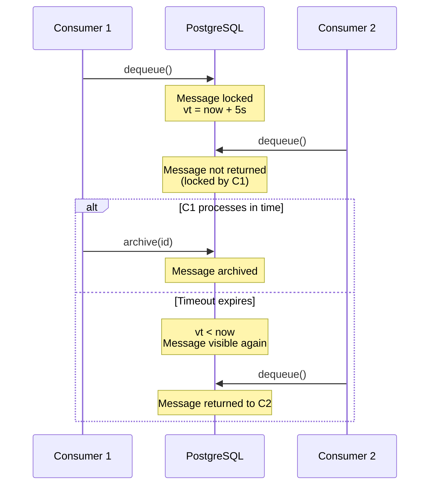

# Producer & Consumer

This page explains the Producer and Consumer pattern in pgqrs and how messages flow through the system.

## Overview

pgqrs uses a classic producer-consumer pattern:

- **Producers** create messages and add them to queues
- **Consumers** fetch messages from queues and process them

Both are implemented as lightweight library components that connect directly to PostgreSQL.

## Producer

A Producer is responsible for creating and enqueueing messages to a specific queue.

### Creating a Producer

=== "Rust"

    ```rust
    use pgqrs::{Admin, Producer, Config};

    let config = Config::from_dsn("postgresql://localhost/mydb");
    let admin = Admin::new(&config).await?;
    let queue = admin.get_queue("tasks").await?;

    let producer = Producer::new(
        admin.pool.clone(),
        &queue,
        "my-service",    // hostname for identification
        3000,            // port for identification
        &config,
    ).await?;
    ```

=== "Python"

    ```python
    from pgqrs import Producer

    producer = Producer(
        "postgresql://localhost/mydb",
        "tasks",       # queue name
        "my-service",  # hostname
        3000,          # port
    )
    ```

### Producer Operations

#### Single Message

```rust
use serde_json::json;

let payload = json!({
    "action": "send_email",
    "to": "user@example.com"
});

let message = producer.enqueue(&payload).await?;
println!("Message ID: {}", message.id);
```

#### Batch Enqueue

Send multiple messages in a single transaction:

```rust
let payloads = vec![
    json!({"task": 1}),
    json!({"task": 2}),
    json!({"task": 3}),
];

let messages = producer.batch_enqueue(&payloads).await?;
println!("Enqueued {} messages", messages.len());
```

#### Delayed Messages

Schedule messages for future processing:

=== "Rust"

    ```rust
    let payload = json!({"reminder": "Follow up with customer"});

    // Available after 5 minutes (300 seconds)
    let message = producer.enqueue_delayed(&payload, 300).await?;
    ```

=== "Python"

    ```python
    import pgqrs

    admin = pgqrs.Admin("postgresql://localhost/mydb")
    producer = pgqrs.Producer(admin, "tasks", "scheduler", 8080)

    payload = {"reminder": "Follow up with customer"}

    # Available after 5 minutes (300 seconds)
    message_id = await producer.enqueue_delayed(payload, delay_seconds=300)
    print(f"Scheduled message {message_id} for 5 minutes from now")
    ```

#### Extend Visibility

If processing takes longer than expected, extend the lock:

```rust
// Extend lock by 30 more seconds
let extended = consumer.extend_visibility(message_id, 30).await?;
if extended {
    println!("Lock extended successfully");
}
```

## Consumer

A Consumer fetches and processes messages from a specific queue.

### Creating a Consumer

=== "Rust"

    ```rust
    use pgqrs::{Admin, Consumer, Config};

    let config = Config::from_dsn("postgresql://localhost/mydb");
    let admin = Admin::new(&config).await?;
    let queue = admin.get_queue("tasks").await?;

    let consumer = Consumer::new(
        admin.pool.clone(),
        &queue,
        "worker-1",     // hostname
        3001,           // port
        &config,
    ).await?;
    ```

=== "Python"

    ```python
    from pgqrs import Consumer

    consumer = Consumer(
        "postgresql://localhost/mydb",
        "tasks",
        "worker-1",
        3001,
    )
    ```

### Consumer Operations

#### Dequeue Messages

```rust
// Fetch available messages (up to default batch size)
let messages = consumer.dequeue().await?;

for message in messages {
    println!("ID: {}", message.id);
    println!("Payload: {:?}", message.payload);
    println!("Enqueued at: {}", message.enqueued_at);
}
```

#### Dequeue with Options

```rust
// Fetch up to 50 messages with 30-second lock
let messages = consumer.dequeue_many_with_delay(50, 30).await?;
```

#### Archive Messages

After successful processing, archive the message:

```rust
// Single message
consumer.archive(message.id).await?;

// Batch archive
let ids: Vec<i64> = messages.iter().map(|m| m.id).collect();
consumer.archive_many(ids).await?;
```

Archiving moves the message to `pgqrs_archive` for audit trails.

#### Delete Messages

If you don't need an audit trail, delete directly:

```rust
// Single message
consumer.delete(message.id).await?;

// Batch delete
consumer.delete_many(ids).await?;
```

## Message Structure

Messages have the following structure:

| Field | Type | Description |
|-------|------|-------------|
| `id` | `i64` | Unique message identifier |
| `queue_id` | `i64` | Reference to the queue |
| `payload` | `JSON` | Your message data |
| `enqueued_at` | `DateTime` | When the message was created |
| `vt` | `DateTime` | Visibility timeout (when lock expires) |
| `read_ct` | `i32` | Number of times dequeued |

## Visibility Timeout

When a consumer dequeues a message, it's locked with a visibility timeout:

1. Message is locked (not visible to other consumers)
2. Consumer has until the timeout to process and archive/delete
3. If timeout expires without completion, message becomes visible again



### Configuring Lock Time

```rust
// Default lock time from config
let messages = consumer.dequeue().await?;

// Custom lock time (30 seconds)
let messages = consumer.dequeue_many_with_delay(10, 30).await?;
```

## Best Practices

### 1. Use Appropriate Lock Times

Set lock times based on your processing duration:

```rust
// Short tasks (< 5 seconds)
let messages = consumer.dequeue_many_with_delay(100, 10).await?;

// Long tasks (minutes)
let messages = consumer.dequeue_many_with_delay(10, 300).await?;
```

### 2. Extend Locks for Long Processing

If processing might exceed the lock time:

```rust
let messages = consumer.dequeue().await?;
for message in messages {
    // Start processing
    let result = start_long_processing(&message);

    // Extend lock if needed
    if result.needs_more_time() {
        // Processing is taking longer than expected
        consumer.extend_visibility(message.id, 60).await?;
    }

    // Complete and archive
    result.finish().await?;
    consumer.archive(message.id).await?;
}
```

### 3. Always Archive or Delete

Always explicitly handle completed messages:

```rust
for message in messages {
    match process(&message).await {
        Ok(_) => consumer.archive(message.id).await?,
        Err(e) => {
            // Log error, message will become visible again after timeout
            tracing::error!("Failed to process {}: {}", message.id, e);
        }
    }
}
```

### 4. Use Batch Operations

For high throughput, use batch operations:

```rust
// Fetch batch
let messages = consumer.dequeue_many_with_delay(100, 30).await?;

// Process all
let results = process_batch(&messages).await;

// Archive successful ones
let successful: Vec<i64> = results
    .iter()
    .filter(|r| r.is_ok())
    .map(|r| r.id)
    .collect();

consumer.archive_many(successful).await?;
```

## What's Next?

- [Workers](workers.md) - Worker lifecycle and management
- [Message Lifecycle](message-lifecycle.md) - Detailed message states
- [Batch Processing Guide](../guides/batch-processing.md) - Processing at scale
