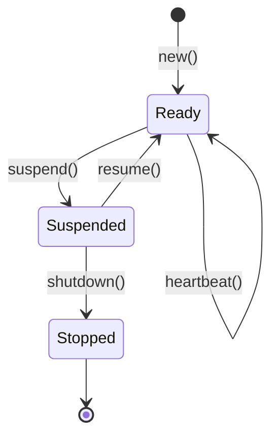

# Workers

Workers are the runtime identity of Producers and Consumers in pgqrs. This page explains how workers are managed and their lifecycle.

## Overview

When you create a Producer or Consumer, pgqrs automatically registers a **worker** in the database. Workers track:

- Which queue they're working with
- Their hostname and port (for identification)
- Their current status
- Last heartbeat time

## Worker Registration

Workers are automatically registered when creating Producers or Consumers:

=== "Rust"

    ```rust
    use pgqrs;

    let store = pgqrs::connect("postgresql://localhost/mydb").await?;

    let producer = pgqrs::producer()
        .queue("tasks")
        .hostname("web-server-1")
        .port(3000)
        .create(&store)
        .await?;
    // Worker automatically registered with queue
    ```

=== "Python"

    ```python
    import asyncio
    import pgqrs

    async def main():
        config = pgqrs.config("postgresql://localhost/mydb")
        store = await pgqrs.connect_with(config)

        # Create a managed worker
        producer = await store.producer("tasks")
        # Worker automatically registered

    asyncio.run(main())
    ```

## Worker Lifecycle

Workers follow a strict state machine:



### States

| State | Description | Transitions |
|-------|-------------|-------------|
| **Ready** | Active and can process work | → Suspended |
| **Suspended** | Paused, not accepting new work | → Ready, → Stopped |
| **Stopped** | Completed shutdown (terminal) | None |

### State Transitions

#### Suspend

Pause a worker without shutting down:

=== "Rust"

    ```rust
    use pgqrs::Worker; // Import the Worker trait

    // Suspend the producer's worker
    producer.suspend().await?;
    ```

=== "Python"

    !!! warning "State Transitions"
        Explicit state transitions (changing status to `Suspended` in the database) are not currently exposed in Python. To pause processing, simply stop calling `dequeue()`.

#### Resume

Resume a suspended worker:

=== "Rust"

    ```rust
    producer.resume().await?;
    ```

=== "Python"

    !!! warning "State Transitions"
        Explicit `resume()` is not exposed in Python. To resume, simply restart your `dequeue()` loop.

#### Shutdown

Gracefully stop a worker:

=== "Rust"

    ```rust
    // Must be suspended first
    producer.suspend().await?;
    producer.shutdown().await?;
    ```

=== "Python"

    !!! warning "State Transitions"
        Explicit `shutdown()` is not exposed in Python. Python consumers automatically handle cleanup when the object is garbage collected or the script exits (see [Automatic Cleanup](#2-graceful-shutdown)).

    ```python
    import signal
    import asyncio
    import pgqrs

    class GracefulWorker:
        def __init__(self):
            self.running = True
            self.consumer = None

        async def setup(self, store):
            self.consumer = await store.consumer("tasks")

        def shutdown_handler(self, signum, frame):
            print(f"Received signal {signum}, shutting down gracefully...")
            self.running = False

        async def process_messages(self):
            while self.running:
                messages = await pgqrs.dequeue(self.consumer, 10)
                for msg in messages:
                    if not self.running:
                        break
                    await process_message(msg)
                    await pgqrs.archive(self.consumer, msg)

                if not messages:
                    await asyncio.sleep(0.1)

    async def main():
        store = await pgqrs.connect("postgresql://localhost/mydb")

        worker = GracefulWorker()
        await worker.setup(store)

        # Set up signal handlers
        signal.signal(signal.SIGINT, worker.shutdown_handler)
        signal.signal(signal.SIGTERM, worker.shutdown_handler)

        await worker.process_messages()

    asyncio.run(main())
    ```

## WorkerHandle

!!! warning "Rust Only"
    `WorkerHandle` is only available in Rust. Python users should use the `Admin` class and its `get_workers()` method for worker management.

Use `WorkerHandle` to manage workers by ID without needing the original Producer/Consumer:

=== "Rust"

    ```rust
    use pgqrs::WorkerHandle;

    // Create a handle for any worker
    let handle = WorkerHandle::new(pool.clone(), worker_id);

    // Check status
    let status = handle.status().await?;

    // Graceful shutdown
    handle.suspend().await?;
    handle.shutdown().await?;
    ```

## Worker Health

### Heartbeats

Workers should send periodic heartbeats to indicate they're alive.

!!! info "Python Automatic Heartbeats"
    In Python, heartbeats are handled automatically by the background worker tasks when using `store.consumer()`. Manual heartbeat control is not exposed.

=== "Rust"

    ```rust
    // Send heartbeat
    worker.heartbeat().await?;
    ```

### Health Checks

Check if a worker's heartbeat is recent:

=== "Rust"

    ```rust
    // Is the worker's last heartbeat within 5 minutes?
    let healthy = worker.is_healthy(chrono::Duration::minutes(5)).await?;
    ```

!!! warning "Python Limitation"
    Detailed health stats (checking last heartbeat time) are currently available only in Rust. Python's `WorkerInfo` currently exposes only `id`, `hostname`, and `status`.


### Automatic Heartbeats

For long-running consumers, send heartbeats periodically:

=== "Rust"

    ```rust
    use std::time::Duration;
    use tokio::time::interval;

    async fn run_consumer_with_heartbeats(consumer: &Consumer) {
        let mut heartbeat_interval = interval(Duration::from_secs(60));

        loop {
            tokio::select! {
                _ = heartbeat_interval.tick() => {
                    consumer.heartbeat().await.ok();
                }
                messages = consumer.dequeue() => {
                    // Process messages...
                }
            }
        }
    }
    ```

=== "Python"

    ```python
    import asyncio
    import pgqrs

    async def worker_with_health_tracking(store, queue_name):
        consumer = await store.consumer(queue_name)

        while True:
            try:
                # Dequeue automatically updates worker heartbeat in database
                messages = await pgqrs.dequeue(consumer, 10)

                for msg in messages:
                    await process_message(msg.payload)
                    await pgqrs.archive(consumer, msg)

                if not messages:
                    await asyncio.sleep(1)

            except Exception as e:
                print(f"Error processing messages: {e}")
                await asyncio.sleep(5)  # Backoff on error

    async def main():
        config = pgqrs.Config("postgresql://localhost/mydb")
        store = await pgqrs.connect_with(config)
        await worker_with_health_tracking(store, "tasks")

    asyncio.run(main())
    ```

## Managing Workers via CLI

### List Workers

```bash
# List all workers
pgqrs worker list

# List workers for a specific queue
pgqrs worker list --queue tasks
```

### Worker Statistics

```bash
pgqrs worker stats --queue tasks
```

### Health Check

```bash
# Check workers with heartbeat older than 5 minutes
pgqrs worker health --queue tasks --max-age 300
```

### Stop a Worker

```bash
pgqrs worker stop --id 42
```

### Purge Old Workers

```bash
# Remove stopped workers older than 7 days
pgqrs worker purge --older-than 7d
```

## Multiple Workers

Run multiple consumers for the same queue to scale processing:

=== "Rust"

    ```rust
    use pgqrs;

    let store = pgqrs::connect("postgresql://localhost/mydb").await?;

    // Each consumer registers as a separate worker
    let consumer1 = pgqrs::consumer()
        .queue("tasks")
        .hostname("host")
        .port(3001)
        .create(&store)
        .await?;

    let consumer2 = pgqrs::consumer()
        .queue("tasks")
        .hostname("host")
        .port(3002)
        .create(&store)
        .await?;

    let consumer3 = pgqrs::consumer()
        .queue("tasks")
        .hostname("host")
        .port(3003)
        .create(&store)
        .await?;

    // Run concurrently
    tokio::join!(
        process_messages(consumer1),
        process_messages(consumer2),
        process_messages(consumer3),
    );
    ```

=== "Python"

    ```python
    import asyncio
    import pgqrs

    async def process_messages(consumer, worker_id):
        while True:
            messages = await pgqrs.dequeue(consumer, 10)
            for message in messages:
                print(f"[Worker {worker_id}] Processing {message.id}")
                await pgqrs.archive(consumer, message)
            if not messages:
                await asyncio.sleep(1)

    async def run_workers():
        config = pgqrs.Config("postgresql://localhost/mydb")
        store = await pgqrs.connect_with(config)

        # Each consumer registers as a separate worker
        consumers = [
            await store.consumer("tasks"),
            await store.consumer("tasks"),
            await store.consumer("tasks"),
        ]

        # Run concurrently
        await asyncio.gather(*[
            process_messages(c, i) for i, c in enumerate(consumers)
        ])

    asyncio.run(run_workers())
    ```

PostgreSQL's `SKIP LOCKED` ensures each consumer gets different messages.

## Worker Information

Get details about a worker:

=== "Rust"

    ```rust
    // From the worker itself
    let worker_id = producer.worker_id();
    let status = producer.status().await?;

    // From admin
    let workers = admin.workers.list().await?;
    for worker in workers {
        println!("Worker {}: {:?} on queue {}",
            worker.id,
            worker.status,
            worker.queue_id
        );
    }
    ```

=== "Python"

    ```python
    import asyncio
    from pgqrs import Admin

    async def main():
        admin = Admin("postgresql://localhost/mydb")

        # Get all workers via admin
        workers_handler = await admin.get_workers()
        workers = await workers_handler.list()

        for worker in workers:
            print(f"Worker {worker.id}: {worker.status}")
            print(f"  Host: {worker.hostname}")

    asyncio.run(main())
    ```

## Best Practices

### 1. Use Meaningful Identifiers

Use hostname and port that help identify the worker:

=== "Rust"

    ```rust
    let hostname = std::env::var("HOSTNAME").unwrap_or("localhost".into());
    let port = 3000 + worker_number;

    let consumer = Consumer::new(pool, &queue, &hostname, port, &config).await?;
    ```

=== "Python"

    ```python
    import os
    import asyncio
    import pgqrs

    async def main():
        config = pgqrs.Config("postgresql://localhost/mydb")
        store = await pgqrs.connect_with(config)

        # Worker identification is handled automatically by the store
        consumer = await store.consumer(queue_name)

    asyncio.run(main())
    ```

### 2. Graceful Shutdown

Always shut down workers gracefully on application exit:

=== "Rust"

    ```rust
    use tokio::signal;

    async fn run_with_graceful_shutdown(consumer: Consumer) {
        tokio::select! {
            _ = process_loop(&consumer) => {}
            _ = signal::ctrl_c() => {
                tracing::info!("Shutting down...");
                consumer.suspend().await.ok();
                consumer.shutdown().await.ok();
            }
        }
    }
    ```

=== "Python"

    ```python
    import asyncio
    import signal
    import pgqrs

    async def run_with_graceful_shutdown(consumer):
        loop = asyncio.get_event_loop()
        stop = asyncio.Event()

        def handle_signal():
            print("Shutting down...")
            stop.set()

        loop.add_signal_handler(signal.SIGINT, handle_signal)
        loop.add_signal_handler(signal.SIGTERM, handle_signal)

        while not stop.is_set():
            messages = await pgqrs.dequeue(consumer, 10)
            for message in messages:
                if stop.is_set():
                    break
                # Process message
                await pgqrs.archive(consumer, message)
            if not messages:
                await asyncio.sleep(1)

        print("Consumer stopped")
    ```

    !!! info "Automatic Cleanup"
        Python consumers automatically handle cleanup when the object is garbage collected or the program exits. Explicit `suspend()` or `shutdown()` calls are not required or exposed.


### 3. Monitor Worker Health

Regularly check worker health in production:

=== "Rust"

    ```rust
    async fn monitor_worker_health(admin: &Admin, queue: &str, max_age_minutes: i64) -> Result<()> {
        let mut interval = tokio::time::interval(std::time::Duration::from_secs(60));

        loop {
            interval.tick().await;

            let workers = admin.workers.list().await?;
            let threshold = chrono::Utc::now() - chrono::Duration::minutes(max_age_minutes);

            for worker in workers {
                if worker.status == WorkerStatus::Running && worker.updated_at < threshold {
                    tracing::warn!(
                        "Worker {} ({}) is stale. Last seen: {}",
                        worker.id, worker.hostname, worker.updated_at
                    );
                }
            }
        }
    }
    ```

=== "Python"

    !!! warning "Limited Health Data"
        Python's `WorkerInfo` currently only exposes `id`, `hostname`, and `status`. Timestamps like `updated_at` are not yet available, so time-based staleness checks must be done via Rust or CLI.

    ```python
    import asyncio
    from pgqrs import Admin

    async def monitor_workers(admin):
        """Monitor worker status (staleness checks not yet supported in Python)."""
        while True:
            workers_handler = await admin.get_workers()
            workers = await workers_handler.list()

            print(f"--- Worker Status ---")
            for worker in workers:
                print(f"Worker {worker.id}: {worker.status} ({worker.hostname})")

            await asyncio.sleep(60)

    # asyncio.run(monitor_workers(admin))
    ```

=== "CLI"

    ```bash
    # Check status of all workers
    pgqrs worker list

    # Check for stale workers (heartbeat > 5 mins ago)
    pgqrs worker health --timeout 300
    ```

### 4. Clean Up Stopped Workers

Periodically purge old stopped workers:

=== "Rust"

    ```rust
    use pgqrs::Admin;
    use pgqrs::types::WorkerStatus;
    use chrono::{Duration, Utc};

    async fn cleanup_stopped_workers(
        admin: &Admin,
        older_than_days: i64,
    ) -> Result<u64, Box<dyn std::error::Error>> {
        let workers = admin.workers.list().await?;
        let cutoff = Utc::now() - Duration::days(older_than_days);
        let mut cleaned_up = 0;

        for worker in workers {
            // Check if worker is stopped and older than cutoff
            // (Note: full timestamp check logic would go here depending on available fields)
            if worker.status == WorkerStatus::Stopped {
                 admin.workers.delete(worker.id).await?;
                 cleaned_up += 1;
            }
        }

        Ok(cleaned_up)
    }
    ```

=== "Python"

    !!! warning "Limited Support"
        Detailed worker field access (like shutdown timestamps) is currently limited in Python. Cleanup is best performed via CLI or Rust tools.

=== "CLI"

    ```bash
    # Run via cron to purge workers older than 30 days
    pgqrs worker purge --older-than 30d

    # Crontab example (daily at 2 AM, purge older than 7 days)
    0 2 * * * pgqrs worker purge --older-than 7d
    ```

## What's Next?

- [Message Lifecycle](message-lifecycle.md) - Understanding message states
- [Worker Management Guide](../guides/worker-management.md) - Production patterns
