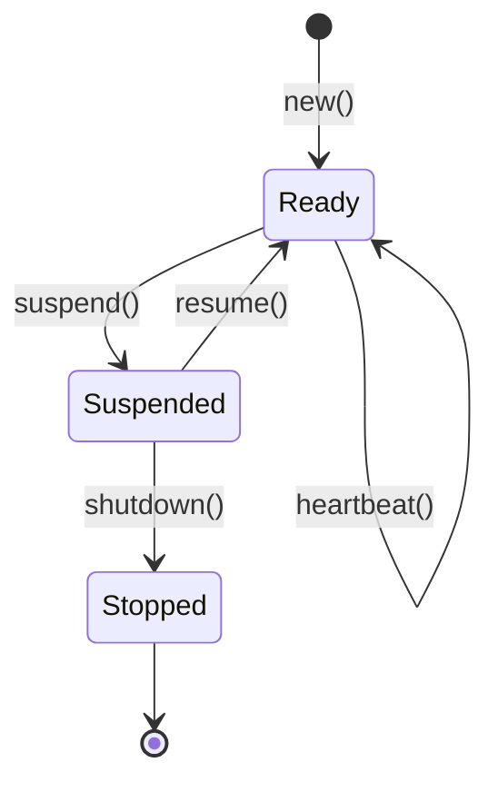

# Workers

Workers are the runtime identity of Producers and Consumers in pgqrs. This page explains how workers are managed and their lifecycle.

## Overview

When you create a Producer or Consumer, pgqrs automatically registers a **worker** in the database. Workers track:

- Which queue they're working with
- Their hostname and port (for identification)
- Their current status
- Last heartbeat time

## Worker Registration

Workers are automatically registered when creating Producers or Consumers:

=== "Rust"

    ```rust
    let producer = Producer::new(
        admin.pool.clone(),
        &queue,
        "web-server-1",  // hostname
        3000,            // port
        &config,
    ).await?;
    // Worker automatically registered with queue
    ```

=== "Python"

    ```python
    producer = Producer(
        "postgresql://localhost/mydb",
        "tasks",
        "web-server-1",
        3000,
    )
    # Worker automatically registered
    ```

## Worker Lifecycle

Workers follow a strict state machine:



### States

| State | Description | Transitions |
|-------|-------------|-------------|
| **Ready** | Active and can process work | → Suspended |
| **Suspended** | Paused, not accepting new work | → Ready, → Stopped |
| **Stopped** | Completed shutdown (terminal) | None |

### State Transitions

#### Suspend

Pause a worker without shutting down:

=== "Rust"

    ```rust
    use pgqrs::Worker; // Import the Worker trait

    // Suspend the producer's worker
    producer.suspend().await?;
    ```

=== "Python"

    !!! warning "Not Yet Implemented"
        Worker lifecycle methods (`suspend`, `resume`, `shutdown`) are not yet available in Python bindings.
        See [GitHub Issue #XX](https://github.com/vrajat/pgqrs/issues) for status.

!!! note
    Consumers can only suspend if they have no pending (locked) messages.

#### Resume

Resume a suspended worker:

=== "Rust"

    ```rust
    producer.resume().await?;
    ```

=== "Python"

    !!! warning "Not Yet Implemented"
        Worker lifecycle methods are not yet available in Python bindings.

#### Shutdown

Gracefully stop a worker:

=== "Rust"

    ```rust
    // Must be suspended first
    producer.suspend().await?;
    producer.shutdown().await?;
    ```

=== "Python"

    !!! warning "Not Yet Implemented"
        Worker lifecycle methods are not yet available in Python bindings.

## Worker Trait

The `Worker` trait provides a common interface for all worker types:

=== "Rust"

    ```rust
    use pgqrs::Worker;

    // Available on Producer, Consumer, and WorkerHandle
    async fn manage_worker(worker: &impl Worker) -> Result<()> {
        // Get worker ID
        let id = worker.worker_id();

        // Check status
        let status = worker.status().await?;

        // Send heartbeat
        worker.heartbeat().await?;

        // Check health (last heartbeat within duration)
        let healthy = worker.is_healthy(chrono::Duration::seconds(300)).await?;

        // Lifecycle operations
        worker.suspend().await?;
        worker.resume().await?;
        worker.shutdown().await?;

        Ok(())
    }
    ```

=== "Python"

    !!! warning "Partial Implementation"
        The Worker trait methods are not yet exposed in Python bindings.
        Currently, workers are created automatically when instantiating Producer/Consumer.

    ```python
    # Workers are created automatically
    producer = Producer(dsn, queue_name, hostname, port)
    consumer = Consumer(dsn, queue_name, hostname, port)

    # Worker management methods not yet available:
    # - worker_id()
    # - status()
    # - heartbeat()
    # - is_healthy()
    # - suspend() / resume() / shutdown()
    ```

## WorkerHandle

Use `WorkerHandle` to manage workers by ID without needing the original Producer/Consumer:

=== "Rust"

    ```rust
    use pgqrs::WorkerHandle;

    // Create a handle for any worker
    let handle = WorkerHandle::new(pool.clone(), worker_id);

    // Check status
    let status = handle.status().await?;

    // Graceful shutdown
    handle.suspend().await?;
    handle.shutdown().await?;
    ```

=== "Python"

    !!! warning "Not Yet Implemented"
        `WorkerHandle` is not yet available in Python bindings.

## Worker Health

### Heartbeats

Workers should send periodic heartbeats to indicate they're alive:

=== "Rust"

    ```rust
    // Send heartbeat
    worker.heartbeat().await?;
    ```

=== "Python"

    !!! warning "Not Yet Implemented"
        Heartbeat functionality is not yet available in Python bindings.

### Health Checks

Check if a worker's heartbeat is recent:

=== "Rust"

    ```rust
    // Is the worker's last heartbeat within 5 minutes?
    let healthy = worker.is_healthy(chrono::Duration::minutes(5)).await?;
    ```

=== "Python"

    !!! warning "Not Yet Implemented"
        Health check functionality is not yet available in Python bindings.

### Automatic Heartbeats

For long-running consumers, send heartbeats periodically:

=== "Rust"

    ```rust
    use std::time::Duration;
    use tokio::time::interval;

    async fn run_consumer_with_heartbeats(consumer: &Consumer) {
        let mut heartbeat_interval = interval(Duration::from_secs(60));

        loop {
            tokio::select! {
                _ = heartbeat_interval.tick() => {
                    consumer.heartbeat().await.ok();
                }
                messages = consumer.dequeue() => {
                    // Process messages...
                }
            }
        }
    }
    ```

=== "Python"

    !!! warning "Not Yet Implemented"
        Heartbeat functionality is not yet available in Python.

    For now, you can implement a basic consumer loop:

    ```python
    import asyncio
    from pgqrs import Consumer

    async def consumer_loop(consumer):
        while True:
            messages = await consumer.dequeue()
            for message in messages:
                # Process message
                await consumer.archive(message.id)

            if not messages:
                await asyncio.sleep(1)
    ```

## Managing Workers via CLI

### List Workers

```bash
# List all workers
pgqrs worker list

# List workers for a specific queue
pgqrs worker list --queue tasks
```

### Worker Statistics

```bash
pgqrs worker stats --queue tasks
```

### Health Check

```bash
# Check workers with heartbeat older than 5 minutes
pgqrs worker health --queue tasks --max-age 300
```

### Stop a Worker

```bash
pgqrs worker stop --id 42
```

### Purge Old Workers

```bash
# Remove stopped workers older than 7 days
pgqrs worker purge --older-than 7d
```

## Multiple Workers

Run multiple consumers for the same queue to scale processing:

=== "Rust"

    ```rust
    // Each consumer registers as a separate worker
    let consumer1 = Consumer::new(pool.clone(), &queue, "host", 3001, &config).await?;
    let consumer2 = Consumer::new(pool.clone(), &queue, "host", 3002, &config).await?;
    let consumer3 = Consumer::new(pool.clone(), &queue, "host", 3003, &config).await?;

    // Run concurrently
    tokio::join!(
        process_messages(consumer1),
        process_messages(consumer2),
        process_messages(consumer3),
    );
    ```

=== "Python"

    ```python
    import asyncio
    from pgqrs import Consumer

    async def process_messages(consumer, worker_id):
        while True:
            messages = await consumer.dequeue()
            for message in messages:
                print(f"[Worker {worker_id}] Processing {message.id}")
                await consumer.archive(message.id)
            if not messages:
                await asyncio.sleep(1)

    async def run_workers():
        # Each consumer registers as a separate worker
        consumers = [
            Consumer("postgresql://localhost/mydb", "tasks", "host", 3001),
            Consumer("postgresql://localhost/mydb", "tasks", "host", 3002),
            Consumer("postgresql://localhost/mydb", "tasks", "host", 3003),
        ]

        # Run concurrently
        await asyncio.gather(*[
            process_messages(c, i) for i, c in enumerate(consumers)
        ])

    asyncio.run(run_workers())
    ```

PostgreSQL's `SKIP LOCKED` ensures each consumer gets different messages.

## Worker Information

Get details about a worker:

=== "Rust"

    ```rust
    // From the worker itself
    let worker_id = producer.worker_id();
    let status = producer.status().await?;

    // From admin
    let workers = admin.workers.list().await?;
    for worker in workers {
        println!("Worker {}: {:?} on queue {}",
            worker.id,
            worker.status,
            worker.queue_id
        );
    }
    ```

=== "Python"

    ```python
    # Worker table access via admin
    admin = Admin("postgresql://localhost/mydb")
    workers = await admin.get_workers()
    count = await workers.count()
    print(f"Total workers: {count}")
    ```

    !!! note
        Direct worker status methods (`worker_id()`, `status()`) are not yet available on Producer/Consumer in Python.

## Best Practices

### 1. Use Meaningful Identifiers

Use hostname and port that help identify the worker:

=== "Rust"

    ```rust
    let hostname = std::env::var("HOSTNAME").unwrap_or("localhost".into());
    let port = 3000 + worker_number;

    let consumer = Consumer::new(pool, &queue, &hostname, port, &config).await?;
    ```

=== "Python"

    ```python
    import os

    hostname = os.environ.get("HOSTNAME", "localhost")
    port = 3000 + worker_number

    consumer = Consumer(dsn, queue_name, hostname, port)
    ```

### 2. Graceful Shutdown

Always shut down workers gracefully on application exit:

=== "Rust"

    ```rust
    use tokio::signal;

    async fn run_with_graceful_shutdown(consumer: Consumer) {
        tokio::select! {
            _ = process_loop(&consumer) => {}
            _ = signal::ctrl_c() => {
                tracing::info!("Shutting down...");
                consumer.suspend().await.ok();
                consumer.shutdown().await.ok();
            }
        }
    }
    ```

=== "Python"

    ```python
    import asyncio
    import signal

    async def run_with_graceful_shutdown(consumer):
        loop = asyncio.get_event_loop()
        stop = asyncio.Event()

        def handle_signal():
            print("Shutting down...")
            stop.set()

        loop.add_signal_handler(signal.SIGINT, handle_signal)
        loop.add_signal_handler(signal.SIGTERM, handle_signal)

        while not stop.is_set():
            messages = await consumer.dequeue()
            for message in messages:
                if stop.is_set():
                    break
                # Process message
                await consumer.archive(message.id)
            if not messages:
                await asyncio.sleep(1)

        print("Consumer stopped")
    ```

    !!! note
        Full graceful shutdown with `suspend()` and `shutdown()` methods not yet available in Python.

### 3. Monitor Worker Health

Regularly check worker health in production:

```bash
# In your monitoring system
pgqrs worker health --queue tasks --max-age 300
```

### 4. Clean Up Stopped Workers

Periodically purge old stopped workers:

```bash
# Run via cron
pgqrs worker purge --older-than 30d
```

## What's Next?

- [Message Lifecycle](message-lifecycle.md) - Understanding message states
- [Worker Management Guide](../guides/worker-management.md) - Production patterns
