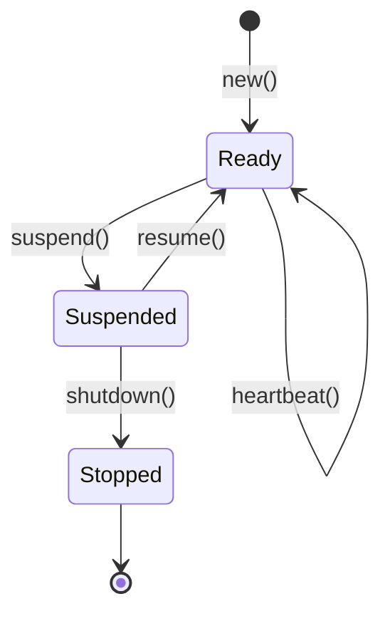

# Workers

Workers are the runtime identity of Producers and Consumers in pgqrs. This page explains how workers are managed and their lifecycle.

## Overview

When you create a Producer or Consumer, pgqrs automatically registers a **worker** in the database. Workers track:

- Which queue they're working with
- Their hostname and port (for identification)
- Their current status
- Last heartbeat time

## Worker Registration

Workers are automatically registered when creating Producers or Consumers:

=== "Rust"

    ```rust
    let producer = Producer::new(
        admin.pool.clone(),
        &queue,
        "web-server-1",  // hostname
        3000,            // port
        &config,
    ).await?;
    // Worker automatically registered with queue
    ```

=== "Python"

    ```python
    producer = Producer(
        "postgresql://localhost/mydb",
        "tasks",
        "web-server-1",
        3000,
    )
    # Worker automatically registered
    ```

## Worker Lifecycle

Workers follow a strict state machine:



### States

| State | Description | Transitions |
|-------|-------------|-------------|
| **Ready** | Active and can process work | → Suspended |
| **Suspended** | Paused, not accepting new work | → Ready, → Stopped |
| **Stopped** | Completed shutdown (terminal) | None |

### State Transitions

#### Suspend

Pause a worker without shutting down:

=== "Rust"

    ```rust
    use pgqrs::Worker; // Import the Worker trait

    // Suspend the producer's worker
    producer.suspend().await?;
    ```

=== "Python"

    ```python
    import pgqrs
    import asyncio

    admin = pgqrs.Admin("postgresql://localhost/mydb")

    # Check worker health through Workers table
    workers = await admin.get_workers()
    worker_list = await workers.list()

    for worker in worker_list:
        print(f"Worker {worker.id}: {worker.hostname}:{worker.port}")
        print(f"Status: {worker.status}")
        print(f"Last seen: {worker.updated_at}")
    ```
    import signal
    import asyncio

    class GracefulWorker:
        def __init__(self):
            self.running = True
            self.consumer = None

        async def setup(self, admin, queue_name):
            self.consumer = pgqrs.Consumer(admin, queue_name, "worker1", 8080)

        async def shutdown(self, sig, frame):
            print(f"Received {sig.name}, shutting down gracefully...")
            self.running = False

        async def process_messages(self):
            while self.running:
                messages = await self.consumer.dequeue()
                for msg in messages:
                    if not self.running:
                        break
                    await process_message(msg)
                    await self.consumer.archive(msg.id)

                if not messages:
                    await asyncio.sleep(0.1)

    # Set up signal handlers
    worker = GracefulWorker()
    signal.signal(signal.SIGINT, worker.shutdown)
    signal.signal(signal.SIGTERM, worker.shutdown)
    ```
    consumer = pgqrs.Consumer(admin, "tasks", "worker1", 8080)

    # Resume processing
    while True:
        messages = await consumer.dequeue()
        for msg in messages:
            await process_message(msg)
            await consumer.archive(msg.id)

        if not messages:
            await asyncio.sleep(1)  # Brief pause if no messages
    ```    # To suspend processing, simply stop calling dequeue()

    consumer = pgqrs.Consumer(admin, "tasks", "worker1", 8080)

    # Normal processing
    while processing:
        messages = await consumer.dequeue()
        for msg in messages:
            # Process message
            await consumer.archive(msg.id)

    # To "suspend" - exit the loop or don't call dequeue()
    ```!!! note
    Consumers can only suspend if they have no pending (locked) messages.

#### Resume

Resume a suspended worker:

=== "Rust"

    ```rust
    producer.resume().await?;
    ```

=== "Python"

    ```python
    # To "resume" processing, restart the dequeue loop

    consumer = pgqrs.Consumer(admin, "tasks", "worker1", 8080)

    # Resume processing
    while True:
        messages = await consumer.dequeue()
        for msg in messages:
            await process_message(msg)
            await consumer.archive(msg.id)

        if not messages:
            await asyncio.sleep(1)  # Brief pause if no messages
    ```

#### Shutdown

Gracefully stop a worker:

=== "Rust"

    ```rust
    // Must be suspended first
    producer.suspend().await?;
    producer.shutdown().await?;
    ```

=== "Python"

    ```python
    import signal
    import asyncio

    class GracefulWorker:
        def __init__(self):
            self.running = True
            self.consumer = None

        async def setup(self, admin, queue_name):
            self.consumer = pgqrs.Consumer(admin, queue_name, "worker1", 8080)

        async def shutdown(self, sig, frame):
            print(f"Received {sig.name}, shutting down gracefully...")
            self.running = False

        async def process_messages(self):
            while self.running:
                messages = await self.consumer.dequeue()
                for msg in messages:
                    if not self.running:
                        break
                    await process_message(msg)
                    await self.consumer.archive(msg.id)

                if not messages:
                    await asyncio.sleep(0.1)

    # Set up signal handlers
    worker = GracefulWorker()
    signal.signal(signal.SIGINT, worker.shutdown)
    signal.signal(signal.SIGTERM, worker.shutdown)
    ```

## Worker Trait

The `Worker` trait provides a common interface for all worker types:

=== "Rust"

    ```rust
    use pgqrs::Worker;

    // Available on Producer, Consumer, and WorkerHandle
    async fn manage_worker(worker: &impl Worker) -> Result<()> {
        // Get worker ID
        let id = worker.worker_id();

        // Check status
        let status = worker.status().await?;

        // Send heartbeat
        worker.heartbeat().await?;

        // Check health (last heartbeat within duration)
        let healthy = worker.is_healthy(chrono::Duration::seconds(300)).await?;

        // Lifecycle operations
        worker.suspend().await?;
        worker.resume().await?;
        worker.shutdown().await?;

        Ok(())
    }
    ```

=== "Python"

    !!! warning "Partial Implementation"
        The Worker trait methods are not yet exposed in Python bindings.
        Currently, workers are created automatically when instantiating Producer/Consumer.

    ```python
    # Workers are created automatically
    producer = Producer(dsn, queue_name, hostname, port)
    consumer = Consumer(dsn, queue_name, hostname, port)

    # Worker management is available through Admin.get_workers()
    # and signal handling for lifecycle management
    ```

## WorkerHandle

Use `WorkerHandle` to manage workers by ID without needing the original Producer/Consumer:

=== "Rust"

    ```rust
    use pgqrs::WorkerHandle;

    // Create a handle for any worker
    let handle = WorkerHandle::new(pool.clone(), worker_id);

    // Check status
    let status = handle.status().await?;

    // Graceful shutdown
    handle.suspend().await?;
    handle.shutdown().await?;
    ```

=== "Python"

    ```python
    # Python doesn't have a direct WorkerHandle equivalent
    # Worker management is done through Consumer/Producer instances
    # and system-level process management

    consumer = pgqrs.Consumer(admin, "tasks", "worker1", 8080)

    # Worker info is available through the Workers table
    workers = await admin.get_workers()
    worker_list = await workers.list()

    for worker in worker_list:
        print(f"Worker {worker.id}: {worker.hostname}:{worker.port}")
        print(f"Status: {worker.status}")
    ```

## Worker Health

### Heartbeats

Workers should send periodic heartbeats to indicate they're alive:

=== "Rust"

    ```rust
    // Send heartbeat
    worker.heartbeat().await?;
    ```

=== "Python"

    ```python
    # Python workers are automatically tracked in the workers table
    # Heartbeats are implicit when creating Consumer/Producer instances

    admin = pgqrs.Admin("postgresql://localhost/mydb")
    workers = await admin.get_workers()

    # Check worker activity
    worker_list = await workers.list()
    for worker in worker_list:
        print(f"Worker {worker.hostname}:{worker.port} - Last seen: {worker.updated_at}")
    ```

### Health Checks

Check if a worker's heartbeat is recent:

=== "Rust"

    ```rust
    // Is the worker's last heartbeat within 5 minutes?
    let healthy = worker.is_healthy(chrono::Duration::minutes(5)).await?;
    ```

=== "Python"

    ```python
    from datetime import datetime, timedelta
    import pgqrs

    admin = pgqrs.Admin("postgresql://localhost/mydb")
    workers = await admin.get_workers()

    # Check if workers are healthy (updated recently)
    worker_list = await workers.list()
    healthy_threshold = datetime.utcnow() - timedelta(minutes=5)

    for worker in worker_list:
        # Compare worker.updated_at with threshold
        is_healthy = worker.updated_at > healthy_threshold
        status = "healthy" if is_healthy else "stale"
        print(f"Worker {worker.id}: {status}")
    ```

### Automatic Heartbeats

For long-running consumers, send heartbeats periodically:

=== "Rust"

    ```rust
    use std::time::Duration;
    use tokio::time::interval;

    async fn run_consumer_with_heartbeats(consumer: &Consumer) {
        let mut heartbeat_interval = interval(Duration::from_secs(60));

        loop {
            tokio::select! {
                _ = heartbeat_interval.tick() => {
                    consumer.heartbeat().await.ok();
                }
                messages = consumer.dequeue() => {
                    // Process messages...
                }
            }
        }
    }
    ```

=== "Python"

    ```python
    import asyncio
    import pgqrs

    async def worker_with_health_tracking(admin, queue_name):
        consumer = pgqrs.Consumer(admin, queue_name, "worker1", 8080)

        while True:
            try:
                # Dequeue automatically updates worker heartbeat in database
                messages = await consumer.dequeue()

                for msg in messages:
                    await process_message(msg.payload)
                    await consumer.archive(msg.id)

                if not messages:
                    # Brief pause if no messages
                    await asyncio.sleep(1)

            except Exception as e:
                print(f"Error processing messages: {e}")
                await asyncio.sleep(5)  # Backoff on error
    ```

## Managing Workers via CLI

### List Workers

```bash
# List all workers
pgqrs worker list

# List workers for a specific queue
pgqrs worker list --queue tasks
```

### Worker Statistics

```bash
pgqrs worker stats --queue tasks
```

### Health Check

```bash
# Check workers with heartbeat older than 5 minutes
pgqrs worker health --queue tasks --max-age 300
```

### Stop a Worker

```bash
pgqrs worker stop --id 42
```

### Purge Old Workers

```bash
# Remove stopped workers older than 7 days
pgqrs worker purge --older-than 7d
```

## Multiple Workers

Run multiple consumers for the same queue to scale processing:

=== "Rust"

    ```rust
    // Each consumer registers as a separate worker
    let consumer1 = Consumer::new(pool.clone(), &queue, "host", 3001, &config).await?;
    let consumer2 = Consumer::new(pool.clone(), &queue, "host", 3002, &config).await?;
    let consumer3 = Consumer::new(pool.clone(), &queue, "host", 3003, &config).await?;

    // Run concurrently
    tokio::join!(
        process_messages(consumer1),
        process_messages(consumer2),
        process_messages(consumer3),
    );
    ```

=== "Python"

    ```python
    import asyncio
    from pgqrs import Consumer

    async def process_messages(consumer, worker_id):
        while True:
            messages = await consumer.dequeue()
            for message in messages:
                print(f"[Worker {worker_id}] Processing {message.id}")
                await consumer.archive(message.id)
            if not messages:
                await asyncio.sleep(1)

    async def run_workers():
        # Each consumer registers as a separate worker
        consumers = [
            Consumer("postgresql://localhost/mydb", "tasks", "host", 3001),
            Consumer("postgresql://localhost/mydb", "tasks", "host", 3002),
            Consumer("postgresql://localhost/mydb", "tasks", "host", 3003),
        ]

        # Run concurrently
        await asyncio.gather(*[
            process_messages(c, i) for i, c in enumerate(consumers)
        ])

    asyncio.run(run_workers())
    ```

PostgreSQL's `SKIP LOCKED` ensures each consumer gets different messages.

## Worker Information

Get details about a worker:

=== "Rust"

    ```rust
    // From the worker itself
    let worker_id = producer.worker_id();
    let status = producer.status().await?;

    // From admin
    let workers = admin.workers.list().await?;
    for worker in workers {
        println!("Worker {}: {:?} on queue {}",
            worker.id,
            worker.status,
            worker.queue_id
        );
    }
    ```

=== "Python"

    ```python
    # Worker table access via admin
    admin = Admin("postgresql://localhost/mydb")
    workers = await admin.get_workers()
    count = await workers.count()
    print(f"Total workers: {count}")
    ```

## Best Practices

### 1. Use Meaningful Identifiers

Use hostname and port that help identify the worker:

=== "Rust"

    ```rust
    let hostname = std::env::var("HOSTNAME").unwrap_or("localhost".into());
    let port = 3000 + worker_number;

    let consumer = Consumer::new(pool, &queue, &hostname, port, &config).await?;
    ```

=== "Python"

    ```python
    import os

    hostname = os.environ.get("HOSTNAME", "localhost")
    port = 3000 + worker_number

    consumer = Consumer(dsn, queue_name, hostname, port)
    ```

### 2. Graceful Shutdown

Always shut down workers gracefully on application exit:

=== "Rust"

    ```rust
    use tokio::signal;

    async fn run_with_graceful_shutdown(consumer: Consumer) {
        tokio::select! {
            _ = process_loop(&consumer) => {}
            _ = signal::ctrl_c() => {
                tracing::info!("Shutting down...");
                consumer.suspend().await.ok();
                consumer.shutdown().await.ok();
            }
        }
    }
    ```

=== "Python"

    ```python
    import asyncio
    import signal

    async def run_with_graceful_shutdown(consumer):
        loop = asyncio.get_event_loop()
        stop = asyncio.Event()

        def handle_signal():
            print("Shutting down...")
            stop.set()

        loop.add_signal_handler(signal.SIGINT, handle_signal)
        loop.add_signal_handler(signal.SIGTERM, handle_signal)

        while not stop.is_set():
            messages = await consumer.dequeue()
            for message in messages:
                if stop.is_set():
                    break
                # Process message
                await consumer.archive(message.id)
            if not messages:
                await asyncio.sleep(1)

        print("Consumer stopped")
    ```

### 3. Monitor Worker Health

Regularly check worker health in production:

=== "Rust"

    ```rust
    use pgqrs::{Admin, Worker, WorkerHandle};
    use chrono::Duration;

    async fn monitor_worker_health(
        admin: &Admin,
        queue_name: &str,
        max_age_minutes: i64,
    ) -> Result<(), Box<dyn std::error::Error>> {
        let workers = admin.get_workers().await?;
        let worker_list = workers.filter_by_queue(queue_name).await?;

        let max_age = Duration::minutes(max_age_minutes);

        for worker in worker_list {
            let handle = WorkerHandle::new(admin.pool.clone(), worker.id);
            let is_healthy = handle.is_healthy(max_age).await?;
            let status = handle.status().await?;

            if !is_healthy {
                eprintln!("⚠️  Worker {} is stale (last seen: {})",
                         worker.id, worker.updated_at);
            } else {
                println!("✅ Worker {} is healthy (status: {:?})",
                        worker.id, status);
            }
        }

        Ok(())
    }

    // Run health checks periodically
    async fn health_monitor_loop(admin: Admin) {
        let mut interval = tokio::time::interval(std::time::Duration::from_secs(60));

        loop {
            interval.tick().await;
            if let Err(e) = monitor_worker_health(&admin, "tasks", 5).await {
                eprintln!("Health check failed: {}", e);
            }
        }
    }
    ```

=== "Python"

    ```python
    import asyncio
    from datetime import datetime, timedelta
    import pgqrs

    async def monitor_worker_health(
        admin: pgqrs.Admin,
        queue_name: str,
        max_age_minutes: int = 5
    ):
        """Check health of all workers for a given queue."""
        workers = await admin.get_workers()
        worker_list = await workers.filter_by_queue(queue_name)

        healthy_threshold = datetime.utcnow() - timedelta(minutes=max_age_minutes)

        healthy_count = 0
        stale_count = 0

        for worker in worker_list:
            is_healthy = worker.updated_at > healthy_threshold

            if not is_healthy:
                print(f"⚠️  Worker {worker.id} ({worker.hostname}:{worker.port}) is stale")
                print(f"    Last seen: {worker.updated_at}")
                print(f"    Status: {worker.status}")
                stale_count += 1
            else:
                print(f"✅ Worker {worker.id} is healthy")
                healthy_count += 1

        print(f"\nHealth Summary: {healthy_count} healthy, {stale_count} stale")
        return healthy_count, stale_count

    async def health_monitor_loop(admin: pgqrs.Admin, queue_name: str):
        """Run continuous health monitoring."""
        while True:
            try:
                await monitor_worker_health(admin, queue_name)
                await asyncio.sleep(60)  # Check every minute
            except Exception as e:
                print(f"Health check failed: {e}")
                await asyncio.sleep(30)  # Backoff on error

    # Usage
    # admin = pgqrs.Admin("postgresql://localhost/mydb")
    # await health_monitor_loop(admin, "tasks")
    ```

=== "CLI"

    ```bash
    # In your monitoring system
    pgqrs worker health --queue tasks --max-age 300
    ```

### 4. Clean Up Stopped Workers

Periodically purge old stopped workers:

=== "Rust"

    ```rust
    use pgqrs::Admin;
    use chrono::{Duration, Utc};

    async fn cleanup_stopped_workers(
        admin: &Admin,
        older_than_days: i64,
    ) -> Result<usize, Box<dyn std::error::Error>> {
        let workers = admin.get_workers().await?;
        let all_workers = workers.list().await?;

        let cutoff_date = Utc::now() - Duration::days(older_than_days);
        let mut cleaned_up = 0;

        for worker in all_workers {
            // Only clean up stopped workers older than cutoff
            if worker.status == pgqrs::WorkerStatus::Stopped
                && worker.shutdown_at.map_or(false, |shutdown| shutdown < cutoff_date) {

                println!("Cleaning up stopped worker {} (shutdown: {})",
                        worker.id,
                        worker.shutdown_at.unwrap());

                match admin.delete_worker(worker.id).await {
                    Ok(_) => {
                        cleaned_up += 1;
                        println!("✅ Deleted worker {}", worker.id);
                    }
                    Err(e) => {
                        eprintln!("❌ Failed to delete worker {}: {}", worker.id, e);
                    }
                }
            }
        }

        println!("Cleanup complete: {} workers removed", cleaned_up);
        Ok(cleaned_up)
    }

    // Run cleanup as a scheduled task
    async fn scheduled_cleanup(admin: Admin) {
        let mut interval = tokio::time::interval(
            std::time::Duration::from_secs(24 * 60 * 60) // Daily
        );

        loop {
            interval.tick().await;
            if let Err(e) = cleanup_stopped_workers(&admin, 7).await {
                eprintln!("Cleanup failed: {}", e);
            }
        }
    }
    ```

=== "Python"

    ```python
    import asyncio
    from datetime import datetime, timedelta
    import pgqrs

    async def cleanup_stopped_workers(
        admin: pgqrs.Admin,
        older_than_days: int = 7
    ) -> int:
        """Clean up stopped workers older than specified days."""
        workers = await admin.get_workers()
        worker_list = await workers.list()

        cutoff_date = datetime.utcnow() - timedelta(days=older_than_days)
        cleaned_up = 0

        for worker in worker_list:
            # Only clean up stopped workers older than cutoff
            if (worker.status == "stopped" and
                worker.shutdown_at and
                worker.shutdown_at < cutoff_date):

                print(f"Cleaning up stopped worker {worker.id} ")
                print(f"  Hostname: {worker.hostname}:{worker.port}")
                print(f"  Shutdown: {worker.shutdown_at}")

                try:
                    await admin.delete_worker(worker.id)
                    cleaned_up += 1
                    print(f"✅ Deleted worker {worker.id}")
                except Exception as e:
                    print(f"❌ Failed to delete worker {worker.id}: {e}")

        print(f"\nCleanup complete: {cleaned_up} workers removed")
        return cleaned_up

    async def scheduled_cleanup_task(
        admin: pgqrs.Admin,
        interval_hours: int = 24,
        older_than_days: int = 7
    ):
        """Run worker cleanup on a schedule."""
        while True:
            try:
                count = await cleanup_stopped_workers(admin, older_than_days)
                print(f"Scheduled cleanup completed: {count} workers removed")

                # Wait for next scheduled run
                await asyncio.sleep(interval_hours * 3600)

            except Exception as e:
                print(f"Scheduled cleanup failed: {e}")
                # Retry after shorter interval on error
                await asyncio.sleep(3600)  # 1 hour

    # Usage examples
    # admin = pgqrs.Admin("postgresql://localhost/mydb")
    #
    # # One-time cleanup
    # count = await cleanup_stopped_workers(admin, older_than_days=30)
    #
    # # Scheduled cleanup (run in background)
    # asyncio.create_task(scheduled_cleanup_task(admin, interval_hours=24))
    ```

=== "CLI"

    ```bash
    # Run via cron
    pgqrs worker purge --older-than 30d

    # Crontab example (daily at 2 AM)
    0 2 * * * pgqrs worker purge --older-than 7d

    # Check what would be deleted (dry run)
    pgqrs worker purge --older-than 30d --dry-run
    ```

## What's Next?

- [Message Lifecycle](message-lifecycle.md) - Understanding message states
- [Worker Management Guide](../guides/worker-management.md) - Production patterns
