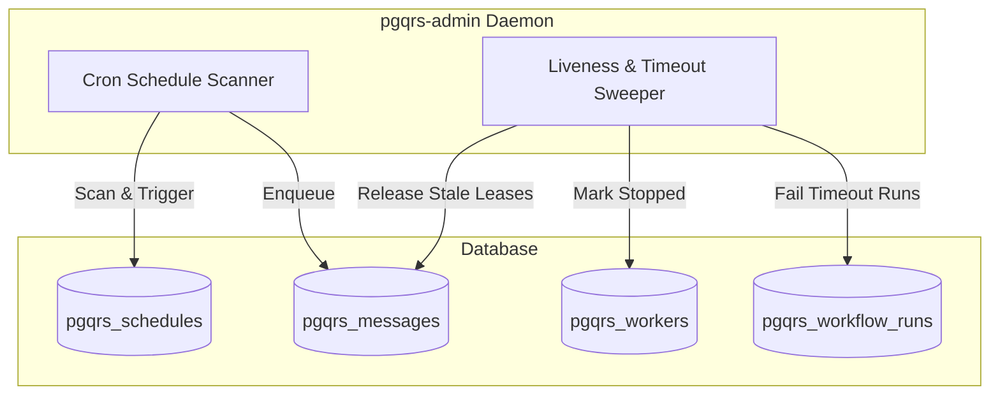

# Mini-Design: pgqrs-admin Coordinator and Scheduler

## Overview
The `pgqrs-admin` daemon is a hosted-compatible, database-agnostic coordinator process that runs as a background service. It acts as the administrator for the shared queue and workflow protocol, owning global cron scheduling and liveness/timeout maintenance tasks.

---

## 1. Responsibilities & Boundaries



### Cron Schedule Scanner
- Periodically scans `pgqrs_schedules` where `status = 'active'` and `next_fire_at <= NOW()`.
- Calculates the next fire time and updates the schedule.
- Enqueues a trigger message to start the workflow.

### Liveness & Timeout Sweeper
- **Lease Reclamation:** Sweeps `pgqrs_messages` where the visibility timeout `vt` has passed but the message is still leased to a worker. If the worker's heartbeat is stale, it releases the lock.
- **Worker Health:** Marks workers as `stopped` if they miss their heartbeat threshold.
- **Workflow Timeout:** Scans `pgqrs_workflow_runs` that have exceeded their maximum execution duration, marking them `ERROR` and aborting outstanding steps.

---

## 2. Database Schema Additions

A new migration `0007_create_schedules_table.sql` will add the schedules and execution tracking tables:

```sql
CREATE TABLE IF NOT EXISTS pgqrs_schedules (
    id BIGINT PRIMARY KEY GENERATED ALWAYS AS IDENTITY,
    name TEXT NOT NULL UNIQUE,
    cron_expression TEXT NOT NULL,
    workflow_name TEXT NOT NULL,
    input JSONB,
    status TEXT NOT NULL DEFAULT 'active',
    next_fire_at TIMESTAMP WITH TIME ZONE NOT NULL,
    created_at TIMESTAMP WITH TIME ZONE DEFAULT NOW(),
    updated_at TIMESTAMP WITH TIME ZONE DEFAULT NOW()
);

CREATE INDEX idx_pgqrs_schedules_next_fire ON pgqrs_schedules(status, next_fire_at);
```

---

## 3. Concurrency & Lock Safety

Multiple instances of `pgqrs-admin` may run concurrently (e.g., in a Kubernetes deployment). To prevent duplicate schedule fires or concurrent sweep conflicts, the daemon uses row-level locking:

- **Schedule Scanning Lock:**
  ```sql
  UPDATE pgqrs_schedules
  SET next_fire_at = $1, -- calculated next time
      updated_at = NOW()
  WHERE id = (
      SELECT id FROM pgqrs_schedules
      WHERE status = 'active'
        AND next_fire_at <= NOW()
      LIMIT 1
      FOR UPDATE SKIP LOCKED
  )
  RETURNING id, workflow_name, input;
  ```
  This query guarantees that exactly one coordinator process locks a due schedule row, computes its next fire time, and enqueues the workflow trigger.

---

## 4. Implementation details
- **Binary Placement:** `crates/pgqrs/src/bin/pgqrs_admin.rs`.
- **Run Command:** `pgqrs-admin --dsn postgresql://... --interval-ms 1000`.
