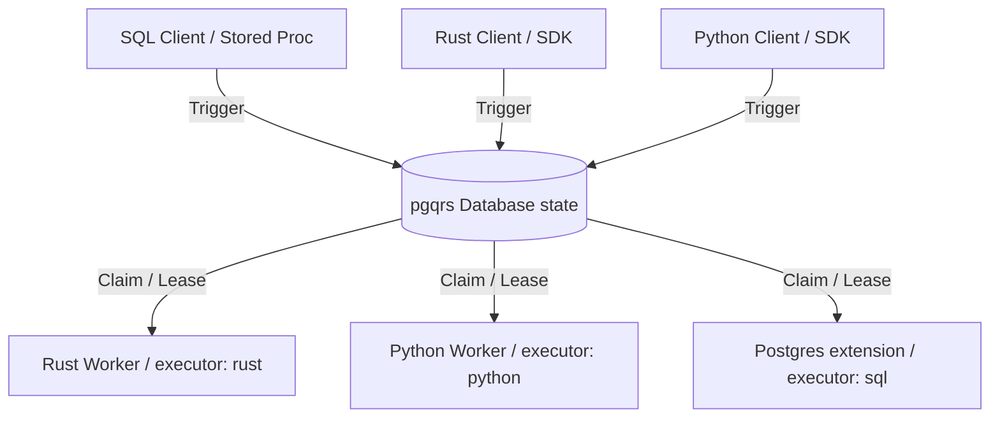

# SQL API, Workflow Triggering, and Scheduler Design

## Overview
This document specifies the user-facing SQL API and durable scheduler model for `pgqrs`. This design ensures that direct SQL clients (e.g., database connections, stored procedures, triggers, and BI tools) can trigger workflows, enqueue messages, manage schedules, and inspect system state.

---

## 1. Unified Triggering vs. Execution

The central rule of the pgqrs durable protocol is: **any client can trigger any workflow, but only a worker with the matching capability can execute it.**

- **Triggering:** Creating a trigger message (enqueuing into the backing queue) and materializing a run record.
- **Execution:** Leasing the message and executing the step/workflow logic. This requires the executor to advertise the capability (e.g., `python`, `rust`, or `sql`).

---

## 2. Durable Schedules & Cron Model

To support periodic trigger invocation without external cron systems, pgqrs introduces database-level durable schedules.

### Schema: `pgqrs_schedules`
- `id` (BIGINT, PK)
- `name` (TEXT, UNIQUE)
- `cron_expression` (TEXT) - Standard 5-field cron (e.g., `*/5 * * * *`) or interval string (e.g., `1 hour`)
- `workflow_name` (TEXT) - Target workflow to trigger
- `input` (JSONB, Nullable) - Payload to pass to the workflow run
- `status` (TEXT) - `active` or `paused`
- `next_fire_at` (TIMESTAMP WITH TIME ZONE)
- `created_at` (TIMESTAMP WITH TIME ZONE)
- `updated_at` (TIMESTAMP WITH TIME ZONE)

### Scheduler Evaluation
The coordinator (`pgqrs-admin` or extension background worker) continuously monitors due schedules:
1. Fetch active schedules where `next_fire_at <= NOW()`.
2. For each schedule, start a transaction:
   - Call the internal enqueue function to trigger `workflow_name` with `input`.
   - Calculate the next fire time based on `cron_expression`.
   - Update `next_fire_at` and `updated_at`.

---

## 3. SQL-Native Jobs & Workflows

SQL-native workflows are defined as an extension-owned capability class.
- **Workflow Steps:** Step execution runs direct SQL queries or calls PL/pgSQL stored procedures.
- **Executor:** The `pgqrs-sql-worker` (or the extension background worker) acts as the runner, executing SQL step statements in an isolated transaction.

---

## 4. v1 SQL API Specification

The database extension will expose the following functions and views under the `pgqrs` schema namespace:

### Enqueue & Trigger Functions
- **`pgqrs.enqueue(queue_name TEXT, payload JSONB) RETURNS BIGINT`**
  Enqueues a raw message into a queue.
- **`pgqrs.trigger_workflow(workflow_name TEXT, input JSONB) RETURNS BIGINT`**
  Triggers a workflow run and returns the materialized `run_id`.

### Schedule Management Functions
- **`pgqrs.create_schedule(name TEXT, cron TEXT, workflow_name TEXT, input JSONB DEFAULT NULL) RETURNS VOID`**
  Creates and schedules a recurring workflow trigger.
- **`pgqrs.pause_schedule(name TEXT) RETURNS VOID`**
  Pauses evaluation of a schedule.
- **`pgqrs.resume_schedule(name TEXT) RETURNS VOID`**
  Resumes evaluation of a paused schedule.
- **`pgqrs.delete_schedule(name TEXT) RETURNS VOID`**
  Removes a schedule.

### Inspection & Admin Functions
- **`pgqrs.cancel_run(run_id BIGINT) RETURNS VOID`**
  Initiates the two-phase cancellation for a running workflow.
- **`pgqrs.release_worker_messages(worker_id BIGINT) RETURNS INTEGER`**
  Forcibly releases all visibility-locked messages leased by a worker.

### Inspection Views
- **`pgqrs.workflow_runs_view`**
  Exposes active and historical workflow runs, including status, input, output, and execution times.
- **`pgqrs.workflow_steps_view`**
  Exposes steps details linked to runs (status, retry count, output, errors).

---

## 5. Security & Privilege Model

To safeguard execution, pgqrs implements a role-based access model:
- **`pgqrs_user` (Role):** Can trigger workflows (`trigger_workflow`), enqueue tasks (`enqueue`), and inspect runs/steps.
- **`pgqrs_admin` (Role):** Can manage schedules (`create_schedule`, `delete_schedule`), register workers, or trigger manual lease overrides.
- **`pgqrs_executor` (Role):** Used by the background workers and external processes to lease work and update checkpoints. Cannot mutate metadata tables or schedules directly.
