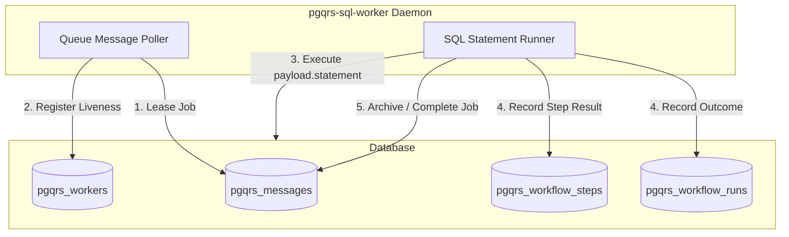

# Mini-Design: pgqrs-sql-worker External SQL Executor

## Overview
The `pgqrs-sql-worker` daemon is a hosted-compatible, out-of-process executor that leases and runs SQL-capability work from the pgqrs queue. It allows database-native workflows (SQL queries, stored procedure calls, DML statements) to be processed using the same durable execution and locking protocol as Rust/Python workers.

---

## 1. Responsibilities & Boundaries



### Queue Message Poller
- Connects to Postgres and registers as a worker with a name (e.g., `sql-worker-<id>`).
- Periodically leases messages from configured queues where the target jobs represent SQL executions.
- Sends worker heartbeats to maintain its lease viability.

### SQL Statement Runner
- Parses the SQL job payload from the leased message.
- Begins an isolated database transaction block.
- Executes the SQL query/statement with parameters.
- Records output (as JSON) or logs errors to the associated run or step record, then commits/rolls back.

---

## 2. SQL Job Payload Schema

A SQL job is defined by a JSON payload enqueued into the workflow/queue system:

```json
{
  "statement": "SELECT process_user_onboarding($1, $2)",
  "params": ["user_abc_123", true],
  "tx": true,
  "statement_timeout_ms": 5000
}
```

### Schema Definition
- `statement` (String, Required): The SQL query or statement to run.
- `params` (Array, Optional): Query parameters (strings, numbers, booleans, null) mapped directly to postgres parameters (`$1`, `$2`, etc.).
- `tx` (Boolean, Optional, default `true`): If `true`, the query executes inside a `BEGIN ... COMMIT` block. If `false`, it executes in auto-commit mode.
- `statement_timeout_ms` (Integer, Optional): Execution timeout for this statement. Override for the global setting.

---

## 3. SQL Safety & Execution Policy

To prevent resource exhaustion, locking conflicts, and privilege escalation, the following rules apply:

### Allowed Statement Classes
- Only standard DQL (`SELECT`, `SHOW`) and DML (`INSERT`, `UPDATE`, `DELETE`, `CALL`) are supported.
- Transaction control commands (`BEGIN`, `COMMIT`, `ROLLBACK`, `ABORT`, `SAVEPOINT`) are explicitly rejected by the parser/runner because they interfere with the worker's transaction boundaries.

### Privilege Model
- The daemon should connect using a restricted user role (e.g. `pgqrs_executor`) rather than a superuser (e.g. `postgres`).
- The role must only have permissions to:
  1. Lease and checkpoint queue messages in the `pgqrs` schema.
  2. Execute the specific tables/functions required by the statements.

### Timeout Enforcement
- To prevent hanging statements or deadlocks, every query is bound by a statement timeout.
- The worker executes:
  ```sql
  SET LOCAL statement_timeout = <timeout_ms>;
  ```
  before executing the user statement. Default global timeout is 30 seconds.

### Result Size Limits
- If a query returns rows, the worker limits the total rows returned to prevent memory exhaustion.
- The default limit is **100 rows** or **1MB** of serialized JSON. Results exceeding this are truncated, and a truncation warning is appended to the step/run record.

---

## 4. SQL-Only Workflows Orchestration

While standard SQL jobs execute single standalone queries, SQL-only workflows coordinate multiple sequential or parallel database steps. 

### How Workflows are Handled by the Protocol
1. **Triggering**: A workflow (e.g. `nightly_sync`) is registered in `pgqrs_workflows` and triggered via SQL (`pgqrs.trigger_workflow('nightly_sync', input)`), creating a run record in `pgqrs_workflow_runs` and enqueuing a trigger message.
2. **Leasing**: `pgqrs-sql-worker` leases the message from the queue.
3. **Execution**: Instead of running a raw SQL query, the worker detects that the target is a registered workflow. It executes a database PL/pgSQL function named after the workflow, passing `run_id` and the JSON `input`:
   ```sql
   SELECT * FROM nightly_sync($1, $2);
   ```
4. **Step Checkpointing**: Within the `nightly_sync` PL/pgSQL orchestrator, the developer executes step statements durably using the helper function `pgqrs.execute_sql_step`:
   ```sql
   -- Checks history of pgqrs_workflow_steps. If already completed, returns cache.
   -- Otherwise, executes statement, saves result, and returns output.
   SELECT pgqrs.execute_sql_step(
       run_id := run_id_param, 
       step_name := 'sync_staging', 
       statement := 'INSERT INTO users SELECT * FROM staging_users'
   );
   ```
5. **Outcome**: If the orchestrator completes successfully, the worker marks the run `SUCCESS`. If it raises an exception, the worker marks it `ERROR` and schedules retries.

---

## 5. Concurrency & Lock Safety

Multiple `pgqrs-sql-worker` instances can run concurrently:
- Standard `SKIP LOCKED` queries guarantee that no two workers attempt to lease the same message.
- If a SQL statement fails or times out, the transaction is rolled back, the error is recorded, and the lease is released (or dead-lettered) according to pgqrs retry policies.

---

## 6. Status of Implementation
- **Worker Protocol**: `postgres-only-worker-protocol.md` establishes the underlying table structures and locking primitives. It does not dictate worker implementation details (such as whether they execute Python, Rust, or SQL).
- **Current State**: SQL workflow and job execution is **not yet implemented**. It will be fully implemented in this workstream (`ws/11-sql-executor`) by introducing:
  1. The `pgqrs-sql-worker` Rust daemon.
  2. Database schema helper functions (`pgqrs.execute_sql_step`).
  3. Extensive integration tests validating end-to-end SQL job and step outcomes.

---

## 7. Implementation details
- **Binary Placement:** `crates/pgqrs/src/bin/pgqrs_sql_worker.rs`.
- **Run Command:** `pgqrs-sql-worker --dsn postgresql://... --queues queue1,queue2 --interval-ms 250`.

