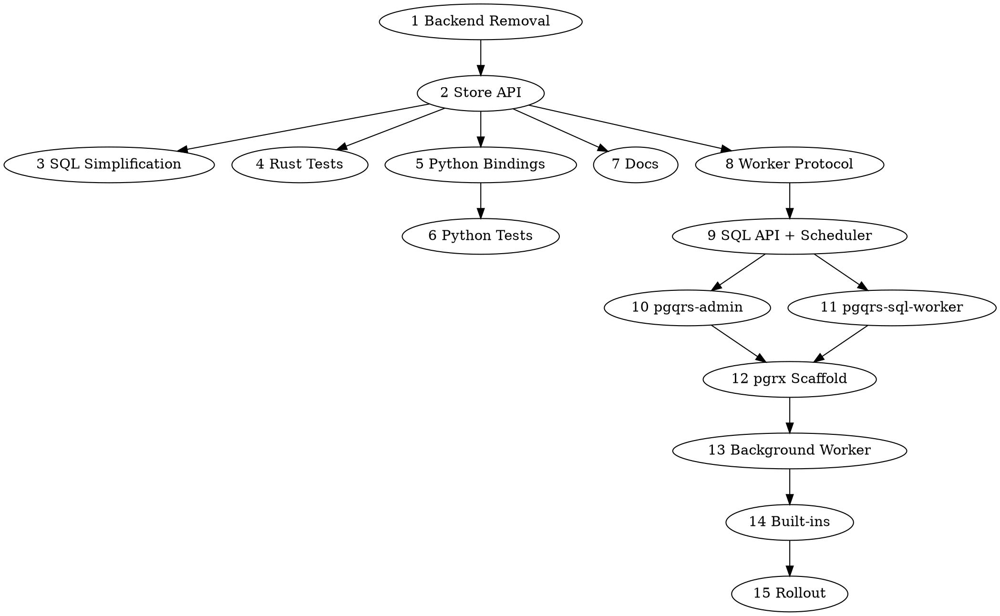

# Postgres-Only Extension Runtime Implementation Plan

This document turns [ADR-0004](../adr/0004-postgres-only-extension-runtime.md)
into an implementation plan for `pgqrs` only. ADR-0004 remains the product and
architecture decision record; this file is the engineering task breakdown.

## Current State

`pgqrs` currently supports Postgres, SQLite, Turso, and S3 behind shared store
traits plus runtime backend selection. The important implementation anchors are:

- `crates/pgqrs/src/store/any.rs` exposes `AnyStore` for runtime backend
  selection.
- `Config` and backend detection select a durable backend from DSNs and feature
  flags.
- `crates/pgqrs/src/store/postgres`, `sqlite`, `turso`, and `s3` implement
  backend-specific persistence.
- `crates/pgqrs/migrations/postgres`, `sqlite`, and `turso` carry separate
  schema definitions.
- Rust and Python APIs already expose usable queue, worker, and workflow
  ergonomics.
- Postgres is the production-grade implementation and should become the source
  of truth for schema, locking, leasing, retries, workflows, and worker state.
- S3-backed queue behavior is explicitly out of scope for this pgqrs plan.

The current multi-backend implementation shapes too many surfaces: Cargo
features, public Rust types, Python bindings, docs, tests, Make targets,
LocalStack helpers, benchmark scenarios, and portable SQL abstractions.

## Target Architecture

`pgqrs` supports only Postgres as durable state and synchronization.

Public connection APIs return one concrete Postgres-backed store or client
handle. There is no `AnyStore`, no runtime backend detection, and no public
backend-selection API. Internally, Postgres migrations and table modules are the
authoritative schema and query layer.

Rust and Python workers continue to execute user functions outside Postgres.
They share a durable worker protocol stored in Postgres:

- register worker identity and capabilities
- heartbeat liveness
- lease ready work
- execute one invocation
- checkpoint completion or error
- participate in retries, cancellation, timeouts, and DLQ movement

Rust, Python, and SQL clients should all be able to trigger workflows through
that protocol. Triggering is client-agnostic; execution is capability-gated. A
SQL client may trigger a Rust or Python workflow, but the workflow executes only
when a Rust or Python worker advertises the matching capability.

The minimum pgqrs runtime has three required roles:

- Postgres: durable state and synchronization.
- `pgqrs-admin`: coordinator, scheduler, and maintenance owner.
- `pgqrs-sql-worker`: executor for SQL jobs and SQL workflow steps.

There are two supported ways to run the required `pgqrs-admin` and
`pgqrs-sql-worker` roles:

- Managed externally by the user as normal processes or containers. This is the
  hosted-Postgres-compatible mode and must work on providers such as RDS,
  Aurora, Cloud SQL, and Azure Database for PostgreSQL.
- Provided by the pgrx extension in self-hosted Postgres deployments where
  native extensions and `shared_preload_libraries` are available.

Rust and Python workers are optional in either mode. They are only required when
users want to execute Rust or Python workflow capabilities.

`pgqrs-admin` owns cron/schedule evaluation. It scans durable schedule state,
calculates due times, creates workflow/job triggers, advances `next_fire_at`,
handles missed-run policy, and prevents duplicate fires through Postgres locks.
It does not execute SQL job bodies or Rust/Python application code.

`pgqrs-sql-worker` leases SQL-capability work and executes approved SQL-shaped
jobs. It does not decide when schedules fire and does not perform global
maintenance. Rust and Python workers remain optional executors for user
function capabilities.

A `pgrx` extension/background worker is part of the target implementation, not
an optional follow-up. It provides a self-hosted implementation path for the
required admin and SQL-worker roles. It should not execute arbitrary user Rust
or Python code. It may run extension-owned work such as maintenance, lease
reclamation, scheduling, retries, DLQ movement, metrics, SQL-shaped built-ins,
and internal orchestration control.

The extension design should borrow heavily from the `pg_durable` shape while
changing the execution boundary for pgqrs:

- Postgres extension owns the SQL schema, extension versioning, and SQL admin
  API.
- One or more background workers are loaded through `shared_preload_libraries`
  and wake on durable state changes, timers, and periodic maintenance ticks.
- Work is represented as durable rows with a clear state machine rather than as
  in-memory task state.
- Claims, retries, timeouts, delayed work, and DLQ transitions happen in
  Postgres transactions.
- Built-in jobs can execute inside the extension, but arbitrary application
  functions are leased to external Rust/Python workers through the pgqrs worker
  protocol.
- Durable schedules/crons are Postgres-owned trigger sources. They may trigger
  SQL built-ins or external Rust/Python workflows; they do not change the
  executor boundary.

Hosted Postgres support must not depend on native extension installation. Any
feature required by the minimum runtime must have an external-process path.

## Scope

### Goals

- Remove SQLite, Turso, and S3 from pgqrs mainline.
- Consolidate public Rust and Python APIs around Postgres-only handles.
- Remove portability abstractions that exist only to support non-Postgres
  backends.
- Keep high-level queue and workflow ergonomics where possible.
- Specify the shared worker protocol as the contract between the extension,
  Rust workers, and Python workers.
- Define a SQL API that can trigger any workflow, including Rust/Python
  workflows, without claiming SQL can execute arbitrary Rust/Python functions.
- Add durable schedules/crons that `pgqrs-admin` can use to trigger SQL, Rust,
  or Python workflows in hosted-compatible deployments.
- Define `pgqrs-admin` and `pgqrs-sql-worker` as required runtime roles, with an
  external-process deployment mode for hosted Postgres and a pgrx deployment
  mode for self-hosted Postgres.
- Implement a phased `pgrx` extension runtime after the Postgres-only store API
  is stable enough to share schema and protocol semantics.

### Non-Goals

- Do not revise ADR-0004.
- Do not preserve backward compatibility for `AnyStore`, backend feature flags,
  SQLite, Turso, or S3 users.
- Do not vendor, migrate, or modify `s3q` in this plan.
- Do not run arbitrary application Rust or Python code inside Postgres.
- Do not build the `pgrx` extension in the same change set as backend removal;
  do include it as a required implementation phase in this roadmap.
- Do not make the native pgrx extension mandatory for any minimum-runtime
  capability that hosted Postgres users need.

## Sequencing

The cleanup should land before extension code starts, but the roadmap includes
the extension as required implementation work. Agents can work in parallel only
after the Cargo feature and store API boundaries are clear.

1. Cargo, feature, dependency, and build-target cleanup.
2. Rust store/API consolidation.
3. Internal SQL simplification.
4. Rust test cleanup and Postgres-only validation.
5. Python binding cleanup.
6. Python test cleanup and fixture simplification.
7. Documentation cleanup.
8. Shared worker protocol design and Postgres schema migration plan.
9. SQL API, workflow triggering, and scheduler design.
10. `pgqrs-admin` external coordinator and scheduler.
11. `pgqrs-sql-worker` external SQL executor.
12. `pgrx` extension crate scaffold, packaging, and install path.
13. Extension background worker control loop.
14. Extension built-in executor and maintenance capabilities.
15. Extension integration tests, packaging, docs, and operational rollout.

The recommended dependency rule is: Tasks 2 through 7 should branch from task 1
or a merged equivalent. Task 8 can start in parallel as design work, but its
schema/API commitments should be reconciled after task 2. Task 9 depends on the
worker protocol from task 8. Tasks 10 and 11 provide the hosted-compatible
runtime baseline. Tasks 12 through 15 depend on the protocol, SQL API design,
and hosted baseline semantics and should be phased as separate PRs.

## Mini-Design Gates

Some workstreams are straightforward removal or cleanup work. Others need a
small design handoff before implementation so a junior engineer can execute
without rediscovering architecture decisions.

Use a mini-design doc when a workstream changes public APIs, schema, runtime
state machines, extension packaging, or cross-language behavior. The mini-design
should live next to this plan under `engg/design/` and be short enough to review
quickly.

Required mini-design docs:

| Workstream | Mini-design needed | Reason |
|------------|-------------------|--------|
| 1. Backend Removal | No | Mostly mechanical removal once scope is clear. |
| 2. Store API Consolidation | Yes | Public Rust API and connection return types change. |
| 3. Internal SQL Simplification | Maybe | Required only if the remaining Postgres storage shape is not obvious after backend removal. |
| 4. Rust Test Cleanup | No | Test inventory and coverage mapping are enough. |
| 5. Python Binding Cleanup | Yes | Public Python classes, type stubs, and Rust/PyO3 ownership boundaries change. |
| 6. Python Test Cleanup | No | Follows the Python API cleanup. |
| 7. Documentation Cleanup | No | Content update against accepted architecture. |
| 8. Worker Protocol Design and Schema Plan | Yes | Durable protocol, schema, leases, retries, cancellation, and compatibility rules are core architecture. |
| 9. SQL API, Workflow Triggering, and Scheduler Design | Yes | Public SQL API, cross-client trigger semantics, SQL workflows, and schedules/crons affect protocol and schema. |
| 10. pgqrs-admin External Coordinator and Scheduler | Yes | Hosted-compatible cron ownership, maintenance, retries, leases, and duplicate-fire prevention are core runtime behavior. |
| 11. pgqrs-sql-worker External SQL Executor | Yes | SQL execution boundaries, safety policy, leases, results, and fairness affect user-visible behavior. |
| 12. pgrx Extension Scaffold and Install Path | Yes | New crate, packaging, install, versioning, and development workflow. |
| 13. Extension Background Worker Control Loop | Yes | Runtime state machine, locking, wakeups, crash recovery, and concurrency model. |
| 14. Extension Built-In Executor Capabilities | Yes | Capability model and execution semantics affect both SQL built-ins and external workers. |
| 15. Extension Integration, Packaging, and Rollout | Yes | Operational requirements, version compatibility, and rollout policy need explicit decisions. |

Mini-design template:

```md
# Mini-Design: <Workstream Name>

## Problem
What this workstream changes and why it cannot be purely mechanical.

## Decision Summary
The concrete approach the implementer should take.

## Public/API Impact
Rust, Python, SQL, CLI, docs, or feature-flag changes.

## Data Model or Runtime Impact
Tables, migrations, worker states, locks, leases, retries, timers, or extension
runtime behavior.

## Files and Boundaries
Likely files to touch, files to avoid, and ownership boundaries.

## Implementation Steps
Small ordered steps that can become PR commits.

## Validation
Commands and expected negative searches.

## Open Questions
Questions that must be answered before coding starts.
```

For handoff, each implementation PR should link back to this plan and to its
mini-design doc when one is required.

## Primary-Agent Handoff Workflow

The primary agent owns coordination. It should not hand a workstream to another
engineer or sub-agent until the upstream gates are satisfied and the handoff
packet is complete.

### Branch and Worktree Model

Use the current branch containing this plan as the integration feature branch
for ADR-0004 implementation. Do not implement individual workstreams directly on
the integration branch.

Each workstream should use its own development branch and worktree:

```sh
git worktree add ../pgqrs-ws-<number>-<slug>_worktree -b ws/<number>-<slug>
```

Branch rules:

- Integration branch: owns this plan, mini-design docs, final integration, and
  cross-workstream conflict resolution.
- Workstream branches: contain one workstream or one clearly reviewable slice of
  a workstream.
- Worktree directory names should end in `_worktree/` so they stay ignored by
  the repo.
- Workstream branches should rebase or merge from the integration branch after
  upstream checkpoints land.
- No workstream branch should bypass primary-agent review.

The primary agent is responsible for review. That includes checking mini-design
approval, reviewing diffs, verifying validation output, deciding whether a
handback satisfies acceptance criteria, and integrating approved workstream
branches back into the feature branch.

### Agent Model Policy

Use model classes consistently so coordination and design receive stronger
reasoning while implementation remains cheap and parallelizable.

Default assignment:

| Role | OpenAI model | Gemini equivalent | Use for |
|------|--------------|-------------------|---------|
| Primary agent | `gpt-5.4 medium` | Current Gemini Pro/Deep Think tier | Overall coordination, handoff packets, review, integration, conflict resolution. |
| Design agent | `gpt-5.4 medium` | Current Gemini Pro/Deep Think tier | Mini-design docs, protocol/schema/API decisions, pgrx extension design. |
| Implementation agent | `gpt-5.3-mini` | Current Gemini Flash tier | Workstream implementation after mini-design approval. |
| Test/review assistant | `gpt-5.3-mini` for routine checks; `gpt-5.4 medium` for architecture-sensitive reviews | Gemini Flash for routine checks; Gemini Pro/Thinking for architecture-sensitive reviews | Test inventory, negative searches, targeted code review, validation summaries. |

Rules:

- The primary agent must be `gpt-5.4 medium`.
- Any mini-design work must use `gpt-5.4 medium` or the Gemini Pro/Thinking
  equivalent.
- Implementation after an approved handoff should use `gpt-5.3-mini` or the
  Gemini Flash equivalent.
- If an implementation agent discovers a design gap, it should stop and hand the
  gap back to the primary agent rather than deciding locally.
- Human gates override model choice: no model may proceed past a required human
  gate without recorded approval.

### Handoff Packet

Every handoff should include:

- Workstream number and title.
- Current base branch or commit SHA.
- Required upstream workstreams and whether they are merged, in review, or
  mocked behind a temporary boundary.
- Mini-design doc path, if required.
- Primary files and files to avoid.
- Acceptance criteria copied from this plan plus any workstream-specific
  refinements.
- Validation commands to run before handback.
- Expected negative `rg` searches.
- Explicit non-goals.
- Open questions that block implementation.
- Assigned model class and whether human approval is required before work starts.

Example:

```md
## Handoff: Workstream 5 - Python Binding Cleanup

Base: <branch-or-sha>
Depends on: Workstream 2 merged, Workstream 1 merged
Mini-design: engg/design/postgres-only-python-api.md

Scope:
- Replace Python `AnyStore` usage with the concrete Postgres handle.
- Remove S3 handle classes and type stubs.

Do not:
- Add extension APIs.
- Preserve hidden S3/SQLite aliases.

Validate:
- cargo check -p py-pgqrs
- rg "AnyStore|S3Store|sqlite|turso|s3://" py-pgqrs/src py-pgqrs/python py-pgqrs/README.md
```

### Human Review Gates

Human gates are required where a mistake would be expensive to unwind or would
lock the product into the wrong public contract. The primary agent prepares the
review packet, records the decision in the mini-design doc, and only then opens
implementation handoffs downstream.

Required human gates:

| Gate | Workstreams | Human approval required for | Review packet |
|------|-------------|-----------------------------|---------------|
| H1 API shape | 2 and 5 | Public Rust/Python API breakage and replacement shape. | Mini-design, examples, deleted compatibility surface, migration notes. |
| H2 Protocol and SQL API | 8 and 9 | Worker protocol, capability model, SQL trigger API, schedules/crons. | State machine, schema sketch, SQL function list, cross-client examples, failure semantics. |
| H3 Hosted runtime baseline | 10 and 11 | `pgqrs-admin` cron/maintenance ownership and `pgqrs-sql-worker` execution boundaries. | Admin/scheduler design, SQL worker safety model, duplicate-fire policy, hosted deployment example. |
| H4 pgrx architecture | 12 and 13 | Extension packaging, `shared_preload_libraries`, background worker concurrency, privileges. | Extension scaffold design, deployment requirements, crash/restart model, locking strategy. |
| H5 Built-ins and scheduler semantics | 14 | SQL built-in executor behavior, schedule execution semantics, fairness with external workers. | Capability list, execution boundaries, retry/cancel semantics, starvation prevention. |
| H6 Release readiness | 15 | Operational rollout and version compatibility. | CI matrix, install/upgrade docs, compatibility matrix, end-to-end validation summary. |

Human gate workflow:

1. Design agent drafts or updates the required mini-design.
2. Primary agent reviews for internal consistency and creates a review packet.
3. Human reviewer approves, rejects, or asks for changes.
4. Primary agent records the decision in the mini-design under `Review Status`.
5. Only after approval may the primary agent hand off implementation work that
   depends on that decision.

If a human gate changes the plan, the primary agent updates this implementation
plan, downstream mini-design docs, and any open handoff packets before work
continues.

### Coordination Steps

1. Primary agent updates this plan if scope changes.
2. Primary agent creates or updates required mini-design docs for the next
   unblocked workstreams.
3. Primary agent assigns design work to `gpt-5.4 medium` or the Gemini
   Pro/Thinking equivalent.
4. Required human gates approve the mini-design before implementation begins.
5. Primary agent assigns implementation to `gpt-5.3-mini` or the Gemini Flash
   equivalent.
6. Implementer works from the handoff packet and mini-design, not from
   assumptions.
7. Implementer returns a handback with changed files, validation output, skipped
   validation, and remaining risks.
8. Primary agent reviews the handback against acceptance criteria and either
   marks the workstream ready to merge or sends it back with specific fixes.
9. After merge, primary agent updates downstream handoff packets with the new
   base branch/SHA and any changed API or schema facts.

### Handback Requirements

Each handback should include:

- Summary of implementation decisions.
- Changed files grouped by component.
- Validation commands run and their result.
- Validation commands not run and why.
- Negative searches run and whether matches remain.
- Any deviations from the mini-design.
- Follow-up work needed before downstream tasks can start.

## Workflow DAG

The workstreams form this dependency graph:

```text
1 Backend Removal
  -> 2 Store API Consolidation
      -> 3 Internal SQL Simplification
      -> 4 Rust Test Cleanup
      -> 5 Python Binding Cleanup
          -> 6 Python Test Cleanup
      -> 7 Documentation Cleanup
      -> 8 Worker Protocol Design and Schema Plan
          -> 9 SQL API, Workflow Triggering, and Scheduler Design
              -> 10 pgqrs-admin External Coordinator and Scheduler
              -> 11 pgqrs-sql-worker External SQL Executor
                  -> 12 pgrx Extension Scaffold and Install Path
                      -> 13 Extension Background Worker Control Loop
                          -> 14 Extension Built-In Executor Capabilities
                              -> 15 Extension Integration, Packaging, and Rollout
```

Parallelization rules:

- Workstream 1 is the root gate. Do not start code changes for 2 through 7 on a
  long-lived branch that still has old backend features unless the branch is
  explicitly scoped as a spike.
- Workstreams 2, 3, 4, 5, and 7 can proceed in parallel after workstream 1 if
  their mini-design or test inventory is complete.
- Workstream 6 depends on the Python API shape from workstream 5.
- Workstream 8 can begin as design work in parallel with cleanup, but its schema
  and API commitments must be reconciled after workstream 2.
- Workstream 9 must not start until workstream 8 has an approved protocol and
  schema plan.
- Workstream 10 depends on the SQL API and scheduling design from 9.
- Workstream 11 depends on the SQL capability model from 9 and the lease
  semantics from 8.
- Workstream 12 depends on hosted baseline semantics from 10 and 11 so the
  extension can mirror or augment them.
- Workstream 13 depends on the extension scaffold from 12 and the protocol from
  8.
- Workstream 14 depends on the background worker control loop from 13.
- Workstream 15 depends on the hosted baseline and extension behavior from 10
  through 14.

Graphviz form:



Primary-agent checkpoints:

- Checkpoint A: Workstream 1 merged. Confirm no non-Postgres feature flags or
  dependencies remain.
- Checkpoint B: Human gate H1 approved and workstream 2 merged. Confirm public
  Rust API shape and update downstream mini-design docs.
- Checkpoint C: Workstreams 3 through 7 merged. Confirm Postgres-only Rust and
  Python client cleanup is complete.
- Checkpoint D: Human gate H2 approved. Freeze protocol, SQL API, and scheduler
  terms before extension implementation.
- Checkpoint E: Workstreams 10 and 11 merged. Confirm hosted-compatible
  `pgqrs-admin` and `pgqrs-sql-worker` baseline before native extension work.
- Checkpoint F: Human gates H3 and H4 approved and workstreams 12 through 14
  merged. Confirm extension runtime behavior before rollout docs and packaging.
- Checkpoint G: Human gate H6 approved and workstream 15 merged. Confirm
  end-to-end validation and release readiness.

## pg_durable Adaptation Principles

The extension should deliberately reuse the parts of the `pg_durable` model that
fit pgqrs:

- Extension-owned SQL objects are the operational API boundary.
- The background worker is a coordinator with a durable state machine, not an
  application process.
- Postgres transactions define state transitions for claiming, completing,
  retrying, timing out, cancelling, and dead-lettering work.
- Wakeups should use Postgres-native mechanisms where practical: SQL functions,
  notifications, latches, advisory locks, and periodic maintenance ticks.
- The extension should be observable through SQL inspection functions and
  Postgres logs.

The pgqrs-specific changes are equally important:

- The durable protocol must support multiple executor classes: extension
  built-ins, Rust external workers, and Python external workers.
- Capability names and versions decide which executor can claim a work item.
- Rust/Python user functions stay outside Postgres and are invoked only by
  external workers.
- The extension may coordinate and execute built-ins, but it must not become a
  dynamic plugin host for arbitrary application code.
- Existing queue and workflow ergonomics should map onto the protocol rather
  than being replaced by a SQL-only programming model.

## Workstreams

### 1. Backend Removal

Remove non-Postgres implementations and their build surface.

Mini-design: not required. This is a scoped removal task.

Primary files:

- `crates/pgqrs/Cargo.toml`
- `Cargo.lock`
- `crates/pgqrs/src/store/{sqlite,turso,s3}`
- `crates/pgqrs/migrations/{sqlite,turso}`
- `crates/pgqrs/src/bin/s3_process_helper.rs`
- `Makefile`
- benchmark helpers that start LocalStack or S3-specific stacks

Handoff notes:

- Start by removing feature flags and dependencies, then remove modules,
  migrations, tests, and docs references.
- Keep Postgres as the default and only backend.
- Do not preserve compatibility shims for old backend names.

Acceptance criteria:

- `pgqrs` no longer exposes `sqlite`, `turso`, `s3`, or `full` features.
- Non-Postgres optional dependencies are removed.
- Non-Postgres modules and migrations are removed from the crate include set.
- Make targets that exist only for S3/LocalStack or non-Postgres testing are
  removed or moved out of the pgqrs path.
- The default build remains Postgres-capable.

Validation:

```sh
cargo check -p pgqrs
rg "sqlite|turso|s3|LocalStack|aws-sdk-s3|object_store" crates/pgqrs/Cargo.toml Makefile crates/pgqrs/src crates/pgqrs/migrations
```

The `rg` command should only return intentionally retained historical comments
or transitional references.

### 2. Store API Consolidation

Replace runtime backend selection with a concrete Postgres-backed store.

Mini-design: required. Produce `engg/design/postgres-only-store-api.md`.

Primary files:

- `crates/pgqrs/src/store/any.rs`
- `crates/pgqrs/src/store/mod.rs`
- `crates/pgqrs/src/store/postgres/mod.rs`
- `crates/pgqrs/src/builders/connect.rs`
- `crates/pgqrs/src/config.rs`
- `crates/pgqrs/src/lib.rs`
- Rust examples and doctests

Design decisions to settle before implementation:

- Delete `AnyStore`.
- Delete `BackendType` and DSN-based backend detection.
- Make `connect` and `connect_with_config` return the concrete Postgres store
  handle.
- Keep builder ergonomics such as `pgqrs::admin(&store)`,
  `pgqrs::enqueue().execute(&store)`, and workflow helpers unless removal of
  multi-backend abstractions makes a smaller breaking API clearly better.

Non-goals:

- Do not redesign queue or workflow APIs for the extension runtime yet.
- Do not introduce a new generic store abstraction unless existing call sites
  require it after `AnyStore` removal.

Acceptance criteria:

- Public Rust docs no longer mention runtime backend selection.
- `AnyStore` is gone from public and internal Rust APIs.
- A Postgres DSN is the only supported connection path.
- Invalid or non-Postgres DSNs fail with a clear error.

Validation:

```sh
cargo check -p pgqrs --no-default-features --features postgres,test-utils
rg "AnyStore|BackendType|connect_with_dsn|sqlite|turso|s3://" crates/pgqrs/src crates/pgqrs/tests
```

### 3. Internal SQL Simplification

Remove portability layers that only exist for non-Postgres stores.

Mini-design: conditional. Produce `engg/design/postgres-only-storage-shape.md`
only if backend removal leaves a non-obvious Postgres storage refactor.

Primary files:

- `crates/pgqrs/src/store/dialect.rs`
- `crates/pgqrs/src/store/query.rs`
- `crates/pgqrs/src/store/postgres/dialect.rs`
- `crates/pgqrs/src/store/tables`
- Postgres table modules under `crates/pgqrs/src/store/postgres/tables`

Handoff notes:

- Collapse SQL generation and table abstractions toward Postgres-native SQL.
- Prefer direct Postgres table modules and migrations over dialect constants.
- Keep reusable code only when it represents a real domain abstraction rather
  than backend portability.

Non-goals:

- Do not rewrite the whole storage layer if deleting portability code leaves a
  clear, maintainable Postgres implementation.
- Do not change persisted schema shape unless needed by the worker protocol.

Acceptance criteria:

- There are no SQL dialect traits or constants whose only remaining purpose was
  SQLite/Turso/S3 support.
- Postgres queries remain easy to map to the corresponding migration/table.
- Existing queue and workflow behavior is unchanged.

Validation:

```sh
cargo test -p pgqrs --lib --no-default-features --features postgres,test-utils
rg "Dialect|Sqlite|Turso|portable|database-agnostic" crates/pgqrs/src/store
```

### 4. Rust Test Cleanup

Delete or rewrite tests that target non-Postgres behavior.

Mini-design: not required. Use a test inventory and coverage map in the PR
description.

Primary files:

- `crates/pgqrs/tests/anystore_tests.rs`
- `crates/pgqrs/tests/sqlite_tests.rs`
- `crates/pgqrs/tests/turso_hardening.rs`
- `crates/pgqrs/tests/s3_tests.rs`
- `crates/pgqrs/tests/common`
- `crates/pgqrs/src/test_utils.rs`
- `crates/pgqrs/src/bin/setup_test_schemas.rs`

Handoff notes:

- Keep coverage for public queue, workflow, worker, builder, admin, and error
  behavior against Postgres.
- Remove backend-matrix tests and fixtures.
- Ensure `setup_test_schemas` and common fixtures are Postgres-only.

Non-goals:

- Do not preserve generic test harnesses for future unknown backends.
- Do not weaken behavior coverage just because backend-specific files are
  deleted.

Acceptance criteria:

- Test filenames and fixtures no longer advertise SQLite, Turso, S3, or
  `AnyStore`.
- Postgres integration tests remain deterministic and parallel-safe.
- Deleted backend tests have either no Postgres-relevant behavior or their
  behavior is covered by Postgres tests.

Validation:

```sh
make test-postgres
cargo nextest run -p pgqrs --no-default-features --features postgres,test-utils
rg "AnyStore|BackendType|sqlite|turso|S3Store|s3://|LocalStack|multi-backend" crates/pgqrs/tests crates/pgqrs/src/test_utils.rs
```

### 5. Python Binding Cleanup

Make Python bindings expose only Postgres-backed handles.

Mini-design: required. Produce `engg/design/postgres-only-python-api.md`.

Primary files:

- `py-pgqrs/Cargo.toml`
- `py-pgqrs/src/lib.rs`
- `py-pgqrs/src/tables.rs`
- `py-pgqrs/src/workers.rs`
- `py-pgqrs/src/workflow.rs`
- `py-pgqrs/python/pgqrs/__init__.py`
- `py-pgqrs/python/pgqrs/__init__.pyi`
- `py-pgqrs/README.md`

Design decisions to settle before implementation:

- Replace `AnyStore` usage with the concrete Postgres handle.
- Remove S3 handle classes, S3-specific config, and backend-specific casts.
- Keep Python queue and workflow ergonomics stable where possible.
- Update type stubs to match the new Postgres-only API.

Non-goals:

- Do not add a Python API for the future extension runtime yet.
- Do not keep hidden S3/SQLite compatibility aliases.

Acceptance criteria:

- `pgqrs.connect()` creates a Postgres-backed store.
- Python module exports no `S3StoreHandle` or backend-selection API.
- Python type stubs match exported runtime classes.

Validation:

```sh
cargo check -p py-pgqrs
rg "AnyStore|S3Store|sqlite|turso|s3://" py-pgqrs/src py-pgqrs/python py-pgqrs/README.md
```

### 6. Python Test Cleanup

Simplify Python tests to Postgres-only fixtures.

Mini-design: not required. This follows the accepted Python API cleanup.

Primary files:

- `py-pgqrs/tests/conftest.py`
- `py-pgqrs/tests/test_s3_store_handle.py`
- `py-pgqrs/tests/test_pgqrs.py`
- `py-pgqrs/tests/test_guides.py`
- Python workflow and concurrency tests

Handoff notes:

- Remove S3-specific tests and backend-selection fixtures.
- Keep testcontainers-based Postgres isolation.
- Ensure guide tests exercise the public Postgres-only quickstart path.

Non-goals:

- Do not add LocalStack or object-store compatibility tests.
- Do not preserve parametrized backend fixtures with one remaining value.

Acceptance criteria:

- Python tests use a single Postgres fixture path.
- No test references `PGQRS_TEST_BACKEND` except possibly as a temporary
  compatibility shim scheduled for deletion.
- S3 handle tests are deleted or replaced with negative import/API assertions if
  useful.

Validation:

```sh
make test-py PGQRS_TEST_BACKEND=postgres
rg "PGQRS_TEST_BACKEND|S3Store|sqlite|turso|s3://|LocalStack" py-pgqrs/tests
```

### 7. Documentation Cleanup

Update user-facing and development docs to describe Postgres-only pgqrs.

Mini-design: not required. This follows ADR-0004 and this implementation plan.

Primary files:

- `README.md`
- `crates/pgqrs/README.md`
- `crates/pgqrs/src/lib.rs`
- `py-pgqrs/README.md`
- `docs/user-guide/concepts/backends.md`
- `docs/user-guide/api/configuration.md`
- `docs/development/testing.md`
- benchmark docs and assets references
- `engg/design/README.md`

Handoff notes:

- Remove active recommendations for SQLite, Turso, S3, backend matrices, and
  multi-backend runtime selection.
- Preserve historical design docs under `engg/` where useful, but clearly avoid
  advertising old backends as current functionality.
- Point implementation planning at ADR-0004 and this document.

Non-goals:

- Do not rewrite historical ADRs or reviews.
- Do not delete old engineering docs unless they actively confuse generated
  user documentation.

Acceptance criteria:

- README, crate docs, Python README, and development docs no longer advertise
  SQLite, Turso, S3, or multi-backend selection as supported current behavior.
- Any retained historical references are clearly historical.
- Quickstarts use Postgres DSNs only.

Validation:

```sh
rg "SQLite|Turso|S3|LocalStack|multi-backend|Choose Your Backend|Backend Selection" README.md crates/pgqrs/README.md crates/pgqrs/src/lib.rs py-pgqrs/README.md docs
```

### 8. Worker Protocol Design and Schema Plan

Specify the durable worker protocol before extension implementation. This is the
contract that external Rust/Python workers and the Postgres extension must both
obey.

Mini-design: required. This workstream is itself a design deliverable; use
`engg/design/postgres-only-worker-protocol.md` or update an existing protocol
doc if one exists.

Primary files:

- New or existing worker-protocol design doc under `engg/design`
- Postgres migrations under `crates/pgqrs/migrations/postgres`
- `crates/pgqrs/src/workers.rs`
- workflow queue/run/step table modules

Design decisions to settle before implementation:

Define protocol semantics for:

- worker identity and compatibility
- capability names and versions
- heartbeat and liveness windows
- work leasing and lease extension
- retry policy and backoff
- cancellation request and observation
- timeout handling
- completion and result checkpointing
- terminal failure and DLQ movement
- idempotency and duplicate completion handling
- wakeup semantics for `LISTEN`/`NOTIFY`, polling, or extension latches
- external Rust/Python worker behavior
- extension-owned built-in capability behavior

Non-goals:

- Do not implement `pgrx` in this task.
- Do not require Rust/Python user functions to run in Postgres.

Acceptance criteria:

- The protocol can be implemented by external Rust workers, Python workers, and
  the Postgres background worker.
- The design identifies table/schema changes, state transitions, lock/lease
  rules, and recovery behavior.
- The design includes compatibility rules for workers with different capability
  versions.
- The migration plan distinguishes existing queue/workflow tables from new
  protocol tables or columns.

Validation:

```sh
rg "identity|capabilit|heartbeat|lease|retry|cancel|timeout|DLQ|NOTIFY|LISTEN|latch" engg/design crates/pgqrs/migrations/postgres
```

### 9. SQL API, Workflow Triggering, and Scheduler Design

Define the user-facing SQL API and durable schedule model before the pgrx
implementation starts. This workstream decides how SQL clients participate in
the same protocol as Rust and Python clients.

Mini-design: required. Produce
`engg/design/pgqrs-sql-api-workflow-scheduler.md`.

Primary files:

- New SQL API and scheduler mini-design under `engg/design`
- Protocol design from workstream 8
- Future Postgres migrations under `crates/pgqrs/migrations/postgres`
- Future extension SQL functions/views
- Rust and Python API docs where cross-client triggering is described

Design decisions to settle before implementation:

- Rust, Python, and SQL clients can all trigger any registered workflow by name
  or capability.
- Triggering is not execution: SQL can trigger Rust/Python workflows, but only
  Rust/Python workers advertising the matching capability can execute them.
- Define SQL-native jobs/workflows as an extension-owned capability class that
  the background worker can execute.
- Define durable schedules/crons that can trigger SQL jobs, Rust workflows, or
  Python workflows.
- Define the v1 SQL API for trigger, enqueue, schedule create/update/pause,
  cancellation, retry, and inspection.
- Define ownership and privilege expectations for SQL functions and scheduler
  administration.

Non-goals:

- Do not design arbitrary Rust/Python execution inside Postgres.
- Do not require Rust/Python workflows to be rewritten as SQL workflows.
- Do not implement the pgrx worker in this workstream.

Acceptance criteria:

- The mini-design states the central rule: any client can trigger any workflow,
  but only a matching executor capability can execute it.
- SQL workflows/jobs and Rust/Python workflows share the same durable protocol
  concepts for trigger, run state, cancellation, retry, timeout, and result
  observation.
- Schedules/crons are durable Postgres state and can target SQL, Rust, or
  Python workflow capabilities.
- The v1 SQL API has named functions/views and clearly marked non-v1 functions.
- The design identifies required schema additions for schedules and SQL
  capability metadata.

Validation:

```sh
rg "trigger_workflow|schedule|cron|SQL API|capability|workflow" engg/design crates/pgqrs/migrations/postgres docs
```

### 10. pgqrs-admin External Coordinator and Scheduler

Implement the required hosted-compatible coordinator process.

Mini-design: required. Produce `engg/design/pgqrs-admin-coordinator.md`.

Primary files:

- New `pgqrs-admin` binary or crate entrypoint
- Admin/scheduler mini-design under `engg/design`
- Postgres schedule and lease migrations from workstreams 8 and 9
- Makefile and docs for running the process locally and in production

Design decisions to settle before implementation:

- `pgqrs-admin` owns schedule/cron evaluation, not `pgqrs-sql-worker`.
- `pgqrs-admin` scans durable schedule state, calculates due times, creates
  workflow/job triggers, advances `next_fire_at`, and records schedule history.
- `pgqrs-admin` defines missed-run and catch-up policy.
- `pgqrs-admin` owns global maintenance: lease reclamation, delayed readiness,
  retry scheduling, timeout transitions, DLQ movement, worker health, and
  metrics maintenance.
- Multiple `pgqrs-admin` instances are safe through Postgres locks or a clear
  single-active coordinator mechanism.
- If a target executor is down, `pgqrs-admin` still creates due triggers; work
  remains pending until a matching executor returns.

Non-goals:

- Do not execute SQL job bodies in `pgqrs-admin`.
- Do not execute Rust/Python application code in `pgqrs-admin`.
- Do not require a pgrx extension for the admin process to function.

Acceptance criteria:

- Hosted Postgres users can run `pgqrs-admin` as an external process with only
  normal database credentials.
- Schedule scanning can trigger SQL jobs, Rust workflows, and Python workflows.
- Duplicate schedule fires are prevented under multiple admin processes.
- Maintenance behavior matches the worker protocol design.
- Admin shutdown/restart does not corrupt lease, schedule, retry, or DLQ state.

Validation:

```sh
cargo test -p pgqrs --no-default-features --features postgres,test-utils admin
rg "pgqrs-admin|schedule|cron|next_fire_at|lease reclamation|DLQ" crates docs engg/design
```

### 11. pgqrs-sql-worker External SQL Executor

Implement the required hosted-compatible executor for SQL jobs and SQL workflow
steps.

Mini-design: required. Produce `engg/design/pgqrs-sql-worker.md`.

Primary files:

- New `pgqrs-sql-worker` binary or crate entrypoint
- SQL worker mini-design under `engg/design`
- Protocol capability registry and SQL job schema from workstreams 8 and 9
- Makefile and docs for local and production execution

Design decisions to settle before implementation:

- `pgqrs-sql-worker` leases work with SQL executor capabilities.
- `pgqrs-sql-worker` executes approved SQL-shaped jobs and records result,
  error, retry, cancellation, and timeout outcomes through the shared protocol.
- `pgqrs-sql-worker` does not evaluate schedules/crons.
- `pgqrs-sql-worker` does not perform global maintenance, lease reclamation, or
  DLQ sweeping except for its own leased work outcomes.
- Define SQL safety policy: allowed statement classes, transaction boundaries,
  role/privilege model, timeouts, result size limits, and observability.
- Multiple SQL workers are safe and fair with Rust/Python workers through
  capability-based leasing.

Non-goals:

- Do not make SQL worker a general-purpose superuser SQL runner.
- Do not let SQL jobs bypass the same retry/cancel/timeout protocol used by
  Rust/Python workers.
- Do not require a pgrx extension for SQL job execution.

Acceptance criteria:

- Hosted Postgres users can run SQL jobs and SQL workflow steps with
  `pgqrs-admin` plus `pgqrs-sql-worker`.
- SQL worker executes only SQL-capability work.
- SQL jobs can be triggered directly or by schedules owned by `pgqrs-admin`.
- SQL worker failures produce protocol-visible failures and retries.
- SQL worker cannot starve external Rust/Python worker leasing.

Validation:

```sh
cargo test -p pgqrs --no-default-features --features postgres,test-utils sql_worker
rg "pgqrs-sql-worker|SQL worker|SQL job|capability|timeout|result size" crates docs engg/design
```

### 12. pgrx Extension Scaffold and Install Path

Create the extension crate and make it installable in local development.

Mini-design: required. Produce `engg/design/pgqrs-extension-scaffold.md`.

Primary files:

- `Cargo.toml`
- `crates/pgqrs-extension/Cargo.toml`
- `crates/pgqrs-extension/src/lib.rs`
- extension SQL/control files generated or managed by `pgrx`
- `Makefile`
- `docs/development/testing.md`

Design decisions to settle before implementation:

- Add a `pgrx` crate that builds a Postgres extension.
- Define the extension name, SQL schema namespace, versioning policy, and
  install/upgrade path.
- Add local development commands for `cargo pgrx init`, build, install, test,
  and package.
- Expose minimal SQL functions for extension version and health inspection.
- Establish how the extension exposes the SQL API and scheduler objects designed
  in workstream 9.
- Establish whether the extension replaces, augments, or coordinates with
  `pgqrs-admin` and `pgqrs-sql-worker` in self-hosted deployments.
- Establish how the extension coexists with the Rust library migrations while
  cleanup is in progress.

Non-goals:

- Do not implement the full background worker loop in the scaffold task.
- Do not change Rust/Python external worker behavior in this task.
- Do not require the extension for hosted Postgres deployments.

Acceptance criteria:

- `crates/pgqrs-extension` is a workspace member or has a documented reason to
  build outside the workspace.
- Local development can build and install the extension into a supported
  Postgres version.
- `CREATE EXTENSION pgqrs` or the chosen extension name succeeds locally.
- A minimal SQL health/version function works.
- Docs state the required Postgres versions, `pgrx` version, and install
  assumptions.

Validation:

```sh
cargo check -p pgqrs-extension
cargo pgrx test -p pgqrs-extension
rg "pgrx|CREATE EXTENSION|shared_preload_libraries|pgqrs-extension" Cargo.toml crates Makefile docs
```

### 13. Extension Background Worker Control Loop

Implement the Postgres-resident coordinator loop. This should borrow the
`pg_durable` model of durable table state plus background worker scheduling, but
use the pgqrs protocol and table names.

Mini-design: required. Produce
`engg/design/pgqrs-extension-background-worker.md`.

Primary files:

- `crates/pgqrs-extension/src/lib.rs`
- extension background worker module
- extension SQL functions for worker control and wakeups
- protocol migrations in `crates/pgqrs/migrations/postgres`
- Rust store/admin code that interacts with extension-owned state

Design decisions to settle before implementation:

- Register a background worker through `pgrx` and Postgres
  `shared_preload_libraries`.
- Run a coordinator loop that wakes on interval, notification, or latch.
- Mirror or augment `pgqrs-admin` coordinator semantics for self-hosted
  deployments.
- Claim extension-owned maintenance work transactionally.
- Scan durable schedules/crons and create workflow/job triggers when they are
  due.
- Reclaim expired leases.
- Move delayed work into ready state.
- Apply retry backoff and timeout transitions.
- Move exhausted work to DLQ.
- Emit useful logs and metrics through Postgres-friendly mechanisms.

Non-goals:

- Do not execute arbitrary user Rust or Python functions inside the background
  worker.
- Do not implement every built-in capability in the first control-loop PR.
- Do not replace external Rust/Python workers; the coordinator should make their
  durable protocol safer.
- Do not make the extension the only supported coordinator for hosted Postgres.

Acceptance criteria:

- The background worker starts when configured through
  `shared_preload_libraries`.
- The control loop is safe to run on multiple Postgres instances where the
  deployment allows it, or the plan explicitly constrains it to one active
  coordinator with an advisory lock.
- Lease reclamation, delayed readiness, retry scheduling, timeout, and DLQ
  transitions are covered by extension tests.
- Schedule scanning can trigger SQL, Rust, or Python workflow capabilities
  without executing Rust/Python code in Postgres.
- Extension coordinator behavior is compatible with `pgqrs-admin` semantics or
  explicitly documented as a self-hosted replacement.
- A stopped or crashed coordinator does not corrupt worker protocol state; work
  resumes when it restarts.

Validation:

```sh
cargo pgrx test -p pgqrs-extension
rg "BackgroundWorker|shared_preload_libraries|schedule|cron|lease|retry|timeout|DLQ|NOTIFY|LISTEN|latch" crates/pgqrs-extension crates/pgqrs
```

### 14. Extension Built-In Executor Capabilities

Add extension-owned capabilities that can run without an external Rust/Python
application worker.

Mini-design: required. Produce
`engg/design/pgqrs-extension-builtins.md`.

Primary files:

- extension built-in executor modules
- protocol capability registry tables or functions
- SQL APIs for enqueuing built-in work
- Rust admin/client wrappers for built-in capabilities, if exposed publicly
- docs and examples

Design decisions to settle before implementation:

- Implement capability registration for extension built-ins.
- Execute SQL-shaped built-ins in the background worker.
- Execute SQL jobs/workflows defined by the SQL API workstream.
- Mirror or augment `pgqrs-sql-worker` SQL execution semantics where practical.
- Support timers/sleeps, internal orchestration control, maintenance jobs, and
  metrics collection as first-class extension capabilities.
- Record completion, failure, retries, timeouts, and DLQ transitions through the
  same protocol used by external workers.

Non-goals:

- Do not add PL/Python, embedded Python, dynamic Rust loading, or untrusted code
  execution inside Postgres.
- Do not require users to rewrite Rust/Python workflows as SQL-only workflows.
- Do not require pgrx built-ins for hosted Postgres SQL job support; that remains
  the role of `pgqrs-sql-worker`.

Acceptance criteria:

- Built-in capabilities use the same durable invocation state machine as
  external workers.
- Capability names and versions are visible through SQL inspection APIs.
- SQL-shaped built-in jobs and SQL workflow steps can be triggered, executed,
  retried, cancelled, scheduled, and observed end-to-end.
- Built-ins cannot starve external worker leasing.
- Built-in behavior is compatible with `pgqrs-sql-worker` semantics or clearly
  documented as self-hosted-only behavior.

Validation:

```sh
cargo pgrx test -p pgqrs-extension
make test-postgres
rg "capability|built-in|builtin|timer|maintenance|metrics|SQL job|schedule" crates/pgqrs-extension crates/pgqrs docs
```

### 15. Extension Integration, Packaging, and Rollout

Make the extension operationally usable and documented.

Mini-design: required. Produce
`engg/design/pgqrs-extension-rollout.md`.

Primary files:

- `Makefile`
- CI workflow files
- `docs/development/testing.md`
- user guide install/configuration docs
- release process docs
- packaging scripts, if added

Design decisions to settle before implementation:

- Add CI coverage for extension build and tests on supported Postgres versions.
- Document install, upgrade, restart, `shared_preload_libraries`, and privilege
  requirements.
- Document the minimum runtime roles: Postgres, `pgqrs-admin`, and
  `pgqrs-sql-worker`.
- Document both ways to satisfy the `pgqrs-admin` and `pgqrs-sql-worker` roles:
  external processes for hosted Postgres, and pgrx for self-hosted Postgres.
- Define compatibility between Rust/Python client versions and extension
  versions.
- Add operational docs for logs, metrics, failure recovery, and safe rollout.

Non-goals:

- Do not make deployment requirements ambiguous; if a feature needs the
  extension, document that as a hard requirement.
- Do not block the Postgres-only client cleanup on packaging polish.

Acceptance criteria:

- CI validates the extension on the supported Postgres version matrix.
- Docs include a local install path and a production install checklist.
- Version compatibility rules are explicit.
- End-to-end tests cover a Rust or Python external worker coexisting with the
- hosted-compatible `pgqrs-admin` coordinator.
- End-to-end tests cover `pgqrs-sql-worker` executing scheduled SQL work.
- End-to-end tests cover a Rust or Python external worker coexisting with the
  extension coordinator in self-hosted mode.
- End-to-end tests cover a SQL schedule triggering a Rust or Python workflow and
  a SQL schedule triggering a SQL built-in job.

Validation:

```sh
cargo pgrx test -p pgqrs-extension
make test-postgres
make test-py PGQRS_TEST_BACKEND=postgres
rg "CREATE EXTENSION|shared_preload_libraries|pgqrs extension|version compatibility" README.md docs crates
```

## Cross-Cutting Risks

- Public API churn: this is intentionally breaking, but examples and type stubs
  must be updated in the same PRs that change APIs.
- Hidden backend references: tests, docs, benchmarks, and helper scripts may
  keep stale backend assumptions after code compiles.
- Over-retained abstraction: leaving generic store/dialect layers in place can
  preserve the complexity ADR-0004 is meant to remove.
- Under-specified worker protocol: extension work should not begin until lease,
  retry, cancellation, timeout, and DLQ semantics are explicit.
- Hosted Postgres compatibility: core scheduling and SQL execution must remain
  available through external processes, not only through pgrx.
- Postgres migration coupling: schema changes for the worker protocol must have
  clear upgrade paths and be exercised by setup/test fixtures.

## End-to-End Test Plan

Run these after the major cleanup has landed:

```sh
make test-postgres
cargo nextest run -p pgqrs --no-default-features --features postgres,test-utils
make test-py PGQRS_TEST_BACKEND=postgres
cargo pgrx test -p pgqrs-extension
```

End-to-end scenarios to cover:

- `pgqrs-admin` scans schedules and creates due triggers.
- `pgqrs-sql-worker` executes a directly triggered SQL job.
- SQL client triggers a Rust workflow; an external Rust worker executes it.
- SQL client triggers a Python workflow; an external Python worker executes it.
- SQL client triggers a SQL job; `pgqrs-sql-worker` executes it.
- Durable schedule triggers a Rust or Python workflow without executing
  Rust/Python code inside Postgres.
- Durable schedule triggers a SQL job executed by `pgqrs-sql-worker`.
- In self-hosted mode, the pgrx extension can run the equivalent coordinator and
  SQL built-in paths when configured.

Documentation and negative validation:

```sh
rg "AnyStore|BackendType|sqlite|turso|S3Store|s3://|LocalStack|multi-backend" README.md crates py-pgqrs docs engg
```

Expected result: only historical engineering documents, ADRs, changelog entries,
or intentionally retained migration notes should match.

## Completion Criteria

The Postgres-only cleanup is complete when:

- Rust and Python public APIs connect only to Postgres.
- `AnyStore`, `BackendType`, non-Postgres modules, non-Postgres migrations, and
  non-Postgres feature flags are gone.
- Postgres Rust and Python test suites pass.
- User-facing docs advertise Postgres-only pgqrs.
- The shared worker protocol has an accepted design ready for implementation.
- The SQL API and scheduler design supports cross-client workflow triggering:
  Rust, Python, and SQL clients can trigger any workflow, while execution remains
  capability-gated.
- `pgqrs-admin` is implemented as the required hosted-compatible coordinator and
  scheduler.
- `pgqrs-sql-worker` is implemented as the required hosted-compatible SQL
  executor.
- The `pgrx` extension crate builds, installs, and runs extension tests.
- The extension background worker implements protocol coordination for built-in
  and external worker coexistence.
- Durable schedules can trigger SQL jobs, extension SQL built-ins, and
  Rust/Python workflows without executing Rust/Python code in Postgres.
- Extension rollout docs describe install, upgrade, version compatibility, and
  operational requirements.

## Logs

- `2026-06-23`: `687caa4` (`feat: make pgqrs postgres-only`) landed on
  `postgres-only-extension-runtime`. This was an initial Postgres-only cleanup,
  but it did not finish removal of all SQLite, Turso, and S3 runtime surface.

- `2026-06-23`: additional cleanup work was done in worktree
  `/private/tmp/pgqrs-worktree-pg-only-2` on branch `worktree/pg-only-2` and
  committed as `ae2cfd9` (`refactor(runtime): remove non-postgres backends`).
  This branch name was misleading relative to the implementation plan because
  it did not correspond to pure workstream 2.

- `2026-06-23`: `ae2cfd9` was squash-merged into
  `postgres-only-extension-runtime` as `554e5ec`
  (`refactor(runtime): remove remaining non-postgres runtime surface`).

- Scope note for `554e5ec`: this latest commit contains work from multiple
  workstreams and should not be treated as a clean implementation of one
  numbered workstream. It primarily includes:
  - workstream 1: backend removal
  - workstream 4: Rust test cleanup
  - workstream 5: Python binding cleanup
  - workstream 6: Python test cleanup
  - workstream 7: documentation cleanup
  - minor workstream 3-style portability cleanup in the remaining dialect code

- Explicitly not completed by `554e5ec`: workstream 2 (`Store API
  Consolidation`) remains outstanding. In particular, the implementation plan's
  workstream 2 goals around removing `AnyStore`, removing `BackendType`,
  removing runtime backend selection, and returning a concrete Postgres store
  from connect paths were not completed in that commit.
