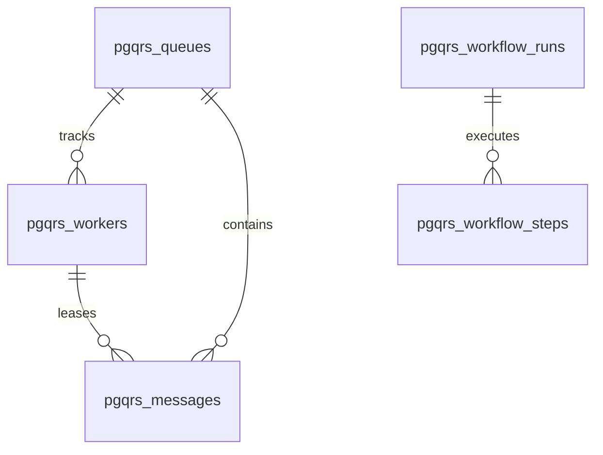
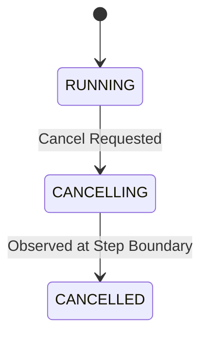

# Postgres-Only Shared Worker Protocol Design

## Overview
This document specifies the durable worker protocol for `pgqrs`. This protocol establishes the common state machine, table schemas, locking rules, and liveness contracts that external workers (Rust, Python) and the Postgres database runtime (the extension and external coordinators) must both follow.

By standardizing on a database-level protocol rather than shared memory or library-specific structures, we ensure:
1. **Multi-Language Interoperability:** Rust, Python, and SQL executors can coordinate work on the same engine.
2. **Operational Decoupling:** The DB manages queue state and task distribution, while executors remain stateless runners.

---

## 1. Protocol Architecture & Tables

The protocol relies on three core entities defined in the database schema:



### pgqrs_workers (Worker Registry)
Keeps track of registered workers, their statuses, and capabilities:
- `id` (BIGINT, PK)
- `name` (TEXT, UNIQUE)
- `queue_id` (BIGINT, FK, Nullable for admin workers)
- `status` (worker_status: `ready`, `polling`, `suspended`, `interrupted`, `stopped`)
- `started_at` (TIMESTAMP WITH TIME ZONE)
- `heartbeat_at` (TIMESTAMP WITH TIME ZONE)
- `shutdown_at` (TIMESTAMP WITH TIME ZONE, Nullable)

### pgqrs_messages (Job Queue State)
Manages task distribution, visibility timeouts, and worker leases:
- `id` (BIGINT, PK)
- `queue_id` (BIGINT, FK)
- `payload` (JSONB)
- `vt` (TIMESTAMP WITH TIME ZONE) - Visibility Timeout (lease expiration)
- `enqueued_at` (TIMESTAMP WITH TIME ZONE)
- `read_ct` (INTEGER) - Lease attempt count
- `dequeued_at` (TIMESTAMP WITH TIME ZONE, Nullable)
- `producer_worker_id` (BIGINT, FK, Nullable)
- `consumer_worker_id` (BIGINT, FK, Nullable) - Leased to this worker
- `archived_at` (TIMESTAMP WITH TIME ZONE, Nullable) - Dead-lettered/completed

---

## 2. Worker Lifecycle & Identity

### Registration
Every worker must register itself with a unique name prior to fetching work:
```sql
INSERT INTO pgqrs_workers (name, queue_id, started_at, heartbeat_at, status)
VALUES ($1, $2, NOW(), NOW(), 'ready'::worker_status)
RETURNING id;
```

### Liveness (Heartbeat)
Workers must update their liveness timestamp at regular intervals (defined by `Config.heartbeat_interval`):
```sql
UPDATE pgqrs_workers
SET heartbeat_at = NOW()
WHERE id = $1;
```

### Stale Worker Reclamation
If `NOW() - heartbeat_at > liveness_threshold` (default: 15s), the worker is considered stale. The coordinator runs a global sweep to clean up stale workers and release their leased messages:
```sql
-- 1. Release messages held by the stale worker
UPDATE pgqrs_messages
SET vt = NOW(), consumer_worker_id = NULL
WHERE consumer_worker_id = $1 AND archived_at IS NULL;

-- 2. Mark worker as stopped
UPDATE pgqrs_workers
SET status = 'stopped'::worker_status, shutdown_at = NOW()
WHERE id = $1;
```

---

## 3. Work Leasing & Execution

### Job Dequeue (Lease Acquisition)
Workers request work by querying `pgqrs_messages` for jobs whose visibility timeout `vt` has passed, locking the rows using `FOR UPDATE SKIP LOCKED`:
```sql
UPDATE pgqrs_messages
SET consumer_worker_id = $1,
    vt = NOW() + INTERVAL '5 seconds', -- default lock time
    read_ct = read_ct + 1,
    dequeued_at = NOW()
WHERE id = (
    SELECT id FROM pgqrs_messages
    WHERE queue_id = $2
      AND vt <= NOW()
      AND archived_at IS NULL
    ORDER BY enqueued_at ASC
    LIMIT 1
    FOR UPDATE SKIP LOCKED
)
RETURNING id, payload, vt;
```

### Lease Extension (Visibility Extension)
If a worker expects execution to take longer than the visibility timeout, it must request a lease extension (`extend_vt`):
```sql
UPDATE pgqrs_messages
SET vt = NOW() + INTERVAL '5 seconds'
WHERE id = $1 AND consumer_worker_id = $2 AND archived_at IS NULL;
```

### Checkpointing (Completion & Failure)
- **Success:** The worker completes processing, archives the message, and registers the outcome:
  ```sql
  UPDATE pgqrs_messages
  SET archived_at = NOW()
  WHERE id = $1 AND consumer_worker_id = $2;
  ```
- **Transient Failure:** The worker fails with a retriable error. The lease is immediately released, and the visibility timeout is backed off:
  ```sql
  UPDATE pgqrs_messages
  SET consumer_worker_id = NULL,
      vt = NOW() + INTERVAL '10 seconds' -- backed off time
  WHERE id = $1 AND consumer_worker_id = $2;
  ```

---

## 4. Retries, Timeouts, and DLQ (Dead Letter Queue)

### Retry Policy
Steps and workflows specify retry limits and backoff strategies (e.g., exponential backoff with jitter). If a step fails, the system calculates `next_retry_at` and sets the step status to `QUEUED`.

### Timeout Handling
Workflows have an overall execution timeout. The `pgqrs-admin` coordinator monitors active runs. If a run exceeds its execution timeout, it transitions the run status to `ERROR` with a `TIMEOUT` reason and releases any associated worker leases.

### Dead-Letter Queue (DLQ)
If a message exceeds its maximum read count (`read_ct >= max_read_ct`), it is moved to the DLQ (archived with a status indicating failure):
```sql
UPDATE pgqrs_messages
SET archived_at = NOW(),
    consumer_worker_id = NULL
WHERE read_ct >= $1 AND archived_at IS NULL;
```

---

## 5. Workflow Cancellation

Cancellation uses a two-phase state machine:



1. **Phase 1 (Request):** An external client requests cancellation of a run. The run state transitions to `CANCELLING`:
   ```sql
   UPDATE pgqrs_workflow_runs
   SET status = 'CANCELLING', updated_at = NOW()
   WHERE id = $1 AND status IN ('QUEUED', 'RUNNING', 'PAUSED');
   ```
2. **Phase 2 (Observation):** Before executing any new step, the language worker checks the run's current status. If it is `CANCELLING`, it aborts and transitions the run to the terminal `CANCELLED` state:
   ```sql
   UPDATE pgqrs_workflow_runs
   SET status = 'CANCELLED', completed_at = NOW(), updated_at = NOW()
   WHERE id = $1 AND status = 'CANCELLING';
   ```

---

## 6. Wakeup & Real-Time Coordination

To avoid CPU and DB churn from continuous short-polling, the protocol uses Postgres `LISTEN` and `NOTIFY`:

- **Producer/Trigger Side:** When a new job is enqueued or workflow triggered, it broadcasts a notification:
  ```sql
  NOTIFY pgqrs_task_wakeup, 'queue_id_123';
  ```
- **Consumer/Worker Side:** Workers listen to the channel:
  ```sql
  LISTEN pgqrs_task_wakeup;
  ```
  Upon receiving a notification matching their queue interest, they immediately wake up and attempt to lease work, falling back to a passive poll interval (e.g., 250ms) if no messages are enqueued.
